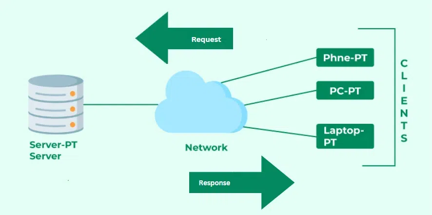
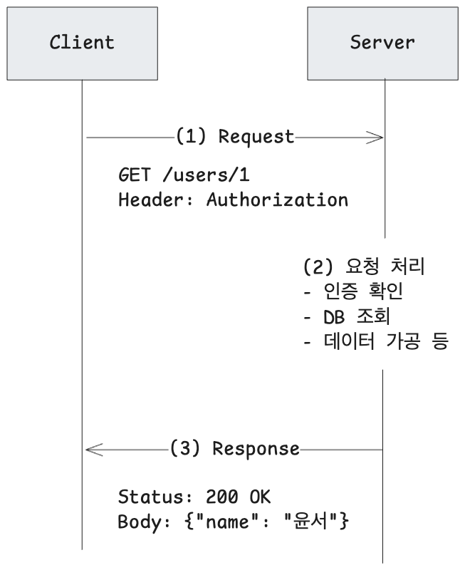
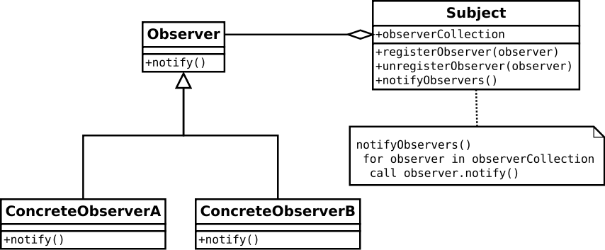
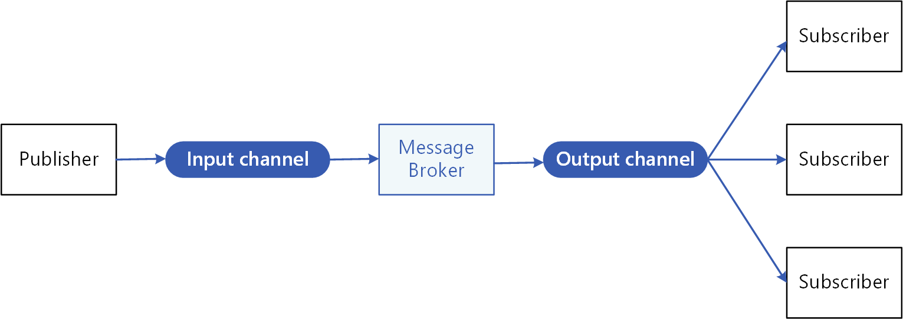
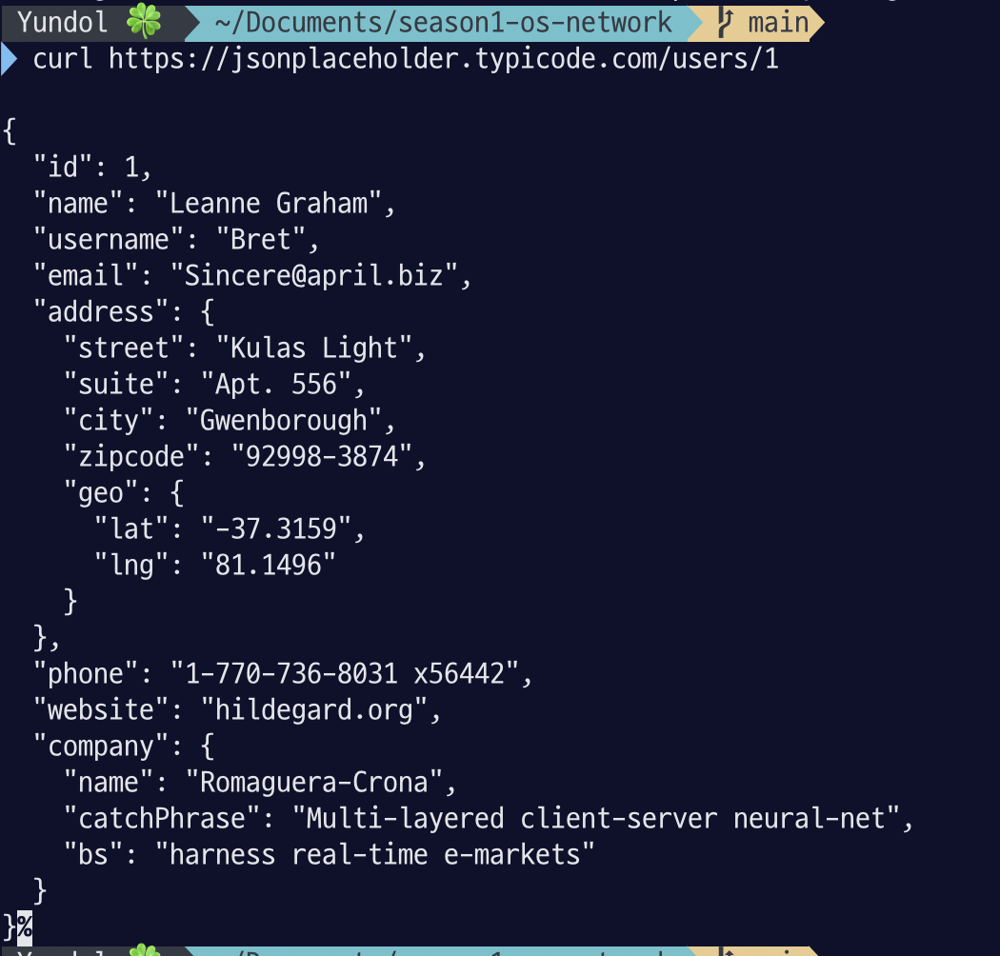
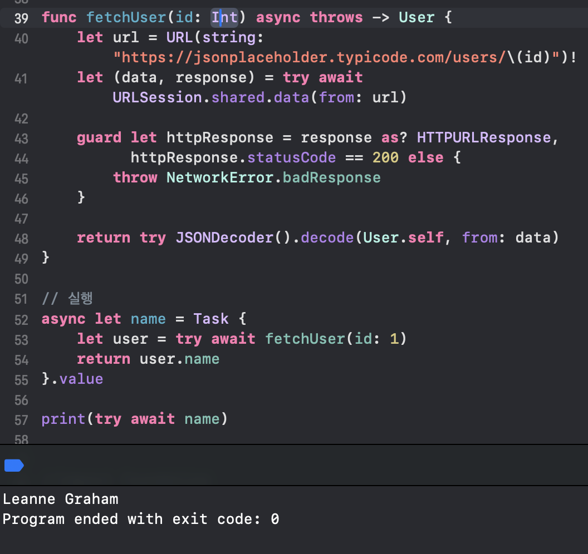

# Client-Server model

## 학습키워드

- Client-Server 모델
- P2P
- Observer 패턴
- Publisher-Subscriber

## 핵심 개념

### Client-Server

- 서버: **서비스 리소스 또는 서비스 제공자**로 하나 이상의 클라이언트에게 서비스를 제공
  - 웹 서버, 파일 서버, API 서버
- 클라이언트: **서비스 또는 리소스 요청자**
  - 웹 브라우저, 모바일 앱, 데스크톱 애플리케이션

> 작업 또는 부하를 나누는 **분산 애플리케이션 구조**의 통신 패턴

> 여기서 분산의 의미는 서버와 클라이언트가 일을 나눠서 한다는 것에 특징을 둠

### Server와 Client의 역할 분담

**서버 측**

- 클라이언트가 접근할 수 없는 정보가 기능이 필요할 때
- 보안/성능상의 이유로 클라이언트에서 작업할 수 없을 때
- SQL Injection과 같은 보안 취약점의 위험이 있음

**클라이언트 측**

- 사용자 입력이 필요할 때(UI 제공)
- 서버의 처리 능력이 부족할 때
- 네트워크 대역폭을 아껴야 할 때
- XSS 공격 등의 보안 위험이 있음

**로그인 처리 예시**  
📱 클라이언트

1. 이메일 형식 검증 (@ 포함 여부)
2. 비밀번호 길이 체크 (8자 이상)
3. 서버로 전송

👾 서버

1. 이메일 중복 확인(DB 조회)
2. 비밀번호 해싱 및 저장
3. JWT 토큰 생성

### 왜 클라이언트와 서버를 분리할까?

1. 책임 분리

- 필요에 따라 각자 역할에 집중

2. 확장성

- 서버 하나가 여러 클라이언트 요청을 동시에 처리
- 사용자 증가 시 서버만 증설하면 됨

3. 유지보수

- 서버와 클라이언트 독립적으로 업데이트가 가능
- 서버 로직 변경 시 클라이언트 앱 재배포하지 않아도 됨

4. 보안

- 중요한 로직과 데이터를 서버에서 관리
- 클라이언트는 디컴파일이 가능해서 비밀 정보를 저장하기 부적합함

5. 일관성

- 모든 클라이언트가 같은 데이터와 로직을 사용

### Client-Server 통신 방식

요청-응답 메세지 패턴으로 데이터를 교환한다.

- 프로토콜: 통신을 위해 서버와 클라이언트가 따라야하는 규칙과 언어의 집합
  - 모든 프로토콜은 7계층 중 응용 계층에서 동작
  - HTTP/HTTPS: 웹 통신 기본 프로토콜
  - WebSocket: 실시간 양방향 통신
- API(Application Programming Interface): 서버가 데이터 교환을 정형화하기 위해 구현한 인터페이스
  - 서비스 접근을 추상화하여 플랫폼 간 데이터 교환을 쉽게 하도록 도와줌
  - RESTful API: 자원 중시므이 설계(GET /users, POST /posts)
  - GraphQL: 클라이언트가 필요한 데이터만 요청

### P2P와의 차이점

**P2P란?**

- 참여자들이 처리 능력, 저장 공간, 네트워크 대역폭과 같은 **자신의 리소스를 직접 공유**하는 분산 컴퓨팅 아키텍처
- 참여자가 공급자인 동시에 요청자(각각이 Server이자 Client)

**특징**

- 대등한 관계: 모든 노드는 권한과 역할이 동일
- ⭐️ 직접 통신: 중간 매개체 없이 노드 간에 직접 데이터 주고 받음
- 활용 예시
  - 암호화폐(비트코인, 이더리움 등), 거래 기록을 모두가 공유
  - 멀티미디어 스트리밍
  - 파일 공유(토렌트)
- 보안에 취약
  - 각 노드가 서버 역할도 하기 때문에 공격에 노출될 가능성 높음
  - 중앙 검증 체계가 부족해서 오염된 파일이나 바이러스가 빠르게 퍼질 위험

|    특징    |                 클라이언트-서버 모델                  |                       P2P                        |
| :--------: | :---------------------------------------------------: | :----------------------------------------------: |
|    구조    |                중앙 집중식(서버 중심)                 |           분산형(노드 간 대등한 구조)            |
|    통신    |                  클라이언트 -> 서버                   |                피어 간 직접 통신                 |
|   확장성   | 서버 로드 밸런싱 필요(사용자가 늘면 서버 부하가 증가) |         노드가 많아질수록 전체 용량 증가         |
|   가용성   |             서버 장애 시 서비스 중단 위험             |      특정 노드가 이탈해도 서비스 유지 관리       |
|    비용    |                         비쌈                          | 저렴(대규모 중앙 서버를 운영할 필요가 없기 때문) |
| 언제 사용? |       데이터 일관성, 보안, 중앙 관리 필요할 때        |     분산 파일 공유, 서버 비용 절감 필요할 때     |

**Client-Server 예시**

- 웹사이트, 대부분의 모바일 앱
- 카카오톡 메시지: 내 폰 → 카카오 서버 → 상대 폰

**P2P 예시**

- 토렌트: 파일 조각을 여러 피어에서 다운로드
- 블록체인: 모든 노드가 거래 기록 공유
- AirDrop: iPhone 간 직접 파일 전송

**Hybrid (혼합) 모델**
Skype, Zoom 등의 화상 통화

- 로그인/인증: 중앙 서버
- 실제 통화: P2P

### Observer 패턴과의 차이점

**Observer 패턴**

- 객체의 상태 변화를 구독하는 다른 객체들에게 전달할 때 사용
- Client-Server와 P2P가 네트워크 아키텍처라면 옵저버 패턴은 소프트웨어 디자인 패턴

|   특징    |                  클라이언트-서버                  |                 옵저버 패턴                  |
| :-------: | :-----------------------------------------------: | :------------------------------------------: |
|   범위    | 네트워크 구조(시스템 간의 물리적/논리적 연결 방식 |   소프트웨어 설계(객체 간의 상호작용 방식)   |
| 통신 방향 |                     요청-응답                     |                  발행-구독                   |
| ⭐️ 의존성 |           클라이언트가 서버를 알아야 함           | Subject는 옵저버의 구체적인 구현을 몰라도 됨 |
| 주요 목적 |            리소스 공유 및 서비스 제공             |        상태 변화에 따른 자동 업데이트        |

**느슨한 결합**

- 네트워크 모델: 서버에 접속하기 위해 IP주소나 포트 등 물리적인 정보를 알아야 함
- 옵저버 패턴: 옵저버 리스트만 관리할 뿐 각 옵저버가 어떤 일을 하는지 알 필요가 없음

**요청과 구독**

- 네트워크 모델: 요청을 해야 데이터를 받음
- 옵저버 패턴: 데이터를 관리하는 측에서 변화가 생기면 알아서 알려줌

**채팅앱 예시**

- Client-Server
  - 로그인/계정 정보 관리
  - 친구 목록 관리
- P2P
  - 보이스톡/페이스톡
- 옵저버 패턴
  - 채팅 메세지 수신 알림
  - 입력 중 알림

### Publisher-Subscriber 모델과의 차이점

**Pub-Sub**  
  
옵저버와 같이 상태 변화를 알리는 것은 동일하지만, 결합도와 중재자 유무에서 차이를 보임

**등장 배경**
옵저버 패턴의 한계를 극복하기 위해 등장

- 옵저버 패턴은 Subject와 Observer가 같은 인터페이스를 공유해야 했음
- 서로의 존재를 알아야 함
- 시간이 지날 수록 유지보수가 어려워 짐

**중재자 역할**

- 메시지 영속성: 구독자가 오프라인이어도 메시지를 보관했다가 나중에 전달
- 수신 보장: 메시지가 반드시 전달되도록 추적
- 유연한 필터링: 특정 메시지만 골라서 전달.

|   특징    |                   옵저버 패턴                   |                Pub-Sub                |
| :-------: | :---------------------------------------------: | :-----------------------------------: |
|  결합도   | 상대적으로 높음(Subject가 Observer를 알아야 함) |            낮음(서로 모름)            |
| 통신 방식 |                    직접 통신                    |       간접 통신(중개자를 경유)        |
| 장애 영향 |  Observer의 실패가 Subject에 영향을 줄 수 있음  | 중재자가 중간에 있어서 완충 작용이 됨 |

## 탐구 내용(실무/iOS 연결)

### Client-Server 모델

## 참고 자료

[P2P](https://en.wikipedia.org/wiki/Peer-to-peer)  
[Client-Server](https://en.wikipedia.org/wiki/Client%E2%80%93server_model)  
[Observer-Pattern](https://en.wikipedia.org/wiki/Observer_pattern)
[Pub-Sub](https://en.wikipedia.org/wiki/Publish%E2%80%93subscribe_pattern)
