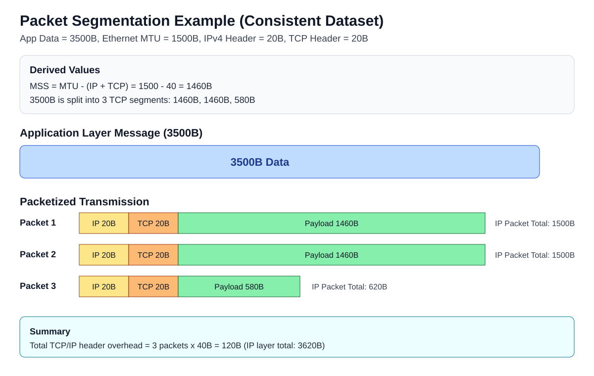
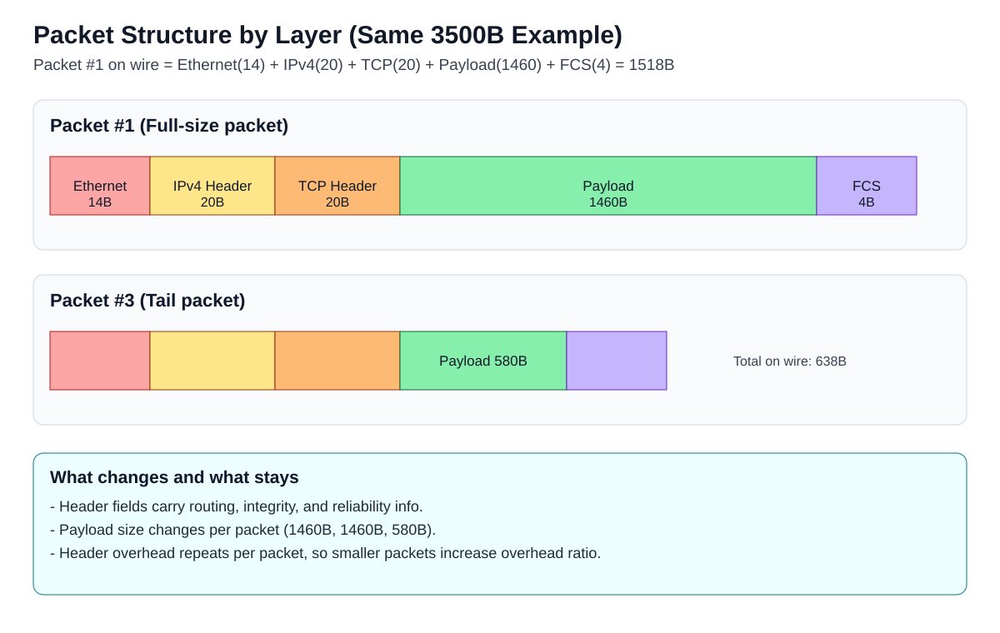
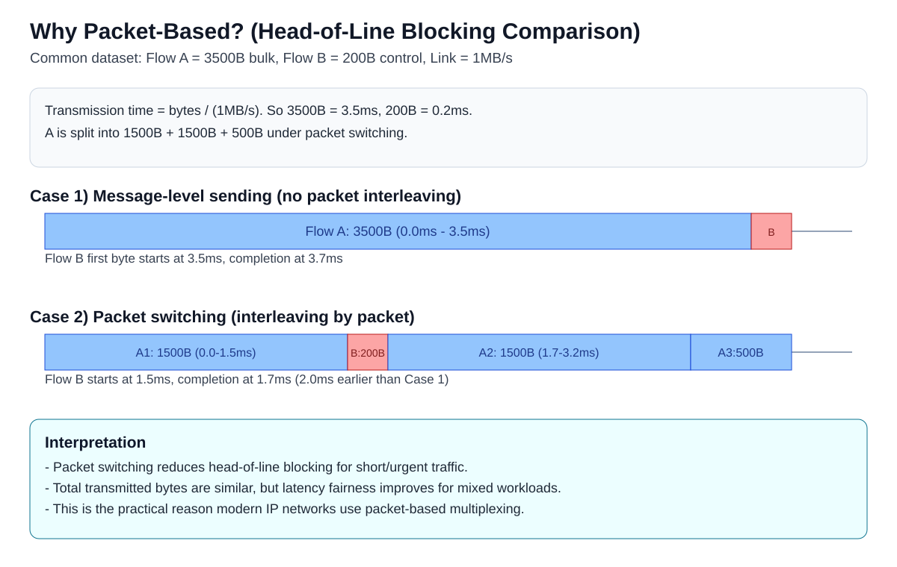
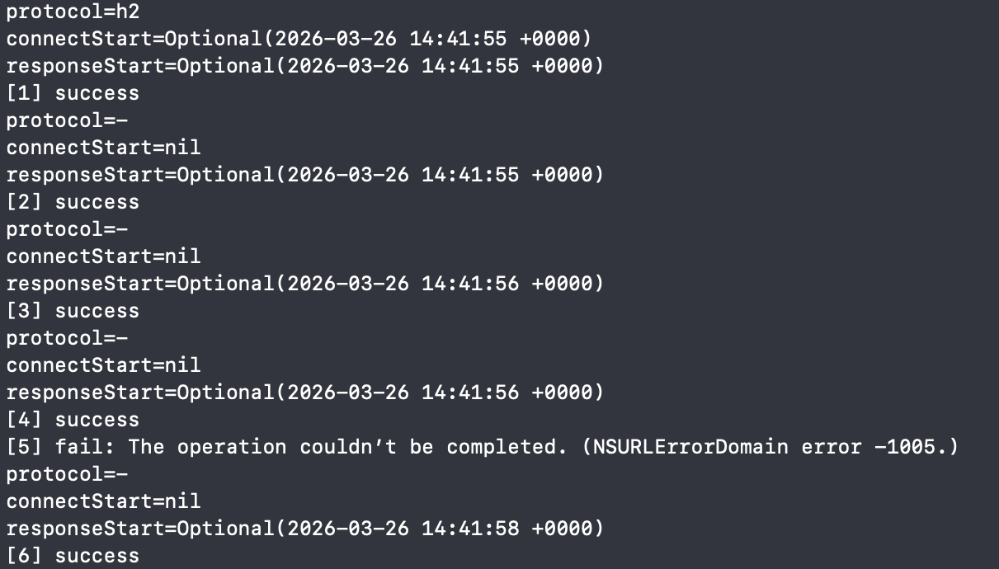

# Packet 기반 통신

### 학습 키워드
- Packet Switching, MTU, MSS, 캡슐화(L2/L3/L4)
- Ethernet/IP/TCP Header, Payload, Port, Seq/Ack
- Multiplexing(다중화), Head-of-Line Blocking, Next Hop
- Fragmentation, ARQ, TCP/QUIC 재전송
- URLSessionTaskMetrics, tcpdump, Network.framework

<br/>

## 1. 핵심 개념

### 계층 (L2/L3/L4)
네트워크에서는 계층마다 데이터 단위 이름이 다릅니다.

- L4(TCP): `세그먼트(Segment)`
- L3(IP): `패킷(Packet, IP Datagram)`
- L2(Ethernet): `프레임(Frame)`

전송할 때는 캡슐화되어 `세그먼트 -> 패킷 -> 프레임` 순서로 감싸지고, 수신 측에서는 반대로 벗겨집니다.

### 1) 데이터 분할 전송: 큰 메시지를 왜 쪼개는가?
네트워크는 "메시지 전체"를 한 번에 보내기보다, 일정 크기 단위(Packet)로 잘라 전송합니다.
핵심 제약은 네트워크 구간이 한 번에 실어 보낼 수 있는 최대 크기인 `MTU(Maximum Transmission Unit)`입니다.
패킷 안에는 제어 정보(헤더)와 실제 본문 데이터(`Payload`)가 함께 들어가므로, 본문에 쓸 수 있는 크기는 MTU보다 작습니다.
TCP에서는 이 본문의 최대 크기를 `MSS`(한 개 TCP 세그먼트에 담을 수 있는 payload 최대 크기)라고 부르고, 일반적으로 `MTU - IP 헤더 - TCP 헤더`로 계산합니다.



이 문서에서는 하나의 일관된 데이터셋으로 설명합니다.

- 애플리케이션 데이터: `3500B`
- Ethernet MTU: `1500B`
- IPv4 Header: `20B`, TCP Header: `20B`
- MSS(`1500 - 20 - 20`): `1460B`

따라서 3500B는 아래처럼 분할됩니다.

- Packet 1: payload `1460B`
- Packet 2: payload `1460B`
- Packet 3: payload `580B`


#### 계산 결과

| 항목 | 값 |
| --- | --- |
| 전송 패킷 수 | 3개 |
| IP 레이어 총 전송량 | `1500 + 1500 + 620 = 3620B` |
| TCP/IP 헤더 오버헤드 | `40B x 3 = 120B` |
| TCP/IP 오버헤드 비율 | `120 / 3620 ~= 3.31%` |

즉, 패킷 분할은 필수지만, 분할 단위가 작아질수록 헤더 오버헤드는 커집니다.

### 2) Packet 구조: 헤더 + 페이로드
Packet은 단순 데이터 덩어리가 아니라, 라우팅/무결성/재조립을 위한 메타데이터를 포함합니다.
이때 `Header`는 목적지/순서/검증 같은 제어 정보이고, `Payload`는 JSON이나 파일 조각 같은 실제 앱 데이터입니다.

- L2(Ethernet): MAC 주소, EtherType, FCS
- L3(IP): 출발지/목적지 IP, TTL(Hop Limit), Protocol
- L4(TCP/UDP): Port, 순서 제어(SEQ/ACK), 체크섬
- Payload: 실제 애플리케이션 데이터



위 3500B 예시 기준으로 보면:

- Full packet on wire: `1518B` (Ethernet 14 + IP 20 + TCP 20 + Payload 1460 + FCS 4)
- Tail packet on wire: `638B` (Ethernet 14 + IP 20 + TCP 20 + Payload 580 + FCS 4)

포인트는 "Payload는 매번 달라져도 Header는 매 패킷 반복"된다는 점입니다.

#### e.g. 같은 데이터라도 Header가 다르면 의미가 달라진다
아래 둘은 payload 텍스트가 같아도, 네트워크 입장에서는 다른 흐름입니다.

- Packet X: `dst port = 443`, `protocol = TCP` -> HTTPS 서버로 전달
- Packet Y: `dst port = 80`, `protocol = TCP` -> HTTP 서버로 전달

즉 payload만으로는 충분하지 않고, Header가 "어디로/어떻게"를 결정합니다.

#### 실제로는 이렇게 실리고(캡슐화) 해석된다
예를 들어 같은 payload `GET /health HTTP/1.1`를 보낸다고 가정하면:

1. 앱 계층: HTTP 요청 문자열 생성
2. TCP 계층: TCP 헤더를 붙이며 `dst port`를 기록 (`443` 또는 `80`)
3. IP 계층: IP 헤더를 붙이며 `protocol=6(TCP)`와 목적지 IP를 기록
4. Ethernet 계층: 프레임 헤더를 붙여 wire로 전송

수신 측은 반대로 벗겨가며 해석합니다.

1. L2(Ethernet): EtherType을 보고 IP 패킷으로 전달
2. L3(IP): `protocol=6`을 보고 TCP로 전달
3. L4(TCP): `dst port`를 보고 해당 소켓/프로세스에 전달
4. 앱 계층: 443이면 보통 HTTPS(TLS), 80이면 HTTP 핸들러가 처리

즉 `dst port`는 라우팅이 끝난 뒤 "서버 안에서 어느 서비스가 처리할지"를 최종 결정하는 키입니다.


### 3) 왜 Packet 기반인가?
Packet 기반이 핵심인 이유는 "공정한 공유 + 장애 격리 + 유연한 라우팅" 때문입니다.
즉 여러 흐름을 같은 링크로 섞어 보내는 `Multiplexing(다중화)`이 가능하고,
앞의 큰 전송 때문에 뒤의 작은 전송이 기다리는 `HoL(Head-of-Line) Blocking`을 줄이기 쉽습니다.
또 손실 시에는 `ARQ`(ACK 기반 재전송)로 필요한 패킷만 다시 보내 복구할 수 있습니다.

#### (1) 짧은 트래픽 지연을 줄인다
대용량 전송이 링크를 오래 점유하면 짧은 제어 트래픽이 뒤에서 대기합니다.
이게 `Head-of-Line Blocking(HoL Blocking)`입니다. (큐 앞의 큰 작업이 뒤 작업을 막는 현상)
패킷 단위로 섞어 보내면(다중화) 짧은 트래픽이 더 빨리 통과합니다.



같은 데이터셋(`A=3500B`, `B=200B`, `1MB/s 링크`)에서
(이 그림은 다중화 개념 설명을 위해 A를 `1500 + 1500 + 500B`로 단순화):

- 메시지 단위 전송: B 완료 `3.5ms`
- 패킷 단위 전송: B 완료 `1.5ms`

짧은 트래픽 체감 지연이 `2.0ms` 개선됩니다.

#### e.g. 실사용 시나리오(사진 업로드 + 채팅 메시지)
- 상황: 사용자 A가 `3500B` 사진 메타데이터를 업로드하는 동시에, 사용자 B가 `200B` 채팅 메시지를 전송
- 그림 기준으로 A는 `1500B -> 1500B -> 500B`로 나눠 전송되고, B는 `200B`로 전송됨
- 메시지 단위 전송이면: B는 A의 `3500B` 전송이 끝난 뒤 시작해서 약 `3.5ms`에 완료
- 패킷 단위 전송이면: A의 첫 `1500B` 뒤에 B를 끼워 보내 약 `1.5ms`에 완료

이게 실시간 서비스에서 packet switching이 기본인 이유입니다.

#### (2) 장애 범위를 줄인다
큰 메시지 전체가 아니라 손실된 패킷만 재전송하면 되므로, 복구 비용을 낮출 수 있습니다.
(TCP는 `ARQ(ACK 기반 재전송)`로 이 동작을 수행)

#### (3) 네트워크 확장성이 높다
라우터는 목적지 IP를 보고 패킷마다 `다음 홉(next hop)`을 고릅니다.
다음 홉은 최종 목적지가 아니라, 바로 다음에 넘길 이웃 라우터입니다.
그래서 특정 링크가 막히면 라우팅 테이블이 갱신되고, 이후 패킷은 다른 경로로 우회할 수 있습니다.

e.g. 평소 `A -> R1 -> R2 -> B`를 쓰다가 `R1-R2` 장애가 나면, `A -> R1 -> R3 -> B`로 전환됩니다.

<br/>

## 2. 탐구하기 / iOS 연결지점

### 1) 패킷 뜯어보기 (macOS)

1. 인터페이스 확인 (`en0` 같은 활성 인터페이스)


```bash
ifconfig | grep -E "^[a-z0-9]+:"
```

- `lo0`: 루프백(내 장비 내부 통신, 127.0.0.1)
- `en0`/`en1`: 물리 네트워크 인터페이스(보통 Wi‑Fi/유선 후보)
- `utun*`: VPN/터널 계열 가상 인터페이스
- `awdl0`, `llw0`: Apple 근거리 무선 기능(AirDrop 등) 관련 인터페이스
- `bridge0` 등: 가상 브리지 인터페이스

</br>

2. Ethernet 헤더 + IP/TCP 기본 필드 보기
```bash
sudo tcpdump -i en0 -e -nn "tcp port 443" -c 20
```
`en0`에서 HTTPS(443) TCP 패킷 20개를 캡처하고, L2(Ethernet) 헤더까지 숫자 형태로 출력

출력 :

```text
22:45:50.804793 aa:aa:aa:aa:aa:aa > bb:bb:bb:bb:bb:bb,
ethertype IPv6 (0x86dd), length 118:
<src-ip>.52534 > <dst-ip>.443: Flags [P.], seq x:y, ack z, win n, length 32
```

- `aa.. > bb..`: Ethernet `src MAC -> dst MAC` (L2)
- `ethertype IPv6 (0x86dd)` / `IPv4 (0x0800)`: 프레임 안의 상위 프로토콜 종류
- `<src-ip>.<src-port> > <dst-ip>.443`: TCP 흐름 방향 (`443`은 HTTPS 서버 포트)
- `Flags [P.]`: 데이터를 실은 PUSH + ACK. 수신 측 애플리케이션에 버퍼 데이터를 빠르게 전달하라는 힌트를 주고, 동시에 상대가 보낸 바이트를 ACK로 확인합니다.
- `Flags [.]`: 데이터 없이 ACK만 전송. 상대가 보낸 데이터를 잘 받았다는 확인만 빠르게 보내 재전송 타이머를 줄이고, 흐름 제어를 안정적으로 유지합니다.
- `seq/ack`: TCP 바이트 단위 순서/확인 응답 번호
- `length`: TCP payload 길이(0이면 순수 ACK)

### 2) URLSession 지연/실패 주입 + Metrics 분석
`URLSession` 요청 전후에 인위 지연과 실패 확률을 주입하면, 재시도/지연 내성이 있는지 바로 확인할 수 있습니다.

여기서 `URLSessionTaskDelegate`를 사용해 요청 1건이 끝날 때마다
`didFinishCollecting` 콜백으로 `URLSessionTaskMetrics`를 받아
`networkProtocolName`, `connectStartDate`, `responseStartDate` 같은 지표를 확인할 수 있습니다.

```swift
import Foundation

struct FaultPolicy {
    let delayMs: ClosedRange<Int>
    let failRate: Double   // 0.0 ~ 1.0
}

enum FaultInjector {
    static func inject(_ policy: FaultPolicy) async throws {
        let ms = Int.random(in: policy.delayMs)
        try await Task.sleep(nanoseconds: UInt64(ms) * 1_000_000)
        if Double.random(in: 0..<1) < policy.failRate {
            throw URLError(.networkConnectionLost)
        }
    }
}

final class MetricsDelegate: NSObject, URLSessionTaskDelegate {
    func urlSession(_ session: URLSession,
                    task: URLSessionTask,
                    didFinishCollecting metrics: URLSessionTaskMetrics) {
        guard let t = metrics.transactionMetrics.last else { return }
        print("protocol=\(t.networkProtocolName ?? "-")")
        print("connectStart=\(String(describing: t.connectStartDate))")
        print("responseStart=\(String(describing: t.responseStartDate))")
    }
}

func runURLSessionExperiment() async {
    let delegate = MetricsDelegate()
    let session = URLSession(configuration: .ephemeral, delegate: delegate, delegateQueue: nil)
    let policy = FaultPolicy(delayMs: 100...800, failRate: 0.2) // 20% 실패
    let url = URL(string: "https://example.com")!

    for i in 1...20 {
        do {
            try await FaultInjector.inject(policy)
            _ = try await session.data(from: url)
            print("[\(i)] success")
        } catch {
            print("[\(i)] fail: \(error.localizedDescription)")
        }
    }
}
```

#### 메트릭 필드
| 필드 | 의미 | 사용 |
| --- | --- | --- |
| `URLSessionTaskMetrics` | 요청 1건의 네트워크 단계별 타이밍/프로토콜 정보를 담은 객체 | 패킷 자체가 아니라 앱 관점의 네트워크 동작을 본다 |
| `networkProtocolName` | 실제 사용된 앱 계층 프로토콜 이름 (`h2`, `h3`, `http/1.1` 등) | 프로토콜 전환(H2/H3) 확인에 유용 |
| `connectStartDate` | 연결 생성 시작 시각(TCP/TLS/QUIC 새 연결이 필요할 때) | `nil`이면 기존 연결 재사용 가능성 큼 |
| `responseStartDate` | 첫 응답 바이트를 받기 시작한 시각(TTFB 시작점) | 값이 늦으면 서버 대기/네트워크 지연 가능성 |

#### 결과

- `[1]`에서 `protocol=h2`, `connectStart=Optional(...)`가 찍혔으므로 첫 요청에서 실제 연결 생성이 발생한 것으로 해석할 수 있음
- `[2]~[4]`에서 `connectStart=nil`이 반복되므로 새 연결 생성 없이 기존 연결을 재사용한 패턴으로 볼 수 있음
- 중간에 `protocol=-`가 보이는 것은 `networkProtocolName`이 비어 반환된 케이스이며, 재사용/수집 시점 차이에서 나타날 수 있음
- `[5] fail: NSURLErrorDomain error -1005`는 연결 끊김 시나리오가 실제로 발생했음을 보여주고, 바로 뒤 `[6] success`는 앱이 이후 요청을 계속 처리했음을 보여줌

`URLSession`만으로는 패킷 내부를 직접 보지 못하므로, "앱 레벨 증상"과 "패킷 레벨 근거"를 분리해서 같이 봐야 합니다.

1. `URLSessionTaskMetrics`는 패킷 헤더 도구가 아니라, 지연 구간/연결 재사용 같은 "동작 패턴"을 보는 계측 도구.
2. 실패 주입 실험으로, 연결 끊김(`-1005`) 상황에서 앱의 에러 처리·재시도·복구 흐름이 정상인지 검증할 수 있다.
3. 원인 분석은 `tcpdump`(L2/L3/L4 근거), 사용자 영향 분석은 `URLSession`(성공률/응답시간)으로 역할을 나눠야 정확해진다.

#### 언제 적용할 수 있나
1. 릴리즈 전 네트워크 안정성 QA: 약한 네트워크에서 실패율/복구력 점검
2. H2/H3 전환 검토 시: `networkProtocolName`과 응답 타이밍 비교
3. 네트워크 코드 리팩터링 이후 회귀 점검: 연결 재사용이 깨졌는지 확인
4. "가끔만 느리다/실패한다"는 운영 이슈 재현: 주입 실험으로 재현성 확보

<br/>

## 3. 의문 / 논점

- 패킷은 작을수록 좋은가?
  - 아니다. 지연/다중화에는 유리할 수 있지만, 헤더 오버헤드와 CPU 처리 비용이 증가한다.
- IP Fragmentation을 적극 사용해도 되는가?
  - 지양하는 편이 좋다. 중간 경로에서 단편화가 일어나면 손실/재조립 실패 복잡도가 증가한다.
- UDP도 Packet 기반인가?
  - 그렇다. UDP도 Datagram(Packet) 단위 전송이며, TCP와 달리 순서/재전송을 보장하지 않는다.
- TCP 세그먼트와 IP 패킷은 같은 말인가?
  - 엄밀히 다르다. TCP는 L4 세그먼트, IP는 L3 패킷이며, 세그먼트가 IP 패킷에 캡슐화되어 전송된다.
- Ethernet 헤더는 패킷에 포함되는가?
  - IP 패킷 기준으로는 포함되지 않는다. on-wire Ethernet 프레임 기준으로는 포함되며, 홉마다 벗겨지고 다시 붙는다.
- 중간 패킷 유실이 나면 `URLSession`이 직접 재전송하는가?
  - 보통은 아니다. TCP(HTTP/1.1, H2) 또는 QUIC(H3) 계층이 재전송을 처리하고, 복구 실패 시에만 URLSession 에러로 올라온다.
- `URLSessionTaskMetrics`로 패킷 내부까지 볼 수 있는가?
  - 아니다. 타이밍/프로토콜/연결 재사용 패턴은 볼 수 있지만 `seq/ack`, 플래그, 재전송 원인은 `tcpdump`/Wireshark가 필요하다.
- `networkProtocolName`이 `-`로 보일 때는 실패인가?
  - 반드시 실패는 아니다. 재사용 연결/수집 시점 차이로 비어 있을 수 있으므로, 성공/실패는 `didCompleteWithError`와 함께 판단해야 한다.

<br/>

## 4. 참고 자료
- [RFC 791: Internet Protocol](https://www.rfc-editor.org/rfc/rfc791)
- [RFC 8200: Internet Protocol, Version 6 (IPv6) Specification](https://www.rfc-editor.org/rfc/rfc8200)
- [RFC 9293: Transmission Control Protocol (TCP)](https://www.rfc-editor.org/rfc/rfc9293)
- [RFC 768: User Datagram Protocol (UDP)](https://www.rfc-editor.org/rfc/rfc768)
- [RFC 1191: Path MTU Discovery](https://www.rfc-editor.org/rfc/rfc1191)
