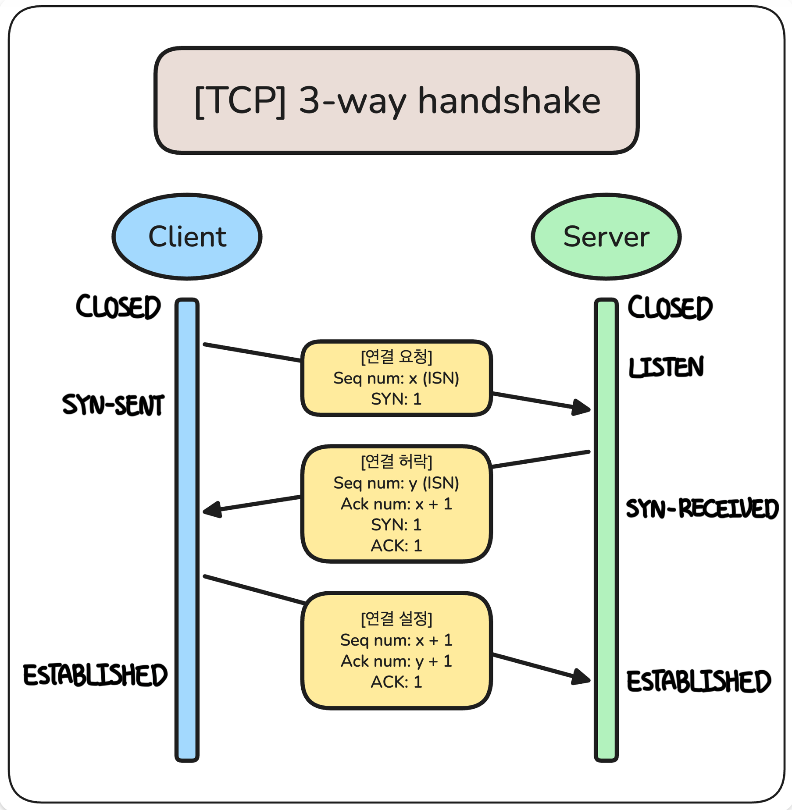
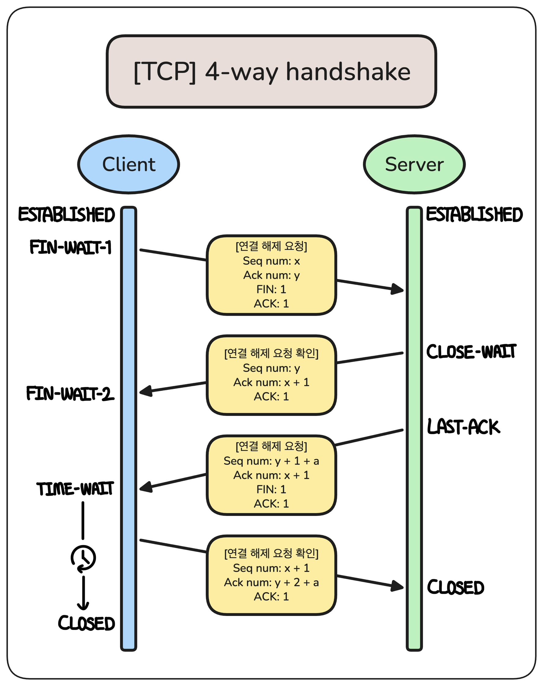
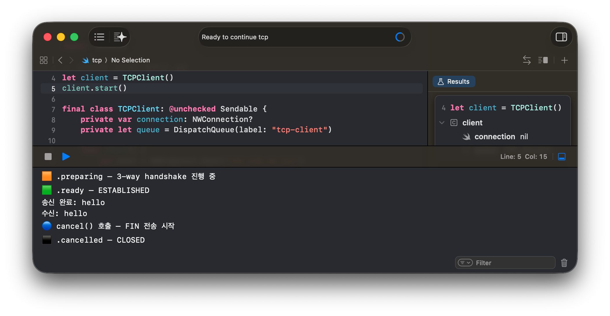
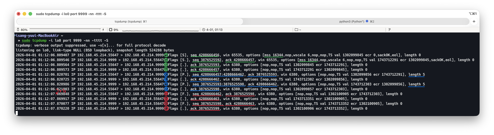
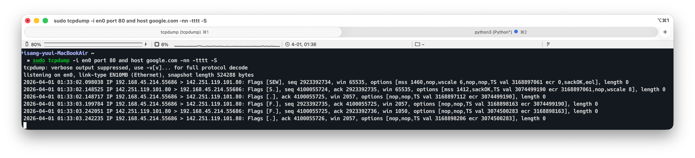
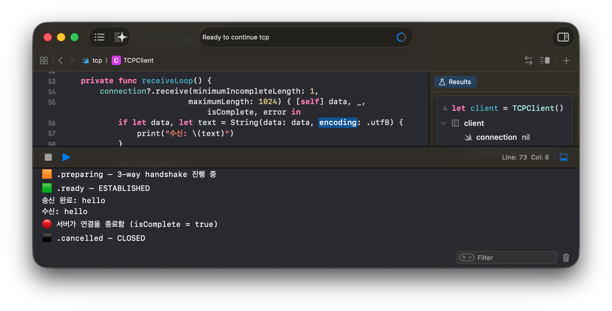
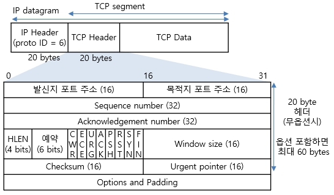

# TCP의 Handshake와 포트 상태

### 학습 키워드

`# TCP` `# 3-Way Handshake` `# 4-Way Handshake`

## 1. 핵심 개념

### TCP의 Handshake

#### 종류

TCP는 장치 간의 연결을 위해 3-way handshake, 연결 해제를 위해 4-way hanshake 프로세스를 사용한다.  
**3-way handshake를 통해 송수신자가 각자 준비되었고, 동기화 되었음을 보장**한다.  
**데이터 유실을 방지하며 안전하게 연결을 해제할 수 있도록 4-way handshake** 방식을 사용한다.

#### 포트 상태

TCP 포트 상태는 그 포트를 사용하는 특정 프로세스와 상대방 사이의 통신 흐름이 어느 단계에 있는지를 나타낸다.  
| 나타나는 단계 | 상태 | 의미 |
|---------|----------------|-------------------------------------------------|
| 🟧 연결 설정 | `LISTEN` | 연결 요청을 기다리는 상태 |
| 🟧 연결 설정 | `SYN-SENT` | 연결 요청 후 응답을 기다리는 상태 |
| 🟧 연결 설정 | `SYN-RECEIVED` | 연결 요청에 대해 응답을 보내고 마지막 확인을 기다리는 상태 |
| 🟩 연결 완료 | `ESTABLISHED` | 연결된 상태 |
| 🟦 연결 종료 | `FIN-WAIT-1` | 연결 해제 요청을 보내고 응답을 기다리는 상태 |
| 🟦 연결 종료 | `FIN-WAIT-2` | 연결 해제 요청에 대한 응답은 받았으나, 상대의 해제 요청을 기다리는 상태 |
| 🟦 연결 종료 | `CLOSE-WAIT` | 상대의 연결 해제 요청에 응답한 후, 자신의 종료 처리를 기다리는 상태 |
| 🟦 연결 종료 | `LAST-ACK` | CLOSE-WAIT 상태였던 자신이 해제 요청을 보낸 후 마지막 응답을 기다리는 상태 |
| 🟦 연결 종료 | `CLOSING` | 양쪽에서 동시에 해제 요청을 주고받았으나 응답은 받지 못한 상태 |
| 🟦 연결 종료 | `TIME-WAIT` | 모든 연결 해제 절차가 끝나고 뒤늦게 도착할 패킷을 기다리는 상태 |
| 🟦 연결 종료 | `CLOSED` | 연결 수립을 시작하기 전의 기본 상태 |

#### 제어 플래그

> 참고 자료: http://www.ktword.co.kr/test/view/view.php?m_temp1=2437&id=1103

TCP 헤더에는 연결과 데이터를 관리하기 위한 제어 플래그 필드가 있다.  
각 필드는 1비트로 구성되며 해당 플래그를 킬 때 `1`로 설정, 끌 때 `0`으로 설정한다.

아래 표는 일부 주요 플래그를 설명한다.  
| **플래그** | **역할** |
|--------------------------|----------------------------------------------|
| **SYN** (Synchronize) | **연결 요청.** 시퀀스 번호를 동기화하여 연결을 시작할 때 사용 |
| **ACK** (Acknowledgment) | **응답 확인.** 상대방으로부터 패킷을 잘 받았음을 알릴 때 사용 |
| **FIN** (Finish) | **연결 종료.** 데이터 전송이 끝나고 연결을 정상적으로 끊고 싶을 때 사용 |
| **RST** (Reset) | **강제 연결 해제.** 문제가 발생하여 연결을 즉시 중단하거나 거부할 때 사용 |

---

### 3-Way Handshake

1. **연결 요청**
   - Sequence number: ISN 생성 후 헤더에 포함
   - SYN 플래그 1로 설정
   - 클라이언트 포트 상태: CLOSED -> SYN-SENT
2. **연결 허락**
   - Sequence number: ISN 생성 후 헤더에 포함
   - Acknowledgement number: 수신한 순서 번호 + 1
   - SYN과 ACK 플래그 1로 설정
   - 서버 포트 상태: LISTEN -> SYN-RECEIVED
3. **연결 설정**
   - Sequence number: 전에 저장한 자신의 순서 번호 + 1
   - Acknowledgement number: 수신한 순서 번호 + 1
   - ACK 플래그 1로 설정
   - 클라이언트는 전송하면서 ESTABLISHED로 상태 변경
   - 서버는 수신하고 ESTABLISHED로 상태 변경.

> **ISN (Initial Sequence Number)** - [참고 자료](https://itwiki.kr/w/TCP_%EC%8B%9C%ED%80%80%EC%8A%A4_%EB%B2%88%ED%98%B8)  
> 보안과 데이터 무결성을 위해 순서 번호를 무작위로 선택하여 설정한다.  
> 연결 시 이 값을 교환하고 ACK 패킷으로 연결을 확인한다.
>
> - 보안 - 외부에서 예측하기 쉽지 않도록 한다.
> - 데이터 무결성 - 동일한 호스트 간의 연결 시 이전 연결에서 네트워크 정체로 인해 늦게 도착한 패킷이 새로운 연결의 번호 범위 안에 들어오게 되어 이를 정상적인 데이터로 착각해 받아들일 상황을 방지한다.

---

### 4-Way Handshake

> 클라이언트와 서버가 마지막으로 보낸 바이트 번호를 각각 x와 y라고 가정한 채 아래를 설명합니다.

1. **Client의 FIN**
   - Sequence number: x + 1
   - Acknowledgement number: y + 1
   - FIN과 ACK 플래그 1로 설정
   - 클라이언트 포트 상태: ESTABLISHED -> FIN-WAIT-1
2. **Server의 ACK**
   - Sequence number: y
   - Acknowledgement number: x + 2
   - ACK 플래그 1로 설정
   - 클라이언트 포트 상태: FIN-WAIT-1 -> FIN-WAIT-2
   - 서버 포트 상태: ESTABLISHED -> CLOSE-WAIT
3. **Server의 FIN**
   - Sequence number: y + 1 (그 사이 보낸 데이터가 있으면 더 증가)
   - Acknowledgement number: x + 2
   - FIN과 ACK 플래그 1로 설정
   - 클라이언트 포트 상태: FIN-WAIT-2 -> TIME-WAIT
   - 서버 포트 상태: CLOSE-WAIT -> LAST-ACK
4. **Client의 ACK**
   - Sequence number: x + 2
   - Acknowledgement number: y + 2 (그 사이 보낸 데이터가 있으면 더 증가)
   - ACK 플래그 1로 설정
   - 서버 포트 상태: LAST-ACK -> CLOSED

클라이언트 포트 상태는 정해진 시간동안 대기한 후 TIME-WAIT -> CLOSED 로 변한다.

 

#### 데이터 유실을 방지하기 위한 3가지 요소를 확인할 수 있다.

**(1) 연결 해제 요청을 받은 측도 FIN 패킷을 따로 전송한다.**

클라이언트는 연결 해제를 원하더라도 서버는 아직 보낼 데이터가 남아있을 수 있음을 고려한 방법이다.  
서버는 클라이언트의 FIN에 응답(ACK)을 보낸 후 자신의 작업을 마무리 한 후 FIN 패킷을 보낸다.

**(2) Half-Close 기법을 사용한다.**

연결 해제를 요청할 때 절반만 닫고 보내는 기법이다.  
FIN은 “나는 더 이상 보낼 데이터가 없다”는 의미이며, ACK는 지금까지 받은 데이터에 대한 확인이다.  
자신은 이제 보낼 데이터가 없지만, 너가 주는 데이터는 이어서 받겠다는 말이다.  
따라서 FIN을 보내더라도 상대방은 계속 데이터를 보낼 수 있다.

**(3) TIME_WAIT 상태를 거친 뒤 연결을 완전히 해제한다.**

서버가 작업을 마무리하고 FIN 패킷을 보냈는데, FIN 패킷 이전에 보낸 패킷이 더 늦게 도착할 경우를 고려한 방법이다.  
그래서 클라이언트는 서버의 FIN 패킷을 받고나서 일정 시간을 대기한 후 완전한 연결 해제 상태로 변한다.  
더해서 클라이언트의 마지막 ACK 패킷이 유실되었을 때, 서버가 재전송하는 FIN에 대해 ACK을 다시 보낼 수 있도록 한다.  
이를 통해 둘 다 안전하게 연결을 해제할 수 있도록 도와준다.

## 2. 탐구 내용 (실무 / iOS 연결)

### NWConnection의 상태 머신과 TCP 포트 상태 매핑

> `URLSession`은 handshake 과정을 추상화해 잘 드러나지 않지만, `Network` 프레임워크를 통해 그 과정을 관찰하고자 했습니다.  
> `NWConnection`의 상태 전이가 앞서 배운 TCP의 어떤 단계에 대응되는지 확인합니다.  
> 패킷 캡처를 읽어 네트워크 디버깅 시 연결 상태를 판단하는 데 도움이 될 수 있습니다.

1. Python으로 간단한 echo 서버를 띄워둔다. (references/test/tcp-handshake/echo_server.py)
2. `NWConnection` 클라이언트를 만든다. (references/test/tcp-handshake/tcpConnection.swift)
3. Mac 터미널에서 에코 서버를 띄운 상태로 다음 명령을 실행한다.
   - `sudo tcpdump -i any port 9999 -nn -tttt`

#### Swift 코드

1. `NWConnection` 인스턴스 생성
2. `connection.start(queue:)` 호출 -> **3-way handshake 시작**
3. `.ready` 상태에서 `sendThenReceiveThenDisconnect()` 호출
   - `sendThenReceiveThenDisconnect()`는 이름처럼 데이터 전송, 수신, 연결 해제를 차례대로 수행하도록 구현해둔 메소드다.
4. c`onnection.send("hello")` 실행
5. 데이터 송신 후 에코 서버가 돌려보낸 `“hello”` 수신
6. 데이터 수신 후 1초 타이머
7. 1초 후 `connection.cancel()` 실행 -> **4-way handshake 시작**
8. `.cancelled` 콜백에서 완전한 연결 해제 확인

#### 결과 확인

> **명령어**
> `sudo tcpdump -i lo0 port 9999 -nn -tttt -S`
>
> - `tcpdump`: 네트워크 패킷 캡처 및 출력 명령어
> - `-i lo0`: 루프백 인터페이스
> - `port 9999`: 포트 번호 9999인 패킷
> - `-nn`: IP 주소와 포트 번호 그대로 표시
> - `-tttt`: 시간 출력 형식 지정 (전체 날짜+시간)
> - `-S`: 순서 번호 절대값으로 표현 -> 생략 시 상대값으로 출력됨
>
> **Flag 의미**
>
> - `S`: SYN
> - `.`: ACK
> - `P`: PUSH
> - `F`: FIN

**🟢 3-Way Handshake**  
| **#** | **방향** | **플래그** | **seq** | **ack** | **의미** |
|:-----:|:----------:|:-------:|:----------:|:----------:|:-----------------------------:|
| 1 | 클라이언트 → 서버 | [S] | 4208666456 | — | SYN, ISN 전송 |
| 2 | 서버 → 클라이언트 | [S.] | 3876525592 | 4208666457 | SYN+ACK, 서버 ISN + 클라이언트 ISN+1 |
| 3 | 클라이언트 → 서버 | [.] | — | 3876525593 | ACK, 연결 완료 |
| 4 | 서버 → 클라이언트 | [.] | — | 4208666457 | ACK (추가 확인) |

> 4번은 handshake의 일부가 아니라, 서버 OS가 클라이언트의 ACK를 받은 뒤 보낸 **추가 ACK**다. 로컬 loopback 환경에서만 이렇다고 한다.
>
> **이 내용을 확인하기 위해 원격 서버(구글의 HTTP 서버)와 연결을 해봤다.**  
> 연결 설정과 해제만 관찰하기 위해 데이터 송수신 코드를 제외하고 실행해봤다.  
> 
> 연결 설정에서 3-way handshake 후 **추가 ACK가 없는 것을 확인했다.**  
> `[SEW]`의 S는 SYN이고, E와 W는 **ECN(Explicit Congestion Notification)** 관련 플래그다. 네트워크 혼잡 상황을 라우터가 패킷에 표시해주면 송수신자가 전송 속도를 조절할 수 있게 해주는 기능인데, 클라이언트가 "나 ECN 지원해"라고 알리는 플래그다. 로컬에서는 혼잡이 발생할 일이 없으니 안 붙었고, 실제 인터넷 통신에서 OS가 자동으로 켠 상황이다.
>
> **또 다른 점은 연결 해제에서 구글 서버가 ACK와 FIN을 합쳐서 보낸 점**이다. 서버 입장에서 보낼 데이터가 전혀 없으니, 굳이 ACK를 따로 보내고 기다릴 이유가 없다. 이걸 **piggybacking**이라고 한다.
>
> 원격 서버와의 연결에서는 추가 ACK가 없는 것을 확인했는데, 루프백 환경에서 왜 추가 ACK를 보내는지는 알지 못했다…

**🔵 데이터 송수신**  
| **#** | **방향** | **플래그** | **seq 범위** | **ack** | **length** | **의미** |
|:-----:|:----------:|:-------:|:---------------------:|:----------:|:----------:|:-----------------:|
| 5 | 클라이언트 → 서버 | [P.] | 4208666457:4208666462 | 3876525593 | 5 | "hello" 전송 (5바이트) |
| 6 | 서버 → 클라이언트 | [.] | — | 4208666462 | 0 | 데이터 수신 확인 |
| 7 | 서버 → 클라이언트 | [P.] | 3876525593:3876525598 | 4208666462 | 5 | "hello" 에코 (5바이트) |
| 8 | 클라이언트 → 서버 | [.] | — | 3876525598 | 0 | 에코 수신 확인 |

`4208666457:4208666462`와 `3876525593:3876525598`은 시퀀스 번호로 5바이트, 즉 `"hello"`가 정확히 담긴 거다.  
서버가 `ack 4208666462`을 보낸 건 `4208666461`번까지 잘 받았다는 뜻이다.

**🔴 4-Way Handshake (연결 해제)**  
| **#** | **방향** | **플래그** | **seq** | **ack** | **의미** |
|:-----:|:----------:|:-------:|:----------:|:----------:|:------------------:|
| 9 | 클라이언트 → 서버 | [F.] | 4208666462 | 3876525598 | FIN+ACK, 연결 해제 요청 |
| 10 | 서버 → 클라이언트 | [.] | — | 4208666463 | ACK, FIN 수신 확인 |
| 11 | 서버 → 클라이언트 | [F.] | 3876525598 | 4208666463 | FIN+ACK, 서버도 해제 요청 |
| 12 | 클라이언트 → 서버 | [.] | — | 3876525599 | ACK, 서버 FIN 수신 확인 |

#### 서버에서 먼저 연결 해제하는 상황

클라이언트가 FIN을 보내기 전 1초 대기하던 타이머의 시간을 10초로 변경했다.  
이 코드를 실행한 뒤, 데이터 송수신이 끝나고 클라이언트가 FIN을 보내기 전 서버 터미널에서 `CTRL+C`를 눌러 서버를 종료했다.  
그때 연결 해제 부분에서 다음과 같은 결과가 나왔다:  
| **시간** | **방향** | **플래그** | **의미** |
|:-:|:-:|:-:|:-:|
| 01:48:46.26 | 서버 → 클라이언트 | [F.] | 서버가 먼저 FIN 전송 (Ctrl+C로 종료) |
| 01:48:46.26 | 클라이언트 → 서버 | [.] | 클라이언트 OS가 자동으로 ACK 응답 |
| 01:48:52.10 | 클라이언트 → 서버 | [F.] | 클라이언트가 FIN 전송 (cancel() 호출) |
| 01:48:52.10 | 서버 → 클라이언트 | [.] | 서버 OS가 ACK 응답 |

**서버가 먼저 종료되었기 때문에 FIN의 시작이 서버**였다.  
서버 FIN(01:48:46)과 클라이언트 FIN(01:48:52) 사이에 **약 6초 간격**이 있다. 이 6초 동안 클라이언트는 서버의 FIN에 ACK는 보냈지만 자기 FIN은 아직 안 보낸 상태, 즉 앞서 정리한 **FIN-WAIT-2 / CLOSE-WAIT** 상태다.

타이머를 10초로 설정했고, 데이터 송수신이 01:48:41에 끝났으니 `cancel()`은 01:48:51쯤 호출될 예정이었다. 서버가 01:48:46에 먼저 `FIN`을 보냈지만, 클라이언트 코드는 그걸 모르고 타이머가 끝날 때까지 기다린 뒤 01:48:52에 `cancel()`을 호출했다. -> 6초 간격의 이유

**Xcode 콘솔에는 처음 실험했을 때처럼 정상적인 로그가 출력되었다.**  
stateUpdateHandler에 `.failed`나 `.waiting` 같은 전이가 찍히지 않은 상황이다. **서버가 `FIN`을 보내도 `NWConnection`은 `.ready`(`ESTABLISHED`) 상태를 유지**한 것이다.

그 이유는 실험 코드에서 `connection.receive()`를 한 번만 호출했기 때문이다.  
한 번만 수신하고 그 뒤에 오는 패킷은 무시하는 코드를 작성했는데, **실무에서는 TCP 연결을 유지하는 동안 receive를 루프를 통해 계속 열어두는 게 일반적**이다.  
**receive를 계속 걸어두는 코드로 수정하고 난 뒤 다시 상황을 재현하니 다음처럼 서버의 FIN을 확인하는 로그**가 출력됐다.  

#### 신기한 상황 발견

`connect()`를 호출하고, 해당 코드를 지운 후 `disconnect()`만 적은 채 실행해봤다.  
Xcode 콘솔에서는 `🔵 cancel() 호출 — FIN 전송 시작`를 출력하고 연결 해제 완료가 확인되지 않았다.  
`tcpdump`에도 아무것도 찍히지 않았다.  
그런데 서버 터미널에는 연결 종료가 확인되었다.

`NWConnection`은 인스턴스 단위로 상태를 관리하는데, 다시 빌드하면서 인스턴스가 사라진다.  
새로 만든 `NWConnection`은 `start()`를 호출한 적이 없어 `.setup` 상태이고, `.setup` 상태에서 `cancel()`을 호출하면 TCP 레벨에서 보낼 `FIN` 자체가 없다.

서버 터미널에서 연결 종료가 확인된 건, 이전 실행에서 맺은 TCP 연결이 클라이언트 프로세스 종료와 함께 OS가 정리하면서 `FIN`을 보냈기 때문이다.  
즉, 앱이 아니라 커널이 소켓을 정리한 상황이다!  
**TCP 연결의 생명주기를 OS 커널이 관리하면서 앱이 크래시되어도 OS가 `FIN`을 보내 상대에게 알려주는 것을 확인했다.**

> 프로젝트의 실행을 종료하는 시점에 서버 터미널에 연결 종료 문구가 출력되는 것도 확인했다.

## 3. 의문 / 논점

### [1] 포트와 소켓이 같은 의미로 섞여서 설명되던데, 어떤 차이가 있을까?

포트는 하나의 호스트에서 여러 네트워크 서비스를 구분하기 위한 논리적 번호다. e.g. HTTP는 80, HTTPS는 443  
소켓은 통신의 양 끝점을 식별하는 조합이다.  
구체적으로 (IP 주소, 포트 번호, 프로토콜)의 조합이며, TCP에서는 보통 (로컬 IP, 로컬 포트, 원격 IP, 원격 포트)의 4-tuple로 하나의 연결을 고유하게 식별한다.  
핵심 차이: 서버의 포트 443 하나에 클라이언트 수천 개가 동시에 연결될 수 있다. 포트는 같지만, 각각의 소켓은 원격 IP와 원격 포트가 다르기 때문에 별개의 연결로 구분된다.

### [2] 순서 번호를 소비하는 방식이 궁금하다

> SYN 패킷은 1을 소비하고 ACK 패킷은 소비하지 않는 듯 하다.  
> Sequence number에 담기는 값은 보내는 측이 보낼 데이터의 크기, Acknowledgement number에 담기는 값은 나중에 받을 데이터의 크기가 계산될 처음 번호가 맞나?

Sequence number: 내가 보낼 데이터의 시작 바이트 번호  
Acknowledgement Number: 다음에 받고 싶은 바이트 번호  
SYN과 FIN은 상대방으로부터 확실한 확인(ACK)을 받아야 하는 "신뢰할 수 있는 이벤트”다.  
번호를 소비해야 상대가 ACK 번호로 수신을 확인해줄 수 있고, 유실 시 재전송도 가능해진다.
따라서 SYN과 FIN은 데이터는 없지만 논리적으로 1바이트를 차지한다.  
ACK는 단순 확인 응답으로, 그 자체에 대한 또 다른 응답을 요구하지 않아 번호를 소비하지 않는다.

### [3] TCP 옵션이 뭐지?

TCP 헤더의 고정 20바이트 뒤에 최대 40바이트까지 붙을 수 있는 가변 길이 필드다.  
주요 옵션:

- MSS (Maximum Segment Size): SYN 패킷에서 교환하며, 한 세그먼트에 담을 수 있는 최대 데이터 크기를 알려준다.
- Window Scale: 윈도우 크기 필드(16비트)의 한계를 넘어 더 큰 데이터를 전송하기 위해 배수를 설정한다.
- Timestamp: RTT(왕복 시간) 측정과 오래된 중복 세그먼트 방지에 사용된다.
- SACK (Selective Acknowledgment): 중간에 빠진 세그먼트가 있을 때, 어떤 범위를 이미 받았는지 알려줘서 필요한 부분만 재전송할 수 있게 한다.

_이미지 출처: http://www.ktword.co.kr/test/view/view.php?m_temp1=1889&id=1103_

### [4] 슬라이딩 윈도우와 체크섬이 궁금하다

**슬라이딩 윈도우**는 TCP의 흐름 제어(flow control) 메커니즘이다. 매번 한 세그먼트 보내고 ACK를 기다리면 너무 느리니까, "ACK를 받지 않아도 미리 보낼 수 있는 범위"를 윈도우로 정한다. 수신자가 TCP 헤더의 Window Size 필드로 "나 지금 이만큼 받을 수 있어"라고 알려주면, 송신자는 그 범위 내에서 ACK 없이 연속으로 보낸다. ACK가 돌아오면 윈도우가 앞으로 "슬라이드"해서 새로운 데이터를 보낼 수 있게 된다. 수신 버퍼가 가득 차면 윈도우 크기가 0이 되어 송신이 멈추고, 여유가 생기면 다시 열린다.

**체크섬**은 데이터가 전송 중에 깨지지 않았는지 확인하는 오류 검출용 합계다. 송신측이 헤더와 데이터를 특정 연산으로 계산해 체크섬 칸에 넣으면, 수신측도 같은 연산을 해서 결과가 일치하는지 확인한다.

### [5] 모든 예시가 Client의 요청으로 시작되는데, 예외의 경우가 있을까?

**연결 설정(3-way handshake)**: 항상 클라이언트가 시작한다. TCP에서 "클라이언트"의 정의 자체가 연결을 먼저 시도하는 쪽이기 때문이다. 다만 RFC 793에는 simultaneous open이라는 케이스가 정의되어 있어서, 양쪽이 동시에 SYN을 보내면 둘 다 SYN-SENT → SYN-RECEIVED → ESTABLISHED로 전이하며 연결이 수립된다. 실무에서는 극히 드물다.

**연결 해제(4-way handshake)**: 어느 쪽이든 먼저 FIN을 보낼 수 있습니다. 또한 양쪽이 동시에 FIN을 보내는 simultaneous close도 가능하며, 이때 CLOSING 상태가 사용된다.

### [6] 서버가 작업을 마무리하고 FIN+ACK를 보내는 게 아니라 ACK를 우선 보내는 이유가 뭘까?

ACK를 먼저 보내는 이유는 **두 가지 관심사를 분리**하기 위해서입니다. "상대의 FIN을 잘 받았다"는 사실의 확인과, "나도 이제 보낼 데이터가 없다"는 자신의 종료 선언은 별개의 이벤트다.  
만약 ACK를 바로 보내지 않으면, 클라이언트는 자신의 FIN이 유실되었다고 판단하고 재전송을 시도하게 된다.  
그래서 서버는 "FIN 잘 받았어"라는 ACK를 즉시 보내서 클라이언트의 재전송을 막고(CLOSE-WAIT 진입), 자기 할 일을 마무리한 뒤 준비가 되면 FIN을 보낸다.

## 4. 참고 자료

[Transmission Control Protocol \(TCP\)](https://www.geeksforgeeks.org/computer-networks/what-is-transmission-control-protocol-tcp/)  
[TCP 3 Way Handshake 란?](https://techjuny.tistory.com/entry/TCP-3-Way-Handshake-%EB%9E%80)  
[4-Way Handshake](https://hojunking.tistory.com/107)  
[\[네트워크\] TCP/UDP와 3 -Way Handshake & 4 -Way Handshake](https://velog.io/@averycode/%EB%84%A4%ED%8A%B8%EC%9B%8C%ED%81%AC-TCPUDP%EC%99%80-3-Way-Handshake4-Way-Handshake)  
[\[네트워크\] TCP 3-way & 4-way handshake란?](https://seongonion.tistory.com/74)
