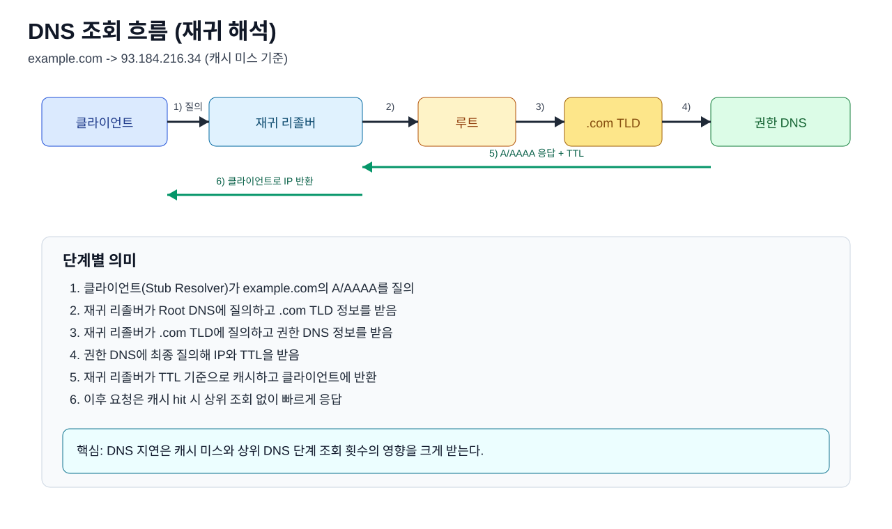
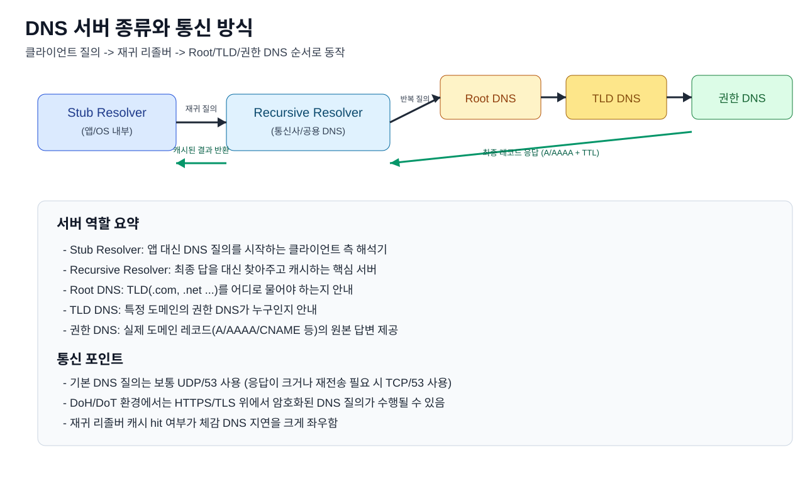
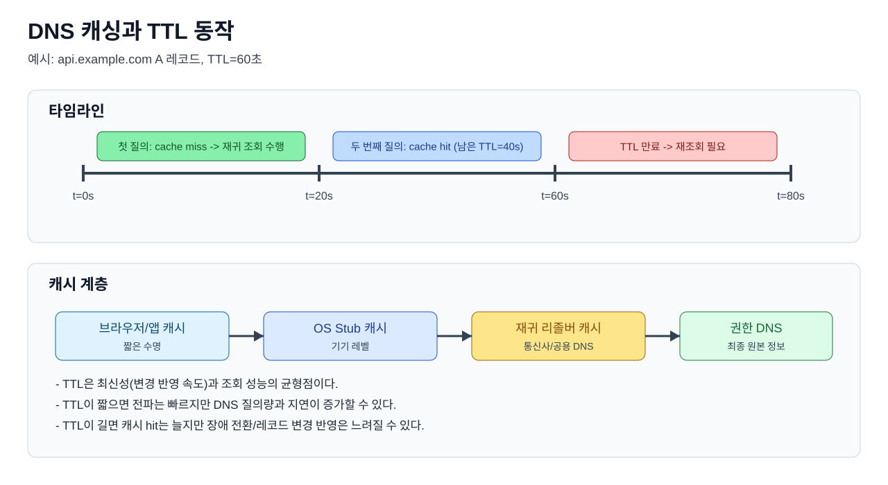
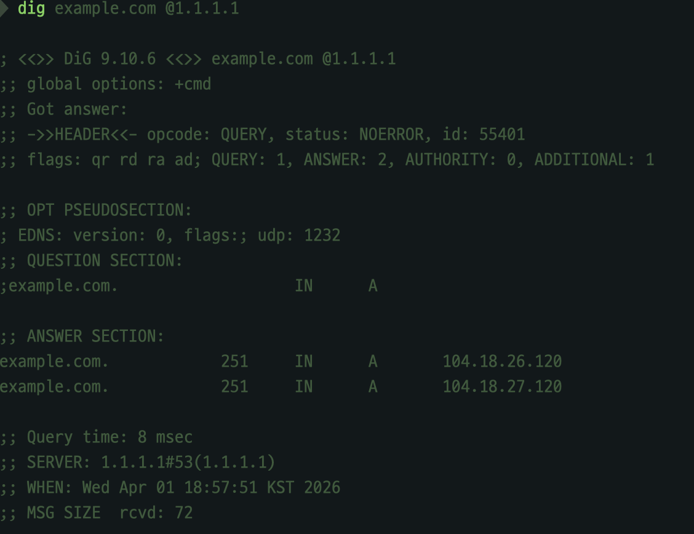
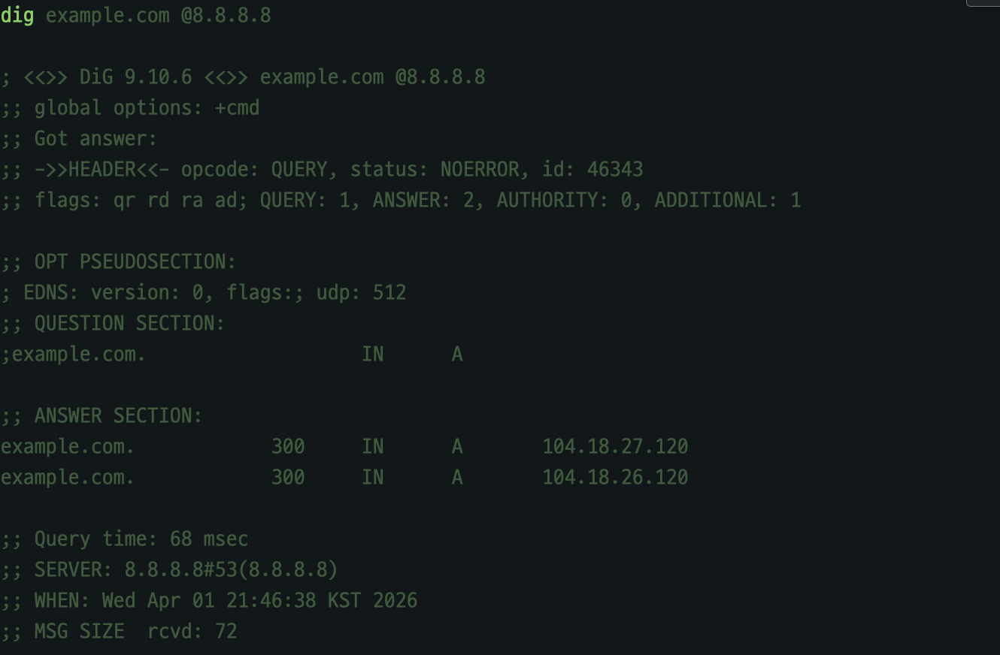

# DNS 역할

### 학습 키워드
- DNS, 도메인, IP 주소
- Stub Resolver, Recursive Resolver, Root/TLD/권한 DNS
- 재귀 조회(Recursive Lookup), 반복 조회(Iterative Lookup)
- 레코드(A/AAAA/CNAME/NS), TTL, 캐시 히트/미스
- `dig`, `URLSessionTaskMetrics(domainLookupStart/End)`

<br/>

## 1. 핵심 개념

DNS는 **사람이 읽는 이름(도메인)** 을 **컴퓨터가 통신하는 주소(IP)** 로 바꿔 주는 시스템입니다.

### DNS 요청에 무엇을 담아 보내나?
DNS 요청은 보통 아래 두 가지를 핵심으로 담아 보냅니다.

1. `QNAME`: 조회할 도메인 이름 (예: `example.com`)
2. `QTYPE`: 어떤 종류의 답이 필요한지 (예: `A`, `AAAA`, `CNAME`)

즉 클라이언트는 "이 도메인에 대해 어떤 레코드 타입을 달라"고 질의하고,  
DNS 서버는 그 타입에 맞는 레코드 데이터를 응답으로 반환합니다.

### 1) DNS가 하는 일: 도메인 -> IP 변환
사람은 `example.com` 같은 도메인을 기억하지만, 네트워크는 결국 IP 주소로 통신합니다.
DNS는 이 간극을 메우는 "이름 해석 시스템"입니다.

- 앱/브라우저는 도메인을 질의
- DNS는 해당 도메인의 레코드를 찾아 IP를 반환
- 반환된 IP로 실제 TCP/QUIC 연결이 시작

즉 DNS는 "연결 시작 전 첫 관문"이며, DNS가 느리면 앱의 첫 화면/첫 요청도 같이 느려질 수 있습니다.

### 2) 앱은 왜 통신사/공용 DNS에 먼저 물어보나?
앱이 DNS 서버를 직접 고르는 경우는 드뭅니다.  
보통은 OS가 네트워크 설정에 등록된 DNS 서버를 사용합니다.

- Wi-Fi: 공유기(DHCP)에서 전달받은 DNS 서버를 사용
- 셀룰러: 통신사 프로파일에 포함된 DNS 서버를 사용
- 수동 설정: 사용자가 공용 DNS(예: 8.8.8.8, 1.1.1.1)로 변경 가능

즉 앱 -> OS Stub Resolver -> 재귀 리졸버 순서로 질의가 전달됩니다.

### 3) DNS 조회 흐름 (재귀 조회)
`재귀 리졸버(Recursive Resolver)`는 모르는 답이면 단계적으로 상위 DNS에 물어 최종 IP를 찾아옵니다.



흐름 :
1. 클라이언트가 재귀 리졸버에 질의
2. 재귀 리졸버가 루트 DNS에 질의 (`.com` 정보 확인)
3. 재귀 리졸버가 `.com` DNS에 질의 (`example.com` 권한 DNS 확인)
4. 권한 DNS에서 최종 IP(A/AAAA)를 받음
5. 재귀 리졸버가 결과를 TTL 시간만큼 캐시
6. 클라이언트에 IP 반환

#### 레코드 타입이 중요한 이유
- `A`: IPv4 주소
- `AAAA`: IPv6 주소
- `CNAME`: 별칭(다른 도메인으로 위임)
- `NS`: 해당 존의 권한 DNS 서버 목록(다음에 물어볼 서버 안내)

여기서 CNAME이 여러 번 연결되면 조회 단계가 늘어나서 초기 지연이 커질 수 있습니다.

### 4) DNS 서버 종류와 서로 통신하는 방식
DNS는 한 대 서버가 전부 처리하는 구조가 아니라, 역할이 나뉜 서버들이 질의/응답을 이어받는 구조입니다.



서버별 역할:
1. `Stub Resolver` (클라이언트 측): 앱/브라우저 대신 DNS 질의를 시작
2. `Recursive Resolver` (재귀 리졸버): 최종 답을 대신 찾아와 캐시한 뒤 클라이언트에 반환
3. `Root DNS`: 어떤 TLD DNS에 물어야 하는지 안내
4. `TLD DNS` (`.com`, `.net` 등): 해당 도메인의 권한 DNS 위치 안내
5. `Authoritative DNS` (권한 DNS): 실제 A/AAAA/CNAME 같은 원본 레코드 응답

서로 통신하는 방식:
- `클라이언트 -> 재귀 리졸버`: "최종 답까지 찾아서 줘"라는 재귀 질의
- `재귀 리졸버 -> Root/TLD/권한 DNS`: 단계적으로 물어보는 반복 질의
- `권한 DNS -> 재귀 리졸버 -> 클라이언트`: 최종 레코드와 TTL 응답

#### DNS 질의 유형 3가지
- `재귀 질의(Recursive Query)`: 클라이언트가 "최종 답을 달라"고 요청
- `반복 질의(Iterative Query)`: DNS 서버가 `NS` 같은 위임 정보를 받아 다음 대상 서버로 단계적으로 추적
- `비재귀 질의(Non-recursive Query)`: 이미 캐시에 있거나 바로 권한이 있는 데이터라 즉시 응답 가능할 때

전송 관점:
- 일반 DNS는 보통 `UDP/53` 사용
- 응답이 크거나(분할 필요) 재전송/신뢰 전송이 필요하면 `TCP/53` 사용
- 보안 경로에서는 DoT(보통 853/TLS), DoH(HTTPS) 형태로 암호화 가능

### 5) 캐싱 개념: 왜 어떤 때는 빠르고 어떤 때는 느린가?
DNS는 같은 이름을 매번 새로 찾지 않도록 캐시를 씁니다.
그래서 같은 도메인을 반복 조회하면 `cache hit`로 매우 빠르게 응답할 수 있습니다.



캐시 관점 핵심:
- `TTL`이 남아 있으면 cache hit -> 빠른 응답
- `TTL`이 만료되면 cache miss -> 상위 DNS 재조회
- `TTL`이 짧으면 최신 반영은 빠르지만 DNS 질의량/지연 증가
- `TTL`이 길면 성능은 유리하지만 장애 전환/레코드 변경 반영이 느릴 수 있음

#### 캐시는 어디에 쌓이나?
- 브라우저 캐시: 같은 탭/세션에서 재요청 시 가장 먼저 히트 가능
- OS 캐시(Stub Resolver): 앱이 반복 요청할 때 DNS 질의를 줄임
- 재귀 리졸버 캐시(ISP/Public DNS): 여러 클라이언트가 같은 도메인을 조회할 때 공통 이득

즉 "DNS가 빨랐다/느렸다"는 한 지점 문제가 아니라, 어느 캐시 계층에서 hit/miss가 났는지로 해석해야 정확합니다.

#### Negative Caching
존재하지 않는 도메인(`NXDOMAIN`) 결과도 일정 시간 캐시됩니다.
오타 도메인을 반복 조회할 때 불필요한 상위 질의를 줄이는 데 유용합니다.

### 6) 중요한 포인트
- DNS는 보안 관점에서도 핵심이다.  
  DNS 응답이 바뀌면 사용자는 정상 사이트라고 믿고도 다른 서버로 접속할 수 있다.
  그래서 보통 아래 두 가지를 함께 본다.
  1. `DNSSEC`: "이 응답이 진짜 권한 DNS 데이터인지, 중간에 바뀌지 않았는지"를 검증하는 장치  
     - `DS`: 부모 존이 자식 존 공개키 지문을 들고 있어 신뢰 체인을 이어 주는 레코드  
     - `RRSIG`: A/AAAA/NS 같은 레코드 묶음(RRset)에 붙는 전자서명
  2. `DoH/DoT`: DNS 조회 구간 자체를 암호화해, 제3자가 질의 내용을 보거나 중간 변조하기 어렵게 만드는 전송 방식

  정리하면 `DNSSEC`은 "응답 진위/무결성 검증", `DoH/DoT`는 "조회 구간 암호화"를 담당한다.

- CDN/멀티리전에서는 "어떤 IP를 반환하느냐"가 성능 그 자체다.  
  같은 도메인이라도 DNS가 한국 사용자에게 한국/가까운 리전 IP를 주면 지연이 줄고,  
  먼 리전 IP를 주면 RTT가 늘어 첫 화면/응답 속도가 느려질 수 있다.  
  그래서 DNS 정책(Geo DNS, 가중치, 헬스체크 연동)은 트래픽 분산뿐 아니라 사용자 체감 속도에 직접 연결된다.

- 장애 대응에서 DNS는 즉시 스위치가 아니라 "전파 시간이 있는 제어 수단"이다.  
  레코드를 바꿔도 클라이언트/리졸버 캐시에 남아 있는 `TTL` 동안은 이전 IP로 계속 붙을 수 있다.  
  즉 "지금 바꿨는데 왜 안 바뀌지?"가 정상일 수 있고, 장애 훈련 시에는 TTL 전략(평시/비상시)을 미리 설계해야 한다.

<br/>

## 2. 탐구하기 / 실무 & iOS 연결지점

### 1) 터미널에서 DNS 흐름 확인
#### (1) 기본 조회
```bash
dig example.com +short
```
A/AAAA 결과를 간단히 확인해 현재 반환 IP를 빠르게 볼 수 있습니다.

#### (2) 재귀 경로 추적
```bash
dig example.com +trace
```
Root -> TLD -> Authoritative 순서로 실제 조회 경로를 단계별로 보여줌

#### (3) TTL 포함 상세 보기
```bash
dig example.com
```
ANSWER 섹션에서 TTL 값을 확인해 캐시 지속 시간을 해석

#### 결과
1. `.`(루트) 단계

   - 루트 NS 목록(`a.root-servers.net` ~ `m.root-servers.net`)을 받음
   - 이후 `.com`을 담당하는 TLD 서버 정보로 이동
2. `.com`(TLD) 단계

   - `a.gtld-servers.net` ~ `m.gtld-servers.net` 목록을 받음
   - `example.com`의 `NS`(권한 DNS)가 `hera.ns.cloudflare.com`, `elliott.ns.cloudflare.com`임을 확인
3. `example.com` 권한 DNS 단계

   - 최종 `A` 레코드 `104.18.27.120`, `104.18.26.120` 반환
   - TTL은 `300`으로 확인

지연 관찰:
1. Root 응답: 약 `9 ms`
2. TLD 응답: 약 `98 ms`
3. Authoritative 응답: 약 `22 ms`

즉 이번 측정에서는 `.com` TLD 구간이 상대적으로 가장 느린 홉

추가로 출력에 `DS`, `RRSIG`가 보이는 것은 DNSSEC 검증 체인 정보가 함께 내려왔다는 의미다입니다.
즉 `DS`(부모->자식 키 연결)와 `RRSIG`(레코드 전자서명)로 위임 관계와 응답 무결성 검증 정보를 함께 확인

### 2) 공용 DNS / 통신사 DNS 비교

국내 통신사 DNS :
1. SKT: `219.250.36.130`, `210.220.163.82`
2. KT: `168.126.63.1`, `168.126.63.2`
3. LG U+: `164.124.101.2`, `203.248.252.2`
4. Google Public DNS: `8.8.8.8`, `8.8.4.4`

이번에는 `1.1.1.1(Cloudflare)`와 `8.8.8.8(Google)`를 비교해보겠습니다. 여기서 핵심은 "절대 우위"가 아니라 "환경별 차이"입니다.
같은 사용자라도 통신사, 지역, 시간대, 캐시 상태에 따라 결과가 바뀔 수 있습니다.

기준:
1. 평균 지연(`Query time`)이 더 낮은가
2. 응답 시간 편차(튐)가 작은가
3. 장애/혼잡 상황에서도 일관성이 유지되는가
4. 운영 정책(로그, 프라이버시, DoH/DoT 지원)이 서비스 요구사항과 맞는가

비교 명령:
```bash
dig example.com @1.1.1.1
dig example.com @8.8.8.8
```
같은 도메인을 여러 번 조회해 `Query time` 평균/편차를 비교하면 됩니다.

#### 결과



1. `@1.1.1.1` 결과
   - `Query time`: `8 msec`
   - `SERVER`: `1.1.1.1#53`
   - `ANSWER`: `104.18.26.120`, `104.18.27.120`
   - `TTL`: `251`
2. `@8.8.8.8` 결과
   - `Query time`: `68 msec`
   - `SERVER`: `8.8.8.8#53`
   - `ANSWER`: `104.18.27.120`, `104.18.26.120`
   - `TTL`: `300`

결론:
1. 두 DNS 모두 같은 목적지 IP 쌍을 반환했으므로, 레코드 자체는 동일 계열 응답으로 볼 수 있음
2. 이번 기준 `Query time`은 `1.1.1.1(8ms)`이 `8.8.8.8(68ms)`보다 낮았음
3. `1.1.1.1`은 낮은 지연이 나오는 사례가 많고 프라이버시 관점이 강조되는 편
4. `8.8.8.8`은 매우 넓은 인프라 기반으로 안정적으로 쓰이는 편
5. 결론은 "내 트래픽 기준 실측"으로 정해야 함

<br/>

## 3. 의문 / 논점

- DNS는 한 번 조회하면 끝인가?
  - 아니다. TTL 만료 시 재조회가 필요하고, 네트워크/리졸버가 바뀌면 결과가 달라질 수 있다.
- TTL을 짧게 하면 무조건 좋은가?
  - 아니다. 전환은 빨라지지만 조회량 증가로 성능/비용에 불리할 수 있다.
- DNS가 느리면 앱이 느린가?
  - 첫 연결 단계에서는 그렇다. 특히 cold start에서 DNS 지연이 체감 성능에 크게 반영된다.
- `URLSession`으로 DNS 패킷 자체를 볼 수 있나?
  - 어렵다. URLSession은 타이밍 지표 중심이고, 패킷 레벨 분석은 `tcpdump`/Wireshark가 필요하다.

<br/>

## 4. 참고 자료
- [Cloudflare Learning Center - DNS란 무엇인가?](https://www.cloudflare.com/ko-kr/learning/dns/what-is-dns/)
- [RFC 1034: Domain Names - Concepts and Facilities](https://www.rfc-editor.org/rfc/rfc1034)
- [RFC 1035: Domain Names - Implementation and Specification](https://www.rfc-editor.org/rfc/rfc1035)
- [RFC 2308: Negative Caching of DNS Queries](https://www.rfc-editor.org/rfc/rfc2308)
- [RFC 8484: DNS over HTTPS (DoH)](https://www.rfc-editor.org/rfc/rfc8484)
- [NetxHack - DNS 요약 비교: 1.1.1.1 vs 8.8.8.8](https://netxhack.com/dns/1-1-1-1_vs_8-8-8-8/)
- [우노 - 통신사별 DNS 서버 아이피 주소 (SKT, KT, LG, 구글)](https://wooono.tistory.com/683)
