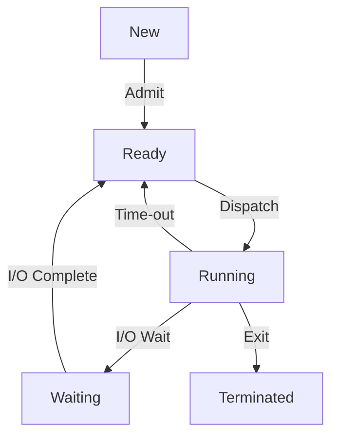

# 1. 내가 학습한 주제 / 작업
PCB(Process Control Block)와 Context Switching
# 2. 핵심 개념 / 문제
## PCB(Process Control Block)
### 개념
- 정의
	운영체제가 프로세스를 식별하기 위해 필요한 정보를 저장하는 자료 구조.
- 위치
	커널(Kernel) 메모리 영역에 보관.
### 구조
운영체제마다 차이가 있기에 교재 기준 대표적 내용만 기재.
- PID
	프로세스를 식별하기 위한 고유 번호.
- 레지스터 값
	프로세스가 멈출 때 레지스터에 담긴 값의 백업.
- 프로세스 상태
	생성, 준비, 실행, 대기, 종료
- CPU 스케줄링 정보
	프로세스가 언제, 어떻게 CPU를 할당받을지에 대한 정보.
- 메모리 관리 정보
	- Base/Limit register: 메모리 시작 주소와 길이를 저장하는 하드웨어 장치.
	- 페이지 테이블
		Base/Limit register를 이용한 방식이 연속된 물리 메모리 공간에 할당하다보니 External Fragmentation 문제가 발생. 
		- 페이징(Paging): 메모리를 일정한 크기로 분할하여 매칭.
		페이지 테이블은 페지이 기법으로 쪼개진 메모리에 대한 매핑 정보.
- 사용한 파일과 입출력 장치
	- 할당된 입출력장치 정보.
	- 프로세스가 실행 중 열어둔 File Descriptor 정보.
### 생명 주기
프로세스의 생명 주기와 같이 한다.
fork 등으로 프로세스가 생성되는 순간 ~ 부모 프로세스가 wait()으로 읽어가는 순간
### 용도
문맥 교환(Context Switching)을 위한 백업 정보.
## TCB(Thread Control Block)
### 개념
운영체제가 프로세스 내의 개별 스레드를 관리하기 위해 상태 정보를 저장하는 자료 구조.
### 구조
- TID
- PC(Program Counter): 코드 상 프로그램 실행 위치
- CPU 레지스터
- Stack Pointer: 스레드의 독립적인 Stack 영역 주소
- 스레드 상태
- 소속된 PCB 포인터
### 특징
- 기본적인 특징은 PCB와 유사.
- PCB는 커널 영역에 존재, TCB는 유저 영역과 커널 영역 둘 다 있을 수 있다. 
- 문맥 교환(Context Switching)#Process와 Thread Context Switching 비교
## Context Switching
### 개념
CPU가 다중 프로그래밍(Multitasking)을 구현하기 위해 현재 실행 중인 프로세스(또는 스레드)의 상태(Context)를 보관하고, 다음 순서로 실행할 프로세스의 상태를 CPU에 복원하는 작업.
### 단계
1. 인터럽트 발생: 프로세스가 Time Quantum을 모두 소모하거나, I/O 요청을 위해 시스템 콜을 호출한 경우.
2. 상태 저장: 기존 프로세스의 Context를 PCB에 저장.
3. 스케줄러: 다음 프로세스 선택.
4. 상태 복원: 다음 프로세스의 PCB로부터 CPU의 레지스터에 들어갈 정보, PC 복원. 
5. 실행
### 오버헤드
멀티태스킹을 위해 Context Switching은 필연적이지만 동시에 프로세스가 필요로하는 연산을 하지 못하고 있는 시간이기도 하다. 
- 레지스터 저장 및 복원 시간
- 스케줄러 실행 비용
위 연산을 진행하는 시간이 직접적인 오버헤드 비용이다. 
한편 간접적으로 비용이 추가되는 이유가 아래와 같다.
- Cold Cache: 프로세스에서 사용하는 캐시가 L1, L2 캐시 메모리에 적재되어 빠르게 작동하다가 프로세스가 교체되면 이전 프로세스의 캐시는 의미가 없기 때문에 Cold Cache가 되어버린다. 
  새로 적재된 프로세스는 캐시를 다시 적재하기 위해 상대적으로 느린 메모리의 정보를 읽어와야 한다. 
- TLB(Translation Lookaside Buffer) 초기화
  TLB는 메모리에 저장된 페이지 테이블에 대한 접근 횟수를 줄이기 위해 CPU에 최근 변환한 주소를 저장하는 공간이다. 
  이 역시 프로세스가 바뀌면 대응하는 메모리 공간도 바뀌어야 하므로 Flush된다. 
### Process와 Thread Context Switching 비교
- Process: 독립된 메모리 공간에 대한 캐시, 메모리 매핑 정보를 전부 교체해야 함.
- Thread: 메모리 공간을 공유하므로 캐시를 비울 필요 없이 PC, 레지스터, 스택 포인터 정도만 변경하면 됨.
# 3. 탐구 내용
### PCB는 프로세스 당 하나, 그렇다면 스레드의 context는?
PCB보다 작은 단위의 개념으로 TCB가 존재한다. 스레드의 context는 여기에 저장된다.
TCB는 공유되는 메모리 공간에 대한 정보 대신, PC, 레지스터, 스택 포인터 등 실행 정보만 저장하여 보다 가볍게 사용할 수 있다.
### 리눅스의 PCB 구현은?
task_struct라는 이름의 C언어 구조체로 구현하고있다. 다음 주소에서 확인 가능.
https://github.com/torvalds/linux/blob/master/include/linux/sched.h

구조체 정의만 약 800줄.
thread_info, pid 등을 저장하는 것을 확인할 수 있었다. 
구조체 크기가 커진 이유는 # ifdef를 이용해 다양한 환경에서 쓸 수 있는 변수까지 포함하기 때문인 것으로 보인다.
### 프로세스 상태 다이어그램과 관계

- Running 상태의 프로세스가 CPU를 점유하다 Waiting큐로 들어갈 때 자신의 context를 PCB에 기록한다.
- Ready 큐의 프로세스가 PCB를 바탕으로 CPU의 레지스터 정보를 복구하고(context 복구) Running 상태가 된다.
### 프로세스가 Terminated 되면 PCB는?
아직 남아있다.
프로세스가 Terminated되면 상태를 Terminated로 바꾼다. 이 상태에서 스레드를 종료하는 것이 아니라 좀비 프로세스로 남아있다가 부모 프로세스가 wait() 시스템 콜을 통해 자식의 종료 코드를 읽어가야 PCB와 프로세스가 삭제된다.
### 좀비(zombie) 프로세스, 고아(orphan) 프로세스
- 좀비 프로세스: 자식은 죽었는데 부모가 wait()으로 수거하지 않은 상태. OS는 이를 정리하기 위한 방법으로 부모를 강제로 죽일 수 있다.
- 고아 프로세스: 부모 프로세스가 먼저 죽은 경우이다. 최초의 프로세스(iOS/macOS에서는 launchd)가 이를 입양한 후 PCB를 수거하여 정리한다. 
### CS에서 학습하는 Context Switching은 단일 CPU 가정, 멀티 코어일 때는?
- Processor Affinity(프로세서 친화도)
	CPU Pinning(CPU 고정)이라고도 불리는 기술. 
	1번 코어에 캐시를 잘 로드해두었는데 2번 코어를 배정받아(Migration) 캐시를 다시 로드하는 상황을 줄이기 위한 기술이다. 캐시는 필요에 따라 로드되기 때문에 프로세스가 자신이 배정받았던 코어로 다시 들어갈 경우 캐시가 부분, 또는 전부가 남아있을 가능성이 커진다.
	- Soft Affinity: OS 스케줄러의 기본값. 배정되었던 코어를 우선하나 무조건은 아니다.
	- Hard Affinity: 개발자가 시스템 콜을 통해 코어를 강제하는 방법.
		iOS의 경우 배터리 수명/발열 등을 이유로 Hard Pinning을 막아두었다고 함.
- 비대칭 다중 처리(AMP)
	Performance Core(P-Core), Efficiency Core(E-Core)로 캐시 크기나 성능 자체가 다른 코어를 적절히 사용하는 방식. 성능을 우선할지, 전력 효율을 우선할지 프로세스에 따라 배치할 수 있다.
	애플 실리콘에서 사용되는 방식.
- Simultaneous Multithreading(SMT, 동시 멀티스레딩)
	1개의 물리 코어를 2개의 논리 코어로 사용할 수 있는 방식. 인텔은 하이퍼스레딩이라고 부른다.
	코어 내에서 작업이 이루어질 때, 연산 속도에 비해 RAM에서 캐시를 읽어오는 속도는 느리다. 따라서 연산 장치 하나에 캐시를 2벌 배치함으로써 메모리를 읽어오는 사이에 연산이 진행될 수 있도록 한다. Context Switching이 일어날 때도 같은 연산장치 내에서는 빠르게 이루어질 수 있다.  
  ❗️단 결국 연산장치는 하나이기 때문에 실제 성능이 2배까지는 아니다.
# 4. 실무 / iOS 연결 지점 
## iOS PCB
### 개념
iOS에서도 PCB(Process Control Block)를 사용하는 방식은 같다. 단 XNU가 Mach, BSD 두 개의 커널을 하이브리드로 이용하기 때문에 각각이 용도에 맞는 구조를 사용한다.
### task 구조체(Mach)
메모리 매핑 정보(페이지 테이블 위치), 가상 메모리 크기 등 하드웨어와 밀접한 자원 제어 정보.
### proc 구조체(BSD)
PID, 프로세스 상태, 열린 파일 목록 등 상위 수준의 정보.
## Swift Concurrency 도입 배경
### 도입 배경
GCD(Grand Central Dispatch)는 개발자가 스레드를 직접 만들지 않고 Queue에 작업을 던지면 OS가 스레드 풀을 관리해주는 시스템이었다. 하지만 다음과 같은 한계가 존재했다.
- 스레드 폭발(Thread Explosion)
	상황 예시) 많은 작업이 대기하는 상황에서 스레드들이 대기 상태로 들어가며 CPU에 여유가 생기면 GCD는 스레드를 더 많들어 CPU의 작업량을 관리하려한다. 이 때 스레드가 무한정 많아질 수 있다. 
	메모리 스택이 많아지는 문제 및 엄청난 문맥 교환(Context Switching) 오버헤드가 발생할 수 있다. 
- 가독성 문제
	비동기 작업 후 @escaping 탈출 클로저를 이용하는 방식에서 콜백 지옥이 생기기 쉬우며 에러 처리가 복잡해졌다.
### Cooperative Thread Pool
- Swift Concurrency에서는 스레드 개수를 CPU 코어 수만큼만 유지한다.
- 각 작업은 스레드에 묶이지 않고 Task 단위로 관리한다.
- 스레드 양보(Yield): await을 만나 작업을 진행하지 않을 때, Task를 잠시 suspend하고 스레드는 다른 Task를 가져와 실행한다. 
- 스레드 개수가 고정되어 있기 때문에 OS 레벨의 Context Switching이 거의 발생하지 않는다. 대신 Swift 런타임이 가벼운 함수 호출 수준으로 Task만 교체한다. 

# 5. 의문 / 논점 
- Cooperative Thread Pool은 스레드 개수를 CPU 코어 수만큼만 유지한다. 그렇다면 실질적으로 Thread라는 단위의 의미가 남아있는가?
