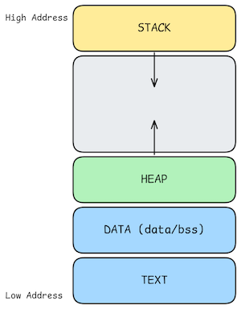
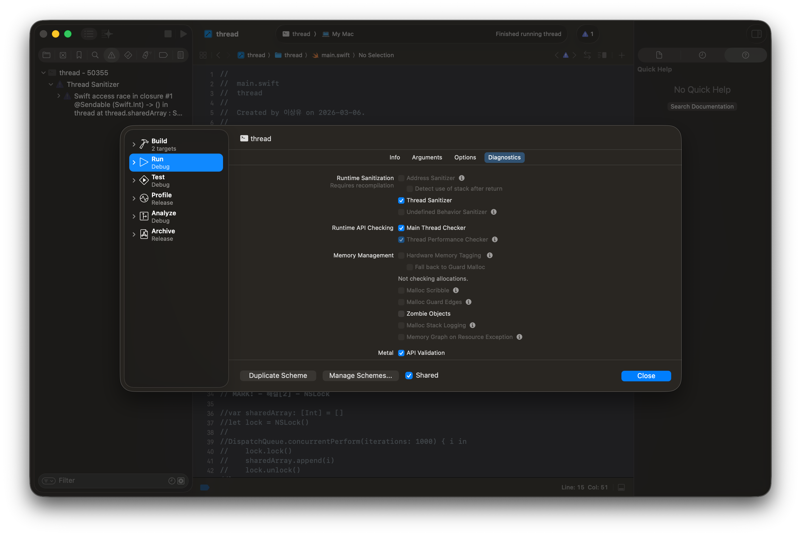
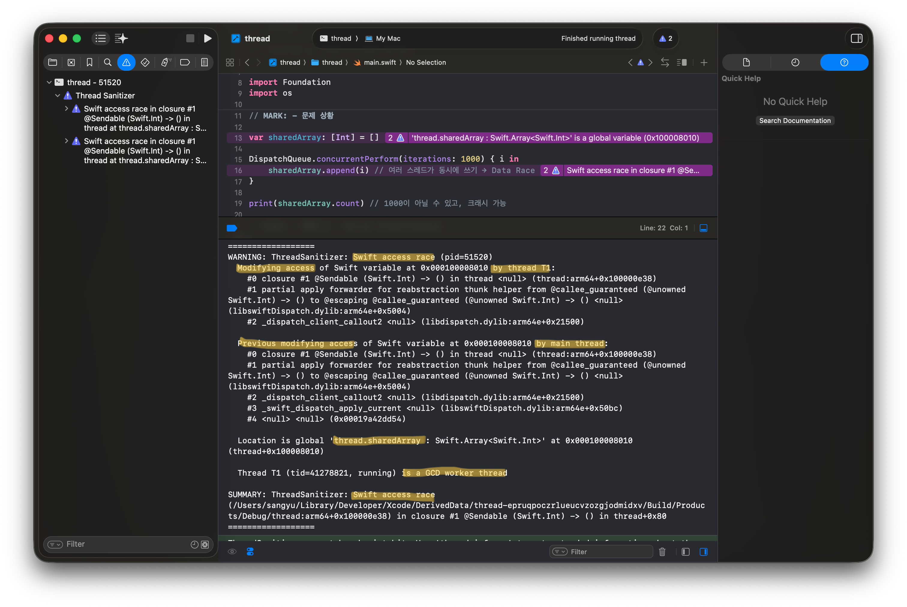

# 프로세스와 스레드의 자원 공유 방식

### 학습 키워드

`# thread` `# process` `# 자원 공유`

## 1. 핵심 개념

### 프로세스의 자원 공유

운영체제는 프로세스에게 가상 메모리 공간을 제공합니다.  
**프로세스의 메모리 구조**는 다음과 같습니다:

- **Text section: 실행 가능한 코드**
- **Data section: 전역 변수**
- **Heap section: 프로그램 실행 중 동적으로 할당되는 메모리**
- **Stack section: 함수 실행 시 일시적으로 사용되는 데이터 공간**

`Text`/`Data` 영역의 크기는 프로그램 실행 중 변하지 않습니다.  
반면 `Heap`/`Stack` 영역의 크기는 프로그램 실행 중 늘어나거나 줄어들 수 있습니다.  
함수가 실행될 때마다 파라미터, 지역 변수, 반환 주소와 같은 기록이 `Stack`에 쌓이고, 함수가 반환될 때 해당 기록은 `Stack`에서 제거됩니다.  
실행 중 동적으로 할당되는 메모리가 Heap 영역에 들어가고, 해당 메모리가 해제될 때 `Heap`에서 제거됩니다.  
아래 그림처럼 `Stack`과 `Heap`은 서로를 향해 영역이 커지는데, 둘 사이에 미할당 가상 메모리 영역이 존재하며, 서로 영역이 충돌하면 메모리 접근 오류가 발생합니다.



프로세스의 메모리 공간은 독립적으로, 한 프로세스는 다른 프로세스의 메모리에 직접 접근할 수 없습니다.  
**프로세스 간 데이터를 주고받기 위해 IPC(Inter Process Communication)**라는 메커니즘이 필요합니다.

IPC 모델:

| **비교 항목**   | **공유 메모리 (Shared Memory)**  | **메시지 전달 (Message Passing)**  |
| --------------- | -------------------------------- | ---------------------------------- |
| **통신 속도**   | **매우 빠름** (직접 메모리 접근) | **상대적으로 느림** (커널 개입)    |
| **구현 난이도** | 높음 (동기화 직접 제어 필요)     | 낮음 (OS가 통신 및 동기화 관리)    |
| **커널 개입**   | 초기 설정 시에만 개입            | 메시지 송/수신마다 시스템 콜 발생  |
| **데이터 복사** | 없음                             | 송신 측 → 커널 → 수신 측 복사 발생 |
| **적합한 환경** | 대용량 데이터, 동일 기기 내 통신 | 소량 데이터, 분산 시스템(네트워크) |

### 스레드의 자원 공유

한 프로세스에 속한 모든 스레드의 공간은 해당 프로세스의 가상 메모리로 제한됩니다.  
**스레드의 메모리 구조**는 다음과 같습니다:

- **Stack: 해당 스레드의 함수 호출 기록**
- **Guard page: 스택이 커지면서 다른 메모리 영역을 침범하지 않도록 접근 불가능하게 설정한 영역 (읽기/쓰기 다 안 됨)**
- **TLS(Tread Local Storage): 스레드마다 별도로 존재하는 전역 변수 공간**

> TCB(Thread Control Block): 스레드 관리에 필요한 데이터 기록 (e.g. 스레드 아이디, 스레드 상태, PC 등)  
> 커널이 스레드를 관리하기 위해 커널 공간에 유지하는 자료구조입니다

`static`이나 일반 전역 변수는 프로세스의 `Data` 영역에 들어가 공유되고, 스레드가 독립적으로 가져야 하는 변수만 TLS에 저장됩니다.  
Guard page는 OS/런타임의 구현에 따라 존재하지 않을 수 있습니다.  
Stack에 저장되는 데이터의 생명주기는 함수 호출 단위고, 그 외 영역의 데이터는 스레드의 생명주기와 동일하게 남아있습니다.  
같은 프로세스에 속한 스레드들은 프로세스의 `Text`/`Data` 영역을 공유합니다.  
따라서 프로세스와는 달리 여러 스레드가 동일한 객체나 변수에 접근할 수 있어 자원 공유가 비교적 쉽습니다.

> **Q: 함수 호출 시에 프로세스의 `Stack`과 스레드의 `Stack`에 모두 기록하는 건가?**
>
> A: 아니었다! 메인 스레드의 Stack이 프로세스 다이어그램에서 보이는 Stack이고, 추가 스레드 Stack은 프로세스의 가상 메모리 내에서 할당된다.
>
> **Q: 주소 공간 상으로 추가 스레드 Stack이 메인 Stack과 Heap 영역의 사이에 위치하는 건 맞을까?**
>
> A: 논리적인 가상 메모리 주소 공간 안에서 보면 맞다.  
> 추가 스레드의 Stack은 보통 **Memory Mapping Segment**라고 불리는 영역(주로 `Heap`과 메인 `Stack` 사이의 공간)에 할당된다. 이 영역은 동적 라이브러리를 로드하거나 `mmap()` 시스템 콜을 통해 메모리를 할당하는 공간이다.  
> 메인 Stack은 프로세스의 최상단 주소에 고정되어 아래로 내려오지만, 추가 스레드의 Stack들은 OS가 가상 메모리의 빈 공간을 찾아 적절히 배치한다. 따라서 물리적으로는 흩어져 있을 수 있지만, **가상 주소 공간상으로는 Heap과 메인 Stack 사이의 거대한 빈 영역** 중 일부를 차지하게 된다.

## 2. 탐구 내용 (실무 / iOS 연결)

### iOS에서는 어떤 IPC 방식이 있을까?

> 참고 자료  
> [Interprocess Communication in iOS](https://arpitkulsh.medium.com/interprocess-communication-in-ios-7e85f5dff7d5)  
> [XPC services on macOS app](https://medium.com/dwarves-foundation/xpc-services-on-macos-app-using-swift-657922d425cd)  
> [macOS - XPC Service](https://dkwlsfk.tistory.com/38)

1. **XPC**: 저수준 IPC 구현을 제공하는 Apple의 프레임워크 ([공식 문서 링크](https://developer.apple.com/documentation/xpc))
   - XPC를 활용해 XPC Service 번들을 만들어 사용할 수 있다.
   - 별도의 프로세스에서 동작하는 서비스로, 해당 프로세스가 망가져도 메인 앱의 프로세스는 죽지 않는다.
2. **App Groups** + 공유 컨테이너 ([공식 문서 링크](https://developer.apple.com/documentation/Xcode/configuring-app-groups))
   - 같은 App Group에 속한 앱이나 Extension끼리 `UserDefaults(suiteName:)`이나 공유 파일 디렉토리를 통해 데이터를 공유한다.
3. **URL Scheme/Universal Links** ([공식 문서 링크](https://developer.apple.com/documentation/xcode/allowing-apps-and-websites-to-link-to-your-content))
   - 앱 간 통신에 사용된다.
   - `UIApplication.shared.open(_:)` 등을 통해 다른 앱을 열면서 URL에 데이터를 담아 전달하는 방식이다.
   - 단방향 통신이고 전달할 수 있는 데이터 크기가 제한적이다.
4. **UIPasteboard**
   - 클립보드를 통한 데이터 공유다.
5. **Keychain 공유** ([공식 문서 링크](https://developer.apple.com/documentation/security/sharing-access-to-keychain-items-among-a-collection-of-apps))
   - 같은 개발자 팀 ID를 가진 앱들 간에 Keychain Access Group을 통해 인증 정보 등 민감한 데이터를 공유할 수 있다.

위 5가지 방법 외에도 Mach Ports라는 커널 수준의 API나 Darwin Notification 등의 방식이 존재합니다.

### 프로세스 - 앱과 위젯 간의 데이터 전달

> 참고 자료  
> [App and system extensions](https://developer.apple.com/documentation/technologyoverviews/app-extensions)  
> [\[iOS - SwiftUI\] 2. 위젯 Widget 사용 방법 - API 데이터 로드와 위젯UI 업데이트](https://ios-development.tistory.com/1133)  
> [ios 위젯](https://velog.io/@aptakqmf12/ios-%EC%9C%84%EC%A0%AF)

App extension이라는 번들이 있습니다.  
이는 앱의 일부로 배포되는 번들인데, 호스팅 한 앱과는 별도로 동작합니다.  
즉, **호스팅 앱과 App extension의 프로세스는 별도로 동작합니다.**  
App extension의 대표적인 예시로 위젯이 있습니다.

> 메인 앱과 위젯은 별도의 프로세스에서 동작한다는 건데, 그럼 **메인 앱과 위젯의 데이터 동기화는 어떻게 구현할 수 있을까?**

앞서 언급한 App Groups와 공유 컨테이너를 이용해 구현할 수 있습니다.  
메인 앱 타겟과 위젯 타겟에 동일한 App Group을 활성화하면, 두 프로세스가 공유 컨테이너에 접근할 수 있습니다.  
**공유 컨테이너 선택:**

1. `UserDefaults(suiteName:)`
   - 자주 쓰던 `UserDefaults.standard`는 메인 앱의 샌드박스 안에 있는 저장소이므로 메인 앱 프로세스에서만 접근 가능합니다.

   ```swift
   let shared = UserDefaults(suiteName: "group.com.myapp.shared")

   // 메인 앱에서 저장
   shared?.set("hello", forKey: "greeting")
   // 위젯 Extension에서 읽기
   let value = shared?.string(forKey: "greeting") // "hello" ✅
   ```

2. App Group 컨테이너의 파일 시스템
   - 함께 쓸 수 있는 공유 폴더가 생깁니다.
   - JSON 파일 혹은 Core Data/SwiftData를 활용하는 방식도 있습니다.
   ```swift
   // 공유 컨테이너 URL 얻기
   let containerURL = FileManager.default.containerURL(forSecurityApplicationGroupIdentifier: "group.com.myapp.shared")!
   // Core Data persistent store를 이 경로에 설정
   let storeURL = containerURL.appendingPathComponent("Model.sqlite")
   ```

메인 앱에서 데이터를 공유 컨테이너에 쓴 다음에 위젯에서 다시 로드하도록 명령을 보내야 위젯 UI에도 변경사항이 적용됩니다.

```swift
WidgetCenter.shared.reloadTimelines(ofKind: "MyWidget")
```

> 서버를 두고 위젯이 서버와 직접 소통하는 방식도 가능합니다.  
> 위젯은 갱신 횟수나 메모리 제한 등이 있어 위험한 상황이 생길 수 있습니다.  
> 간단한 데이터를 가져와 사용한다면 서버와 직접 통신해도 괜찮습니다.  
> 혹은 메인 앱과의 공유 컨테이너를 조회하고 찾지 못하면 서버와 통신하는 방식도 존재합니다.  
> 이럴 때는 앞서 말한 메인 앱이 갱신을 트리거 하는 방식대신 위젯 스스로 reload policy를 통해 주기적으로 갱신할 수 있습니다.

### 스레드 - 경쟁 상태

> 참고 자료 - [\[Swift\] Race Condition과 Thread Safe](https://siwon-code.tistory.com/34)  
> 이후 주차의 주제가 `동기화 & 경쟁 상태`여서 아래 내용을 깊게 학습하고 탐구하지는 않았습니다.  
> Claude와 함께 실험을 진행했고, 어떤 해결 방법이 있는지도 도움을 받았습니다.  
> 깊은 동작 원리는 이후 주차에서 학습할 예정입니다.

기존에 앱을 구현하면서 스레드 간의 자원을 공유하는 방식을 계속 사용해왔습니다.  
백그라운드에서 읽어온 데이터를 가져와서 메인 스레드에서 UI를 업데이트 하는 흐름을 자연스럽게 구현했는데, 이 또한 스레드 간의 자원 공유가 발생한 상황이었습니다.  
스레드끼리 소통해서 자원을 주고받은 것이 아닌, 함께 속해있는 프로세스의 공유 공간에 접근해 주고받는 상황입니다.

여러 스레드가 공유 자원에 접근할 때, 실행 순서나 타이밍에 따라 결과가 달라질 수 있는 상황을 **race condition**라고 합니다.  
그중에서도 두 개 이상의 스레드가 같은 메모리에 동기화 없이 동시에 접근하고, 하나 이상이 쓰기를 수행하는 경우를 **data race**이라고 합니다.  
모든 스레드가 읽기만 한다면 메모리 변화가 없으므로 data race는 발생하지 않습니다.

> Data race는 타이밍에 따라 발생하기도 하고 멀쩡하게 지나가기도 합니다.  
> 때문에 테스트 환경에서 놓치고 넘어갈 수 있어, 사전에 방지하는 것이 중요합니다.

#### 문제 상황 설정

> Xcode에서 race condition을 감지하는 기능을 설정할 수 있습니다.  
> Edit scheme -> Run -> Diagnostics -> Thread Sanitizer 선택  
> 참고 자료 - [\[Xcode\] Thread Sanitizer - Race Condition 디버깅](https://jeong9216.tistory.com/659#google_vignette)
> 

여러 스레드에서 동시에 배열의 append를 호출하는 문제 상황을 만들어봤습니다.

```swift
import Foundation

var sharedArray: [Int] = []

DispatchQueue.concurrentPerform(iterations: 1000) { i in
    sharedArray.append(i) // 여러 스레드가 동시에 쓰기 → Data Race
}

print(sharedArray.count) // 1000이 아닐 수 있고, 크래시 가능
```

129가 출력되면서 의도하지 않은 결과가 나왔고, Thread Sanitizer에서도 문제 상황을 감지했습니다.  
매번 실행할 때마다 결과가 다르며, 포착되는 스레드도 달라집니다.

> 아래 결과에서 메인 스레드가 왜 쓰기 접근을 했는지 궁금해 알아본 결과, DispatchQueue.concurrentPerform은 호출한 스레드도 워커로 활용한다고 합니다.  
> [공식 문서 링크](https://developer.apple.com/documentation/Dispatch/DispatchQueue/concurrentPerform%28iterations:execute:%29)



#### 해결 방법

1. **Serial Queue**  
   GCD(Dispatch) 프레임워크의 직렬 큐를 사용하는 방법입니다.

- 동기화 주체: 개발자
- Data race 감지 시점: 런타임
- 주의할 점: 읽기와 쓰기가 모두 직렬화되기 때문에 읽기가 빈번한 상황에서는 병목이 발생할 수 있습니다.

```swift
import Foundation

var sharedArray: [Int] = []
let serialQueue = DispatchQueue(label: "com.example.serialQueue")

DispatchQueue.concurrentPerform(iterations: 1000) { i in
    serialQueue.sync {
        sharedArray.append(i)
    }
}

print(sharedArray.count) // 1000 보장
```

2. **NSLock**  
   Foundation 프레임워크에서 제공하는 전통적인 Lock 방식입니다.

- 동기화 주체: 개발자
- Data race 감지 시점: 런타임
- 주의할 점: 예외 상황에서 unlock을 빠뜨리면 데드락이 발생할 수 있고, 같은 스레드에서 재귀적으로 lock을 호출해도 데드락이 걸립니다.

```swift
import Foundation

var sharedArray: [Int] = []
let lock = NSLock()

DispatchQueue.concurrentPerform(iterations: 1000) { i in
    lock.lock()
    sharedArray.append(i)
    lock.unlock()
}

print(sharedArray.count) // 1000 보장
```

3. **os_unfair_lock**  
   Darwin(os) 프레임워크에서 제공하는 저수준 Lock입니다.  
   NSLock보다 오버헤드가 적어 성능이 중요한 짧은 임계 구역에 적합합니다.

- 동기화 주체: 개발자
- Data race 감지 시점: 런타임
- 주의할 점: Swift에서 구조체의 주소를 넘겨야 하므로 메모리 안정성에 주의해야 합니다.

```swift
import Foundation
import os

var sharedArray: [Int] = []
var unfairLock = os_unfair_lock()

DispatchQueue.concurrentPerform(iterations: 1000) { i in
    os_unfair_lock_lock(&unfairLock)
    sharedArray.append(i)
    os_unfair_lock_unlock(&unfairLock)
}

print(sharedArray.count) // 1000 보장
```

4. **Concurrent Queue + Barrier(flag)**  
   GCD(Dispatch) 프레임워크의 concurrent queue에 barrier flag를 조합하는 방법입니다.  
   읽기는 동시에 허용하고 쓰기만 독점 실행하므로 읽기 빈도가 쓰기보다 훨씬 높은 상황(예: 캐시 조회)에 적합합니다.  
   쓰기 시 barrier flag를 빠뜨리면 보호가 깨지고, 반드시 직접 생성한 concurrent queue에서 사용해야 합니다.

- 동기화 주체: 개발자
- Data race 감지 시점: 런타임
- 주의할 점: global queue에 barrier를 걸면 무시됩니다.

```swift
import Foundation

var sharedArray: [Int] = []
let rwQueue = DispatchQueue(label: "com.example.rwQueue", attributes: .concurrent)

// 쓰기: barrier로 독점 접근
func writeValue(_ value: Int) {
    rwQueue.async(flags: .barrier) {
        sharedArray.append(value)
    }
}

// 읽기: 동시 접근 허용
func readAll() -> [Int] {
    rwQueue.sync {
        return sharedArray
    }
}

DispatchQueue.concurrentPerform(iterations: 1000) { i in
    writeValue(i)
}

print(readAll().count) // 1000 보장
```

5. **Actor**  
   Swift Concurrency에서 제공하는 참조 타입으로, 컴파일러가 내부 상태의 격리를 강제합니다.  
   Actor 격리 영역 외부에서 상태에 접근할 때는 await가 필요하며, 이를 어기면 컴파일 에러가 발생합니다.  
   이를 통해 많은 Data Race를 컴파일 타임에 방지할 수 있습니다.  
   async/await 기반의 코드에 적합합니다.

- 동기화 주체: 컴파일러 + 런타임(Actor executor)
- Data race 감지 시점: 주로 컴파일 타임
- 주의할 점: 기존 GCD 코드와 혼용할 때 경계 처리가 필요하며, actor 간 순환 호출로 인한 논리적 문제를 주의해야 합니다.

- 동기화 주체: 컴파일러
- Data race 감지 시점: 컴파일 타임
- 주의할 점: 기존 GCD 코드와 혼용할 때 경계 처리에 신경 써야 하고, 여러 actor 간의 상호 호출 시 교착 가능성도 고려해야 합니다.

```swift
// Actor
actor SafeArray {
    private var storage: [Int] = []

    func append(_ value: Int) {
        storage.append(value)
    }

    func getAll() -> [Int] {
        return storage
    }

    var count: Int {
        storage.count
    }
}

// 사용 부분
let safeArray = SafeArray()

await withTaskGroup(of: Void.self) { group in
    for i in 0..<1000 {
        group.addTask {
            await safeArray.append(i)
        }
    }
}

let count = await safeArray.count
print(count) // 1000 보장
```

## 3. 의문 / 논점

-

## 4. 참고 자료

[Operating System Concepts](https://product.kyobobook.co.kr/detail/S000003114660)
