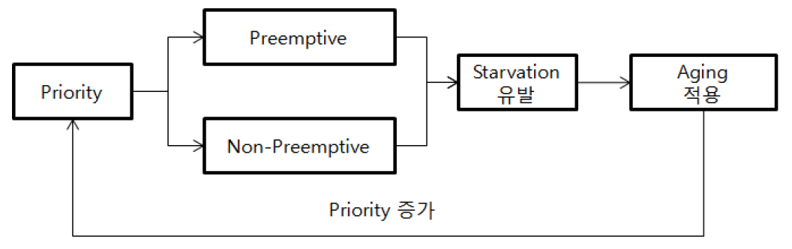
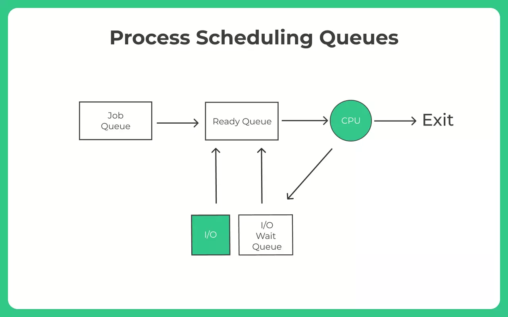
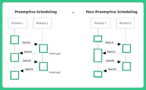

# 프로세스 스케줄링

### 학습 키워드

- CPU 스케줄링, 스케줄러 역할
- Fairness (공정성), Starvation (기아)
- Preemptive vs Non-preemptive (선점/비선점)

## 1. 핵심 개념

### CPU 스케줄링과 스케줄러 역할

#### 1) CPU Scheduling이란?

CPU Scheduling은 Ready 상태(실행 가능) 인 프로세스/스레드들 중에서 다음에 CPU를 사용할 대상을 선택하는 운영체제의 정책(Policy)입니다.

**CPU는 희소 자원이기 때문에, 스케줄링은 “누가 먼저”뿐 아니라 “얼마나” CPU 시간을 받을지(시간 분할)까지 결정**

#### 2) 스케줄러의 역할(왜 필요한가)

스케줄러는 아래 목표들이 동시에 충족되도록 CPU를 배분합니다. 하지만 중요한 점은 이 목표들이 서로 충돌한다는 것입니다,
- 공정성(Fairness): 특정 작업이 계속 밀려 실행 기회를 못 얻는 상황(기아)을 막기

- 응답성(Response time): 사용자 입력/요청에 빠르게 반응(인터랙티브 작업 우대)

- 처리량(Throughput): 단위 시간에 더 많은 작업 완료

- 자원 활용(CPU utilization): CPU가 놀지 않도록(유휴 최소화)

- 오버헤드 관리(Context switch overhead): 너무 자주 바꾸면 문맥교환 비용이 커져 성능 하락

- 예시: Round Robin에서 타임 퀀텀(Time Quantum)을 조절할 때 생기는 충돌
    - 퀀텀(한 번에 CPU를 쓰는 시간)을 짧게 잡으면, 각 작업이 더 자주 CPU를 받아서 응답성(Response time) 과 공정성(Fairness) 이 좋아집니다. (특정 작업이 오래 기다릴 가능성이 줄어듦)
    - 그런데 너무 짧아지면 작업 전환이 자주 발생해 문맥교환 오버헤드(Context switch overhead) 가 커지고, 그만큼 실제 계산에 쓰는 시간이 줄어 처리량(Throughput) 과 CPU 효율(utilization 관점의 ‘유효 작업 비율’) 이 떨어질 수 있습니다.

즉 스케줄러는 공정/응답/처리량/오버헤드 사이에서 절충합니다.

 

### 공정성(Fairness)과 기아(Starvation)

#### 공정성이란?

공정성은 “모두에게 똑같이”가 아니라, 보통 두개 중 하나로 정의 됩니다.
- 동등 배분(Equal share): 같은 우선순위면 CPU 시간을 비슷하게
- 비례 배분(Proportional share): 가중치(우선순위)에 비례해 CPU 시간 배분

#### 기아(Starvation)

우선순위가 높거나 짧은 작업이 계속 들어오면, 낮은 우선순위 작업은 영원히 CPU를 못 받을 수 있습니다.
이걸 막는 대표 기법이 Aging 기법입니다.

**Aging(노화)**: 기다린 시간이 길수록 우선순위를 조금씩 올려줍니다.

[출처](https://blog.skby.net/%EC%97%90%EC%9D%B4%EC%A7%95-aging/)

 

### 선점(Preemptive) vs 비선점(Non-preemptive)

먼저 선점, 비선점에 대해 설명하기 앞 서 스케줄링의 기본 큐 구조에 대해 설명해보겠습니다.

#### 작업 큐(Job Queue)
- 시스템에 제출된 전체 프로세스 집합
- 보통 디스크 같은 보조기억장치에 있고, 장기 스케줄러가 여기서 일부를 골라 메모리로 올린다(= 준비 상태로 진입).

#### 준비 큐(Ready Queue)
- 메모리에 적재되어 CPU를 할당받기만 하면 바로 실행 가능한 프로세스들이 대기
- **단기 스케줄러(CPU 스케줄러)** 가 여기서 다음 실행 대상을 정합니다.(알고리즘에 따라 순서/우선순위가 달라짐).

#### 대기 큐(Wait Queue / Device Queue)
- I/O 완료, 락 해제, 이벤트 발생 등을 기다리는 프로세스들이 대기
- 이벤트가 발생하면 프로세스는 다시 준비 큐로 이동한다.

1. Job Queue → Ready Queue(장기 스케줄러): 시스템에 제출된 프로세스 중 일부를 메모리에 올려 “CPU를 받을 준비가 된 상태”로 만든다.
2. Ready Queue → Running(단기 스케줄러): 준비 큐에서 다음 실행 대상을 골라 CPU를 할당하면 실행 상태가 된다.
3. Running → Wait Queue: 실행 중 I/O 요청이나 이벤트 대기가 필요하면 CPU를 내려놓고 대기 큐로 이동한다.
4. Wait Queue → Ready Queue: I/O 완료/이벤트 발생 시 다시 실행 가능해져 준비 큐로 돌아간다.

 

#### 비선점(Non-preemptive Scheduling)
- 핵심: 한 번 CPU를 받은 프로세스는 스스로 CPU를 내려놓을 때까지 계속 실행한다.
(즉, 다른 프로세스가 강제로 CPU를 빼앗을 수 없다.)
- CPU를 내려놓는 대표 상황
	1.	작업이 끝남(terminate)
	2.	I/O 요청 등으로 대기 상태(Wait Queue) 로 들어감(block)
	3.	스스로 양보(yield)하는 정책을 쓴 경우
- 장점: 문맥교환이 상대적으로 적어서 오버헤드가 작고 구현이 단순하다.
- 단점: CPU를 오래 잡는 작업이 있으면, 다른 작업은 Ready Queue에서 오래 대기하게 되어 
    - 응답성 악화(대화형 작업이 늦게 반응)
	- 기아 가능성(특정 작업이 계속 뒤로 밀림)
이 커질 수 있다.

#### 선점(Preemptive Scheduling)
- 핵심: OS가 실행 중인 프로세스(Running)를 중간에 끊고, CPU를 회수해 Ready Queue의 다른 프로세스에게 줄 수 있다.
- 언제 끊나(대표 트리거)
	1.	타이머 인터럽트(퀀텀 만료): 정해진 시간만큼 실행하면 교체(시분할)
	2.	우선순위 변화/높은 우선순위 작업 도착: 더 중요한 작업을 먼저 실행
	3.	커널 정책에 따른 재스케줄링 이벤트
- 장점:
    - 프로세스가 CPU를 독점하기 어려워서 공정성/응답성 확보가 쉽다.
	- 특히 대화형 시스템에서 “입력 후 빠르게 반응”을 만들기 유리하다.
- 단점:
	- 자주 끊을수록 문맥교환 증가 + 캐시 손실 등 오버헤드가 커져 처리량이 떨어질 수 있다.
	- “언제든 끊길 수 있음” 때문에 동기화(락) 설계가 더 중요해진다(경쟁/역전 같은 이슈가 노출되기 쉬움).

현대 범용 OS는 대화형 시스템 품질 때문에 보통 선점을 기본으로 사용한다고 합니다.

 

## 2. 탐구하기 / iOS 연결지점
### Q1. 공정성(Fairness)은 "동등 배분"인가, "비례 배분"인가?
  - 둘 다 공정성의 정의로 인정될 수 있으며, 핵심은 “무엇을 공정하다고 평가할 것인지(목표 함수)”를 먼저 정하는 데 있습니다.
  - 스케줄링은 응답시간(Response time), 처리량(Throughput), 문맥교환 오버헤드(Context switch)처럼 여러 지표를 동시에 다룹니다. 이 지표들은 서로 충돌하기 때문에, “공정성”도 단일 정의로 고정되기 어렵습니다. 
  - 그렇기 때문에 대화형 시스템에서는 사용자의 체감 품질을 위해 p95/p99 응답시간을 낮추는 것이 중요한 반면, 배치 시스템에서는 전체 완료 시간(턴어라운드)이나 처리량을 더 중시하는 경향이 있습니다. 따라서 동일한 정책이라도 환경에 따라 “공정하다/공정하지 않다”의 판단이 달라질 수 있습니다.
  - 공정성은 “모두에게 똑같이”만이 아니라, “가중치에 비례해” 또는 “체감 응답성을 보장하는 방향으로” 등 시스템 목표에 따라 정의되는 상대적 개념입니다.
### Q2. 선점은 왜 기본 전략이 되었는가?
  - 긴 작업이 CPU를 독점할 때 발생하는 응답성 붕괴를 막기 위해, 현대 범용 OS는 선점을 기본으로 채택하는 경향이 있습니다.
  - 비선점 스케줄링에서는 한 프로세스가 Running 상태에서 CPU를 오래 점유하면, Ready 상태의 짧은 작업이 줄줄이 밀리면서 사용자 입력/화면 갱신이 지연될 수 있습니다. 선점은 타이머 인터럽트(타임 퀀텀 만료)나 우선순위 이벤트를 통해 “지금은 끊고 다른 작업을 실행”하도록 강제함으로써 응답시간의 상한을 관리하려는 장치입니다.
  - **트레이드오프**: 다만 선점이 잦아질수록 문맥교환과 캐시 손실이 누적되어 처리량이 감소할 수 있습니다. 즉 선점은 “응답성을 얻기 위해 오버헤드 비용을 지불하는 선택”이며, 타임 퀀텀은 이 절충을 조절하는 핵심입니다.
  - 선점은 “항상 이득”이 아니라, 응답성 보장을 위해 비용을 감수하는 구조적 선택이라고 보는 것이 타당합니다.
### Q3. 기아(Starvation)는 왜 반복적으로 등장하는가?
  - 우선순위 기반 정책에서 “중요한 작업 우대”를 강하게 적용할수록, 덜 중요한 작업이 지속적으로 밀리며 기아가 구조적으로 발생할 수 있습니다.
  - 스케줄러가 매번 “더 높은 우선순위”를 선택하도록 설계되어 있고, 높은 우선순위 작업이 꾸준히 유입된다면 낮은 우선순위 작업은 선택 후보에서 계속 배제될 수 있습니다. 이는 구현 실수라기보다 정책의 자연스러운 결과입니다.
  - 따라서 기아 완화는 선택이 아니라 안전장치에 가깝습니다. 대표적으로 Aging은 대기 시간이 길수록 우선순위를 점진적으로 올려, 장기적으로 실행 기회를 보장합니다. 또한 시스템에 따라 주기적 우선순위 부스트(priority boost) 같은 보정 규칙을 추가하기도 합니다.
  - 우선순위 정책은 반드시 “보정 규칙”과 함께 설계되어야 서비스 품질이 안정적입니다.

### 결론
- 스케줄링은 우선순위 정렬 문제가 아니라 목표 함수 선택 문제입니다.
같은 workload라도 응답시간을 최우선으로 둘지, 처리량을 최우선으로 둘지에 따라 “좋은 정책”이 달라집니다.
- 공정성은 절대값이 아니라 정책 상대값입니다.
Equal share는 “같은 몫”, Proportional share는 “가중치 비례 몫”입니다. 공정성은 “모두 같게”라기보다, “정의된 규칙을 일관되게 적용해 장기적으로 기회가 보장되는가”로 보는 편이 설득력이 있습니다.
- 선점은 응답성을 개선하지만, 전환이 잦아지면 처리량이 깎일 수 있습니다.
이는 RR/타임 슬라이스 기반 정책에서 특히 뚜렷하며, 퀀텀은 응답성과 오버헤드 사이의 조절 변수입니다.
- 기아 완화는 선택이 아니라 안전장치입니다.
우선순위 정책은 보정이 없으면 long-tail 지연이 커지고 서비스 품질이 불안정해질 수 있으므로, aging/부스트 같은 장치가 필요합니다.

 

## 3. 의문 / 논점
- 1. 공정성은 "동일 배분"인가 "목표 기반 배분"인가?
  - 답변: 실무에서는 목표 기반 배분에 가깝다. 응답성/처리량 목표에 따라 공정성 정의가 달라진다.
- 2. 선점은 항상 좋은가?
  - 답변: 아니다. 응답성은 좋아지지만 문맥교환/캐시 손실이 늘어 처리량이 떨어질 수 있다.
- 3. 기아는 왜 생기고 어떻게 줄이나?
  - 답변: 우선순위 우대가 강하면 저우선순위가 계속 밀린다. aging/priority boost 같은 보정이 필요하다.
- 4. 왜 단일 알고리즘으로 끝내지 못하나?
  - 답변: 응답성, 공정성, 처리량, 오버헤드가 서로 충돌해서 한 규칙으로 모두 최적화하기 어렵기 때문이다.
