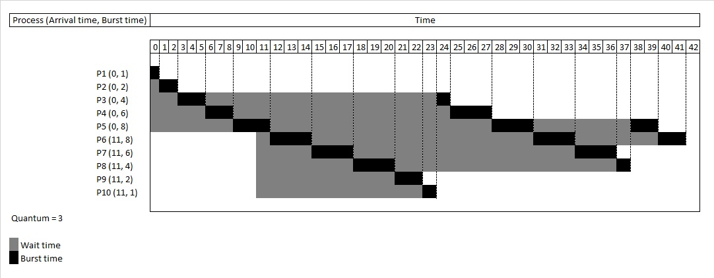
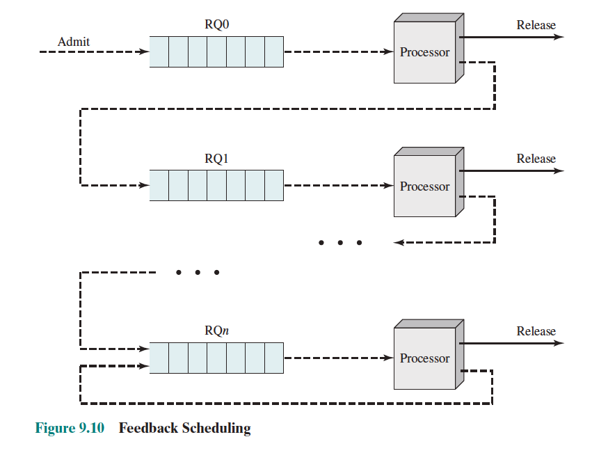
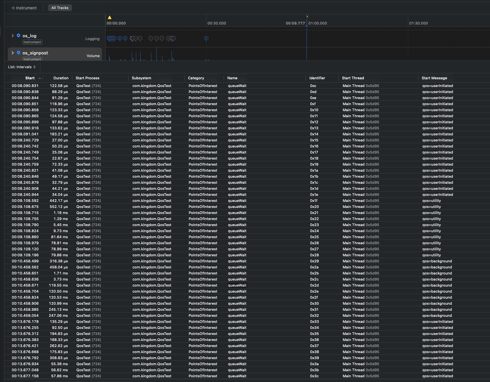

# 선점/비선점 스케줄링 알고리즘 분석

### 학습 키워드
- 선점 스케줄링 / 비선점 스케줄링
- 타임 슬라이스(타임 퀀텀), 타이머 인터럽트
- 우선순위 스케줄링, 기아(Starvation), 에이징(Aging)
- 문맥 교환(Context Switch) 오버헤드
- 응답 시간(Response Time), 처리량(Throughput), CPU 활용률(Utilization)
- FCFS, SJF / SRTF, 라운드 로빈(RR), 우선순위, MLFQ

<br/>

## 1. 핵심 개념
### 1) 선점 / 비선점 
- **비선점(Non-preemptive)**: 실행 중인 작업이 **스스로 CPU를 반납**(종료/대기/yield)할 때까지 계속 실행
- **선점(Preemptive)**: **타이머(퀀텀 만료)** 또는 **우선순위 이벤트**로 OS가 실행 중 작업을 **강제로 교체**

### 2) 타임 슬라이스(퀀텀) 처리 로직
- 스케줄된 스레드에게 한 번 할당하는 CPU 시간
- Running 시작 → 타이머 설정
- 퀀텀 만료(타이머 인터럽트) → 현재 작업 중단(선점) → Ready Queue로 재진입
- **퀀텀 트레이드오프**: 짧을수록 응답성 증가 / 문맥교환 오버헤드 증가(처리량 감소 가능)

### 3) 우선순위 처리 로직
- Ready Queue에서 “우선순위가 높은 작업”을 먼저 선택
- **선점형 우선순위**: 더 높은 우선순위가 Ready로 들어오면 즉시 교체 가능
- 낮은 우선순위 **기아 위험** → **에이징(Aging)** 같은 보정 필요  

### 4) 알고리즘 분석(선점/비선점 관점)

#### 4.1 FCFS (First-Come, First-Served) — 비선점
- **분류**: 비선점
- **선택 기준**: 먼저 도착한 순서대로 실행
- **선점 조건**: 없음(종료/대기 전까지 계속 실행)
- **장점**
  - 구현 단순, 문맥교환 적음(오버헤드 감소)
- **단점**
  - 긴 작업이 앞에 있으면 짧은 작업들이 뒤에서 오래 기다림(Convoy effect)  

- **지표 영향(경향)**
  - 응답 시간: 나쁠 수 있음(앞 작업이 길면)
  - 처리량: 상황에 따라 나빠질 수 있음(대기 증가로 파이프라인 꼬임)
  - 문맥교환: 낮음
- **결론**
  - 순서는 공정한데, 긴 작업 하나가 전체를 느리게 만들어서 체감 성능이 들쭉날쭉해질 수 있음

#### 4.2 SJF / SRTF — 비선점 vs 선점 비교에 최적
- SJF (Shortest Job First)
    - **분류**: 보통 비선점
    - **선택 기준**: CPU burst가 짧은 작업부터
    - **장점**: 평균 대기시간을 줄이는 데 유리(이론적으로 강함)
    - **단점**: burst time 예측 필요, 긴 작업 기아 가능

- SRTF (Shortest Remaining Time First)
    - **분류**: 선점(SJF의 선점 버전)
    - **선점 조건**: 더 짧은 “남은 시간” 작업이 Ready에 들어오면 현재 작업 선점 
    - **장점**: 짧은 작업 응답성 증가
    - **단점**: 긴 작업이 계속 밀리며 기아 가능(보정 필요)

- **결론**
  - SJF는 한 번 선택하면 끝까지 돌리고, SRTF는 더 짧은 작업이 오면 중간에 끊고 바꾼다. 그래서 SRTF가 짧은 작업 반응은 좋지만, 긴 작업이 계속 밀릴 수 있음

#### 4.3 라운드 로빈(Round Robin, RR) — 선점 기반 시분할 대표

- **분류**: 선점
- **선택 기준**: Ready Queue를 순환하며 각 작업에 동일 퀀텀 부여
- **선점 조건**: 퀀텀 만료 시 타이머 인터럽트로 선점
- **장점**
  - 공정성 증가(기회 균등), 대화형 응답성 증가
- **단점**
  - 퀀텀이 너무 작으면 문맥교환 오버헤드 증가하고 처리량 감소 가능
  - 퀀텀이 너무 크면 비선점처럼 동작 → 응답성 감소
- **결론**
  - 퀀텀이 ‘응답성 vs 오버헤드’를 조절하는 키

#### 4.4 우선순위 스케줄링(Priority) — 선점/비선점 둘 다 가능
- **분류**: 선점형/비선점형 모두 존재
- **선택 기준**: 우선순위가 높은 작업 먼저
- **선점 조건(선점형)**: 더 높은 우선순위가 Ready에 들어오면 즉시 교체 가능
- **장점**
  - 중요한 작업 응답성 증가(시스템/대화형 작업 우대에 유리)
- **단점**
  - 낮은 우선순위 기아 위험 → **에이징(Aging)** 보정 필요 
- **결론**
  - 응답성은 챙기기 좋지만, 공정성은 보정(에이징)이 없으면 깨지기 쉬움.

#### 4.5 MLFQ (다단계 피드백 큐) — 현실적 절충

[출처](https://stevengong.co/notes/Multi-Level-Feedback-Queue)

- **동작 흐름**
  - 프로세스는 기본적으로 **가장 높은 우선순위 큐**에서 시작
  - 할당된 퀀텀 안에 CPU를 짧게 쓰고 바로 I/O로 넘어가면(= 인터랙티브 성향) **상위 큐에 더 오래 머무르거나 승급**할 수 있습니다.
  - 반대로 퀀텀을 자주 다 쓰는(= CPU-bound) 작업은 **점점 하위 큐로 강등**되어 더 긴 퀀텀을 받지만, 우선순위는 낮아집니다.
  - 모든 작업이 영원히 내려가서 굶지 않도록, 주기적으로 전체 우선순위를 초기화하는 **priority boost**(또는 aging)를 두기도 합니다.

- **대표 규칙 예시**
  - Q0(최상위): 퀀텀 10ms, 짧은 작업/대화형 우대
  - Q1: 퀀텀 20ms
  - Q2(최하위): FCFS 또는 긴 퀀텀
  - 규칙: 퀀텀을 다 쓰면 한 단계 강등, I/O로 자발적 블록이 잦으면 유지/승급

- **분류**: 선점(피드백 기반, 다단계)
- **핵심 아이디어**
  - 짧은 작업/대화형 작업은 높은 큐(짧은 퀀텀)에서 빠르게 돌리고,
  - CPU를 오래 쓰는 작업은 점점 낮은 큐로 내려보냄(긴 퀀텀 또는 FCFS)
  - 결과적으로 짧은 작업은 빠르게 끝내고, 긴 작업도 결국은 진행되게 만들어 **응답성과 공정성의 균형**을 만들어냅니다.
- **장점**
  - “응답성(상단 큐) + 처리량/안정성(하단 큐)” 절충에 유리
- **단점**
  - 파라미터(큐 수, 퀀텀, 승급/강등 규칙)가 복잡 → 튜닝/정책 설계가 중요
  - 워크로드(대화형/배치)나 시스템 목표(응답성/처리량)에 따라 최적 규칙이 달라, “정답 설정”이 없고 튜닝 비용이 든다.
- **결론**
  - MLFQ는 “선점 + 우선순위 + 퀀텀”을 결합해, 대화형 응답성과 전체 처리량을 동시에 노리는 대표적인 절충 전략
  - 단일 알고리즘이라기보다, 시스템 목표에 맞춘 **규칙(피드백) 설계**에 가깝습니다.

<br/>

## 2. 탐구하기 / iOS 연결지점
### 1) iOS에서 체감되는 지점(스케줄링 관점)
- `메인 스레드 끊김(UI jank)`:
  - UI 이벤트 처리/애니메이션 같은 사용자 상호작용 작업이 CPU를 제때 받지 못하면 터치 지연, 스크롤 버벅임으로 바로 체감됩니다.
  - iOS는 이런 작업을 빠르게 처리해야 하므로 QoS에서도 `userInteractive`/`userInitiated`를 강조합니다. ([DispatchQoS.userInitiated](https://developer.apple.com/documentation/dispatch/dispatchqos/userinitiated?utm_source=chatgpt.com))
- `QoS에 따른 실행 우대(우선순위/공정성 체감)`:
  - GCD의 QoS는 작업 중요도를 시스템에 전달해 CPU/타이머 등 자원을 더 중요한 작업에 우선 배정하도록 돕습니다.
  - 즉, 높은 우선순위 작업이 상대적으로 더 빨리 수행되고 자원 우대를 받는 구조입니다. 
  ([Energy Efficiency Guide: Prioritize Work with QoS](https://developer.apple.com/library/archive/documentation/Performance/Conceptual/EnergyGuide-iOS/PrioritizeWorkWithQoS.html))

### 2) QoS 차이 검증 정리
#### 목표
동일한 CPU-bound 작업을 실행할 때 QoS(`userInitiated` / `utility` / `background`)에 따라 아래가 달라지는지 확인해보고자 합니다.
- 실행 시작까지 대기 시간(`queueWait`)
- 실제 연산 시간(`cpuWork`)

#### 핵심 아이디어
QoS 차이는 보통 "연산 자체가 더 빨라짐"이 아니라, CPU를 더 빨리/자주 배정받는지(스케줄링 우대)에서 나타납니다.  
그래서 `cpuWork`보다 `queueWait`를 먼저 비교하는 게 중요합니다.

#### 실험 설정(플로우 요약)
1. 조건 고정
   - 동일 기기, 동일 빌드(Release/Profile 권장)
   - 동일 연산량(`iterations` 고정)
   - 백그라운드 앱 최소화
2. 부하 생성
   - Background Load를 켜서(낮은 QoS) CPU 경쟁 상황
3. 버스트 실행
   - 한 번 클릭에 동일 QoS 작업을 여러 개(Burst N개) 동시에 enqueue해서 큐 대기를 유도
4. 측정
   - `os_signpost` interval로 두 구간을 기록
   - `queueWait`: 요청 시점 -> 실제 실행 시작까지(스케줄링 대기)
   - `cpuWork`: 실제 연산 구간
   - Instruments(`os_signpost`)에서 `queueWait` duration을 QoS별로 비교

#### 코드 핵심 요약(측정/부하/버스트)
1. `signpost`로 `queueWait`/`cpuWork` 구간 기록

```swift
import os
import Foundation

enum CPUWork {
    static let log = OSLog(subsystem: Bundle.main.bundleIdentifier ?? "QoSTest",
                           category: .pointsOfInterest)

    static func run(iterations: Int) -> UInt64 {
        var x: UInt64 = 0
        for i in 0..<iterations {
            x &+= UInt64(i) &* 2862933555777941757
            x ^= (x >> 33)
        }
        return x
    }

    static func runAsync(qos: DispatchQoS.QoSClass,
                         iterations: Int = 30_000_000,
                         completion: @escaping (UInt64) -> Void) {
        let id = OSSignpostID(log: log)

        // 요청 -> 실제 실행 시작(스케줄링 대기)
        os_signpost(.begin, log: log, name: "queueWait", signpostID: id, "qos=%{public}s", "\(qos)")
        DispatchQueue.global(qos: qos).async {
            os_signpost(.end, log: log, name: "queueWait", signpostID: id, "qos=%{public}s", "\(qos)")

            // 실제 연산 구간
            os_signpost(.begin, log: log, name: "cpuWork", signpostID: id, "qos=%{public}s", "\(qos)")
            let result = run(iterations: iterations)
            os_signpost(.end, log: log, name: "cpuWork", signpostID: id, "qos=%{public}s", "\(qos)")

            completion(result)
        }
    }
}
```

2. 낮은 QoS로 Background Load 생성(경쟁 상황 만들기)

```swift
@State private var backgroundLoadTask: Task<Void, Never>?

private func setBackgroundLoad(enabled: Bool) {
    backgroundLoadTask?.cancel()
    backgroundLoadTask = nil
    guard enabled else { return }

    backgroundLoadTask = Task.detached(priority: .background) {
        while !Task.isCancelled {
            _ = CPUWork.run(iterations: 5_000_000)
            await Task.yield()
            try? await Task.sleep(nanoseconds: 2_000_000) // 숨 고르기
        }
    }
}
```

3. 버튼 1번 클릭에 Burst N개 enqueue(큐 대기 유도)

```swift
@State private var burstCount: Int = 10
@State private var isRunning = false

private func runBurst(_ qos: DispatchQoS.QoSClass) {
    guard !isRunning else { return }
    isRunning = true

    let group = DispatchGroup()
    for _ in 0..<max(1, burstCount) {
        group.enter()
        CPUWork.runAsync(qos: qos) { _ in
            DispatchQueue.main.async { group.leave() }
        }
    }

    group.notify(queue: .main) { isRunning = false }
}
```

#### 관찰 결과



- `userInitiated`: 대체로 **us 단위(거의 즉시)** 로 실행 시작, 간헐적으로 ms 단위 스파이크 존재
- `utility`: us~ms도 있으나, 수십 ms 대기 구간이 반복적으로 관찰됨
- `background`: 100ms+ 및 200ms+ 대기가 반복적으로 관찰됨(가장 밀림)

결론: QoS는 "항상 빠름"이 아니라, **부하/경쟁 상황에서의 상대적 우대** 로 작동하며,  
그 차이는 `cpuWork`보다 **`queueWait`(실행 기회/대기 시간)** 에서 뚜렷하게 드러난다.
<br/>

## 3. 의문 / 논점
- 선점은 어디까지가 이득인가?
  - 응답성은 좋아지지만, 분할이 과하면 전환/경쟁 오버헤드가 커져 전체 완료 시간이 다시 늘 수 있다.
- QoS 차이는 "속도 향상"인가 "실행 기회 우대"인가?
  - 이번 관찰 기준에서는 `cpuWork` 자체보다 `queueWait` 차이가 더 크게 나타나며, 핵심은 상대적 우대다.
- 낮은 우선순위 작업 지연은 언제 문제로 볼 것인가?
  - `background`가 반복적으로 큰 대기(예: 100ms+)를 보이면 사용자 기능/동기화 지연에 영향이 있는지 판단 기준이 필요하다.
- 실제 OS가 절충형 정책을 쓰는 이유는 무엇인가?
  - 단일 목표(응답성 또는 처리량)만 최적화하면 다른 지표가 무너져서, 결국 부하 상황별 균형 정책이 필요하다.


## 4. 참고 자료
- [CPU Scheduling | Tech Interview (gyoogle.dev)](https://gyoogle.dev/blog/computer-science/operating-system/CPU%20Scheduling.html)
  - 선점/비선점, FCFS/SJF/RR/MLQ/MLFQ를 면접형 요약으로 빠르게 훑기 좋음.
- [[운영체제] 비선점 스케줄링과 선점 스케줄링](https://inuplace.tistory.com/318)
  - 선점/비선점 차이와 대표 알고리즘을 비교 중심으로 정리.
- [운영체제 공룡책 5단원 정리](https://witch-work.pages.dev/os-4/)
  - 공룡책 기준으로 스케줄링 챕터를 알고리즘별로 구조화해 정리.
