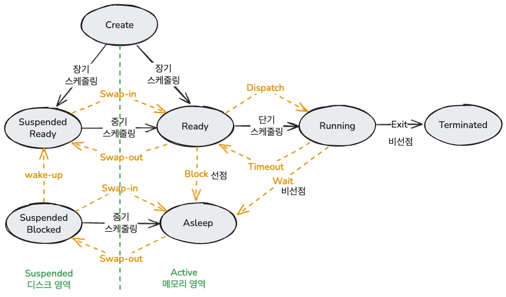
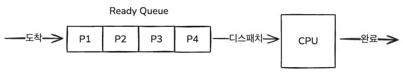

# 스케줄링 알고리즘

### 학습 키워드

- 스케줄링 알고리즘이 필요한 이유
- 스케줄링 알고리즘의 종류
- 스케줄링 알고리즘 비교

---

## 1. 핵심 개념

### CPU 스케줄링

기다리고 있는 여러 프로세스 중 누구를 선택할 것인지에 대한 기준

---

### 성능 평가 지표

스케줄링 알고리즘의 효율성을 비교할 때 사용하는 기준들

| 지표                             | 설명                                         | 목표   |
| -------------------------------- | -------------------------------------------- | ------ |
| **대기 시간 (Waiting Time)**     | 프로세스가 Ready Queue에서 CPU를 기다린 시간 | 최소화 |
| **응답 시간 (Response Time)**    | 요청 후 첫 번째 응답이 올 때까지 걸린 시간   | 최소화 |
| **반환 시간 (Turnaround Time)**  | 프로세스 제출부터 완료까지의 총 소요 시간    | 최소화 |
| **처리량 (Throughput)**          | 단위 시간당 완료된 프로세스의 수             | 최대화 |
| **CPU 이용률 (CPU Utilization)** | 전체 시간 중 CPU가 실제로 일한 비율          | 최대화 |

> 평균 대기 시간 = 각 프로세스의 대기 시간의 합 / 프로세스 개수  
> 평균 반환 시간 = 각 프로세스의 반환 시간의 합 / 프로세스 개수

---

### 주요 용어 정리

| 용어                              | 설명                                                                                       |
| --------------------------------- | ------------------------------------------------------------------------------------------ |
| **Starvation (기아 현상)**        | 우선순위가 낮은 프로세스가 CPU를 영원히 할당받지 못하는 현상                               |
| **Aging (에이징)**                | Starvation 해결책. 대기 시간이 길어질수록 우선순위를 점진적으로 높여주는 기법              |
| **Context Switching (문맥 교환)** | CPU가 현재 실행 중인 프로세스를 저장하고 다른 프로세스로 전환하는 작업. 오버헤드 발생      |
| **Time Quantum (타임 슬라이스)**  | Round-Robin 등에서 각 프로세스에 할당되는 최대 CPU 사용 시간 단위                          |
| **Future Knowledge 문제**         | 프로세스의 실행 시간을 미리 알 수 없는 현실적 한계. SPN/SRT/HRRN의 공통 문제               |
| **Dispatch**                      | 스케줄러가 선택한 프로세스에 실제로 CPU를 할당하는 행위                                    |
| **Convoy Effect**                 | 실행 시간이 짧은 프로세스가 긴 프로세스 뒤에 줄 서서 오래 기다리는 현상 (FCFS의 대표 문제) |

---

### 비선점 vs 선점 (Nonpreemptive vs Preemptive)

**비선점 (Nonpreemptive)**

한 프로세스가 CPU를 할당받았을 때 CPU를 스스로 반납할 때까지 계속 사용하도록 하는 방법

- 프로세스가 Running 상태에서 Asleep 상태로 전환될 때 (입출력 요청)
- 프로세스가 수행을 마치고 종료될 때

**선점 (Preemptive)**

CPU를 할당받아 실행 중인 프로세스로부터 CPU를 빼앗아 다른 프로세스에 할당해주는 방법

현재 실행중인 프로세스보다 우선순위가 높은 프로세스가 도착하면, **현재 프로세스를 중단하고 우선순위가 높은 프로세스에 할당**

- 프로세스가 Ready 상태에서 Asleep 상태로 전환될 때 (시간 종료와 같은 인터럽트 발생)
- 프로세스가 Asleep 상태에서 Ready 상태로 전환될 때 (입출력 종료)

---

### 스케줄링 종류 정리



| 구분              | 주요 역할                  | 관리 대상                     | 발생 빈도 |
| ----------------- | -------------------------- | ----------------------------- | --------- |
| **장기 스케줄링** | Create → Ready/Suspended   | Job Queue → Ready Queue       | 낮음      |
| **중기 스케줄링** | Suspended ↔ Active (Swap)  | 메모리 할당량 조절 (Swapping) | 중간      |
| **단기 스케줄링** | Ready → Running (Dispatch) | Ready Queue → CPU             | 매우 높음 |

**장기 스케줄링**

- 시스템의 다중 프로그래밍 정도를 제어
- 메모리에 너무 많은 프로세스가 올라오지 않게 조절하는 역할
- 최근 Time-sharing 시스템에서는 생략되거나 중기 스케줄러가 이 역할을 분담하기도 함

**중기 스케줄링**

- 디스크(Suspended) ↔ 메모리(Active) 사이의 이동을 관리
- **Swap-out**: 메모리가 부족할 때 프로세스를 통째로 디스크로 내보내는 것
- **Swap-in**: 디스크에 있는 프로세스를 다시 메모리로 가져오는 것

**단기 스케줄링**

- Ready → Running으로 넘어가는 단계를 결정
- 메모리에 있는 '준비(Ready)' 상태의 프로세스 중 어떤 프로세스에게 CPU를 할당(Dispatch)할지 결정
- 매우 빈번하게 일어나기 때문에 속도가 아주 빨라야 함
- **흔히 말하는 '프로세스 스케줄러'가 바로 이 단기 스케줄러를 의미**

---

## 2. 비선점 스케줄링

### 1️⃣ FCFS (First Come First Service)

선입선출 방식으로 FIFO 스케줄링이라고도 부른다.



**장점**

- Ready 상태 프로세스의 개수와 크기를 알 수 있다면 프로세스가 언제 실행되는지 예측 가능하다.
- 도착 순서만이 실행 순서에 영향을 준다.

**단점**

- CPU를 독점하여 사용하기 때문에 아주 긴 프로세스가 실행될 경우 뒤에 있는 프로세스는 오래 기다려야 함 → **Convoy Effect**
- 대화식 시스템에 적합하지 않음
- 평균 응답 시간이 길어짐

> 상술한 단점으로 시스템에 단독으로 사용되지 않고, 우선순위가 동일한 경우 차선책으로 활용이 가능하다.

---

### 2️⃣ SPN (Shortest Process Next)

Ready Queue에서 기다리고 있는 프로세스 중 CPU 요구량이 가장 적은 것을 먼저 실행시켜주는 방식. SJF(Shortest Job First)라고도 불린다.

**장점**

- 평균 응답 시간 최소화
  - 평균 응답 시간 = (각 프로세스가 완료되기까지 시간의 합) / (프로세스의 개수)

**단점**

- 실행 시간이 긴 프로세스는 CPU를 할당 받지 못해 **Starvation(무한 대기 현상)** 이 발생할 수 있음
- 짧은 실행 시간을 가진 프로세스가 계속해서 도착하는 경우 더욱 심화
- 프로세스의 실행 시간을 미리 알아야 하는 **Future Knowledge 문제** 존재

> FCFS에 비해 전체적으로 빠른 응답 시간을 기대할 수 있지만, 긴 프로세스와 짧은 프로세스의 편차가 커서 예측 가능성은 떨어짐

---

### 3️⃣ HRRN (Highest Response Ratio Next)

SPN의 단점인 **긴 프로세스의 Starvation을 방지**하기 위한 기법으로, Ready Queue의 프로세스 중 응답률이 가장 높은 프로세스에게 높은 우선순위를 할당한다. **Aging을 공식에 반영한 알고리즘**이다.

**응답률 (Response Ratio) 공식**

```
응답률 = (대기 시간 + 서비스 시간) / 서비스 시간
```

- 프로세스가 기다리는 시간이 길어질수록 응답률이 높아져 우선순위가 올라감 → Aging 효과

**장점**

- 대기 시간이 길어질수록 응답률이 높아지므로, Aging 효과 자동 적용
- SPN처럼 짧은 작업을 우선시하면서도, 긴 작업도 언젠가는 실행될 수 있도록 보장

**단점**

- 프로세스의 서비스 시간(실행 시간)을 미리 알아야 하므로 **Future Knowledge 문제** 여전히 존재
- 매 스케줄링 시점마다 모든 프로세스의 응답률을 계산해야 하므로 오버헤드 발생

---

## 3. 선점 스케줄링

### 1️⃣ SRT (Shortest Remaining Time)

SPN을 선점 방식으로 운영하는 것으로, Ready Queue에서 완료까지 **남은 CPU 요구량이 가장 짧은 것**을 먼저 실행한다. 실행 도중 남은 실행 시간이 더 짧은 프로세스가 큐에 들어올 경우 현재 실행 중인 작업을 중단하고 새 프로세스에 CPU를 할당한다.

**장점**

- SPN보다 평균 대기 시간이 더 짧다.
- 이론적으로 최소 평균 대기 시간을 보장하는 최적 알고리즘에 가깝다.

**단점**

- SPN의 단점(Starvation, 낮은 예측 가능성, Future Knowledge 문제)을 그대로 가지고 있다.
- 선점으로 인한 잦은 **Context Switching** 오버헤드 발생
- 프로세스의 남은 실행 시간을 항상 추적해야 하므로 구현이 복잡하다.

> **잦은 Context Switching 해결 방법**  
> 문제 상황: 곧 완료되는 작업인데 더 짧은 프로세스가 도착한 경우 → Context Switching으로 인해 작업 완료까지 시간이 더 걸릴 수 있음  
> 해결 방법: SRT를 위한 **임계값(Threshold)** 을 두어, 두 프로세스의 남은 시간 차이가 임계값을 넘지 않을 경우에는 선점하지 않도록 함

---

### 2️⃣ Round-Robin (라운드로빈)

각 프로세스에게 동일한 크기의 CPU 시간(**Time Quantum**)을 할당하고, 해당 시간이 지나면 CPU를 반납 후 Ready Queue의 맨 뒤로 이동하는 방식. 대화식 시스템에 적합한 대표적인 선점 알고리즘이다.

**장점**

- 모든 프로세스에게 공평하게 CPU 시간을 할당 → **Starvation 없음**
- 응답 시간이 예측 가능하고, 대화식 시스템에 적합
- Time Quantum을 조절하여 성능 조정 가능

**단점**

- Time Quantum이 너무 크면 FCFS와 동일하게 동작
- Time Quantum이 너무 작으면 Context Switching 오버헤드가 지나치게 증가
- CPU 집중 작업과 I/O 집중 작업이 혼재할 경우 비효율적

> **Time Quantum 설정 원칙**  
> 일반적으로 Context Switching 시간의 10~100배 정도로 설정하며, 전체 프로세스의 80% 이상이 Time Quantum 내에 완료될 수 있도록 설정하는 것이 권장된다.

---

### 3️⃣ Multi-level Queue (다단계 큐)

Ready Queue를 여러 개의 독립된 큐로 나누고, 각 큐마다 다른 스케줄링 알고리즘과 우선순위를 적용하는 방식. 프로세스는 특정 기준(프로세스 유형, 우선순위)에 따라 처음부터 특정 큐에 배정되며, **큐 간 이동은 불가**하다.

**큐 구성 예시 (우선순위 높음 → 낮음)**

1. 시스템 프로세스 큐 (Real-time)
2. 대화형 프로세스 큐 (Interactive) → Round-Robin 적용
3. 배치 프로세스 큐 (Batch) → FCFS 적용

**장점**

- 프로세스 유형에 맞는 알고리즘을 선택할 수 있어 효율적
- 높은 우선순위 큐의 빠른 응답 보장

**단점**

- 낮은 우선순위 큐의 프로세스는 **Starvation** 이 발생할 수 있음
- 큐 간 이동이 불가하여 유연성이 떨어짐

---

### 4️⃣ Multi-level Feedback Queue, MFQ (다단계 피드백 큐)

다단계 큐의 단점을 보완한 방식으로, **큐 간 프로세스 이동이 가능**하다.

- CPU를 오래 점유한 프로세스는 낮은 우선순위 큐로 이동 (강등)
- I/O 위주의 프로세스나 오래 기다린 프로세스는 높은 우선순위 큐로 이동 (승격)

**동작 원리**

1. 처음 들어온 프로세스는 최상위(높은 우선순위) 큐에 배정
2. Time Quantum 내에 완료되지 않으면 하위 큐로 강등 (CPU 집중 프로세스로 판단)
3. 하위 큐일수록 Time Quantum을 크게 설정
4. **Aging** 을 적용하여 하위 큐에서 오래 대기한 프로세스는 상위 큐로 승격

**장점**

- 프로세스의 특성(CPU 집중 vs I/O 집중)에 맞게 동적으로 우선순위 조정
- Aging 적용으로 **Starvation 방지**
- 가장 일반적인 범용 운영체제 스케줄러로 활용 → **현대 OS의 핵심 알고리즘**

**단점**

- 설계와 구현이 복잡함 (큐 개수, Time Quantum 크기, 승격/강등 기준 등 결정 필요)
- 파라미터 설정에 따라 성능 차이가 크게 날 수 있음

---

### 5️⃣ Fair-share

전통적인 스케줄링이 프로세스 단위로 CPU를 할당한다면, Fair-share 방식은 **사용자(User) 또는 그룹(Group) 단위**로 CPU 자원을 공평하게 배분하는 방식이다.

특정 사용자가 많은 프로세스를 생성하더라도 미리 정해진 비율 이상의 CPU를 사용하지 못하도록 제한한다.

**장점**

- 사용자 또는 그룹 간 CPU 사용의 공평성 보장
- 한 사용자가 프로세스를 과도하게 생성해도 다른 사용자의 성능에 영향을 주지 않음

**단점**

- 개별 프로세스의 응답 시간이 느려질 수 있음
- 사용자 그룹 관리가 필요하여 구현 복잡도 증가

---

## 4. 스케줄링 알고리즘 비교

| 알고리즘          | 방식   | 평균 대기 시간 | 오버헤드  | Starvation   | 특징                             |
| ----------------- | ------ | -------------- | --------- | ------------ | -------------------------------- |
| FCFS              | 비선점 | 낮음           | 매우 낮음 | 없음         | 단순, Convoy Effect              |
| SPN               | 비선점 | 최소           | 낮음      | 발생         | 최적 응답 시간, Future Knowledge |
| HRRN              | 비선점 | 양호           | 중간      | 없음         | Aging 공식 내장                  |
| SRT               | 선점   | 매우 낮음      | 높음      | 발생         | SPN 선점 버전                    |
| Round-Robin       | 선점   | 균등           | 중간      | 없음         | 대화식 시스템 최적               |
| Multi-level Queue | 선점   | 큐별 상이      | 낮음      | 발생 가능    | 큐 간 이동 불가                  |
| MFQ               | 선점   | 양호           | 높음      | 없음 (Aging) | 현대 OS 표준                     |
| Fair-share        | 선점   | 그룹별 균등    | 중간      | 없음         | 사용자 단위 공평성               |

## 5. iOS / macOS에서의 스케줄링

### 커널 기반: XNU + Mach 스케줄러

Apple 플랫폼은 **XNU 커널** 위에서 동작하며, 스케줄러는 **Mach 스케줄러**를 기반으로 한다.

- 기본 구조는 **MFQ(다단계 피드백 큐)** 계열이지만, 단순 우선순위 숫자 대신 **QoS(Quality of Service)** 라는 의도(intent) 기반 등급으로 추상화
- 배터리 상태, 발열, 포그라운드/백그라운드 여부에 따라 시스템이 동적으로 스케줄링에 개입한다.

---

### QoS (Quality of Service) 등급

| QoS 등급           | 우선순위 | 용도                      | 예시                          |
| ------------------ | -------- | ------------------------- | ----------------------------- |
| `.userInteractive` | 최고     | UI 갱신, 애니메이션       | 메인 스레드, 터치 이벤트 처리 |
| `.userInitiated`   | 높음     | 사용자가 직접 요청한 작업 | 버튼 탭 후 데이터 로드        |
| `.default`         | 중간     | 일반 작업                 | QoS 미지정 시 기본값          |
| `.utility`         | 낮음     | 오래 걸리는 작업          | 파일 다운로드, 프로그레스바   |
| `.background`      | 최저     | 사용자에게 안 보이는 작업 | 백업, 인덱싱, 캐시 정리       |
| `.unspecified`     | 없음     | QoS 정보 없음             | 레거시 API                    |

---

### iOS vs macOS 동작 차이

| 항목                      | iOS                                                                             | macOS                                                      |
| ------------------------- | ------------------------------------------------------------------------------- | ---------------------------------------------------------- |
| **포그라운드/백그라운드** | 백그라운드 앱은 `.background` QoS로 강제 강등, 일정 시간 후 실행 중지           | 백그라운드 앱도 계속 실행 가능, QoS 강등 없음              |
| **배터리 최적화**         | Low Power Mode 시 `.background`, `.utility` 작업 실행 빈도를 시스템이 직접 제한 | 배터리 절약 모드가 있지만 iOS보다 덜 공격적으로 개입       |
| **메모리 압박**           | 메모리 부족 시 백그라운드 앱을 적극적으로 종료(Jetsam)                          | 가상 메모리 스왑을 통해 앱을 종료하지 않고 유지            |
| **실시간 스레드**         | 오디오, 렌더링 등 제한적으로만 허용                                             | 더 넓은 범위에서 실시간 스레드 허용                        |
| **App Nap**               | 없음                                                                            | 비활성 앱의 타이머, 네트워크 등 리소스를 자동으로 throttle |

> **핵심 차이 요약**: iOS는 배터리와 메모리 제약으로 인해 시스템이 스케줄링에 훨씬 적극적으로 개입하고, macOS는 상대적으로 앱의 자율성을 더 많이 허용한다.

---

### GCD (Grand Central Dispatch)

GCD는 XNU의 QoS 시스템 위에서 **스레드 풀을 추상화**해주는 레이어
개발자가 직접 스레드를 생성/관리하지 않고, 큐에 작업을 던지면 시스템이 알아서 스레드를 배정한다.

**동작 원리**

```
작업(Block) 제출
      ↓
DispatchQueue (Serial / Concurrent)
      ↓
GCD 스레드 풀 (Thread Pool)   ← 시스템이 코어 수에 맞게 스레드 수 조절
      ↓
Mach 스케줄러 (QoS → 우선순위 변환)
      ↓
CPU 코어 실행
```

1. 작업을 큐에 제출하면 GCD가 내부 스레드 풀에서 적절한 스레드를 골라 배정
2. 큐의 QoS가 Mach 스케줄러의 우선순위로 변환되어 실제 CPU 시간 배분에 반영
3. 스레드가 부족하면 새로 생성, 남으면 회수 — 개발자는 이 과정을 신경 쓰지 않아도 됨

```swift
// QoS가 다른 큐 — 내부적으로 서로 다른 Mach 우선순위를 가짐
DispatchQueue.global(qos: .userInteractive).async { /* 높은 우선순위 */ }
DispatchQueue.global(qos: .background).async     { /* 낮은 우선순위 */ }

// Serial Queue — 작업이 순서대로 하나씩 실행됨
let serial = DispatchQueue(label: "com.example.serial", qos: .userInitiated)

// Concurrent Queue — 작업이 동시에 실행됨
let concurrent = DispatchQueue(label: "com.example.concurrent",
                               qos: .utility,
                               attributes: .concurrent)
```

**GCD의 문제점: 스레드 폭발 (Thread Explosion)**

GCD는 `await`가 없기 때문에 작업이 블로킹되면 스레드가 그대로 잠긴다.
블로킹된 스레드 수가 늘어나면 GCD는 새 스레드를 계속 생성하고, 결국 수백 개의 스레드가 생길 수 있다.

```swift
// ⚠️ 위험한 패턴 — 세마포어가 스레드를 블로킹
DispatchQueue.global().async {
    semaphore.wait()   // 이 스레드는 여기서 잠김
    doWork()
    semaphore.signal()
}
```

**Priority Inversion (우선순위 역전) 자동 해결**

낮은 QoS 작업이 높은 QoS 작업이 필요한 자원을 점유하고 있을 때 역전 현상이 발생한다.
GCD는 이를 자동으로 감지하여 낮은 QoS 작업의 우선순위를 일시적으로 높여준다.

---

### Swift Concurrency

Swift 5.5에서 도입된 `async/await`는 GCD 위가 아닌 **Swift Concurrency Runtime** 위에서 동작하는 별도의 레이어

**동작 원리**

```
async 함수 호출
      ↓
Task 생성 (우선순위 포함)
      ↓
Cooperative Thread Pool   ← CPU 코어 수만큼만 스레드 유지
      ↓
await 지점에서 실행 중단 → 스레드 반환
      ↓
재개 조건 충족 시 다시 스레드 배정
```

1. `await`를 만나면 현재 실행을 **중단(suspend)** 하고 스레드를 즉시 반환
2. 반환된 스레드는 다른 Task가 즉시 사용 가능
3. 재개 조건(I/O 완료, 타이머 등)이 충족되면 다시 스레드를 배정받아 이어서 실행
4. 전체 스레드 수는 **CPU 코어 수에 수렴** → 스레드 폭발 없음

```swift
// Task 우선순위는 QoS와 매핑됨
Task(priority: .userInitiated) {
    let data = await fetchData()   // await: 스레드 반환 후 재개
    updateUI(data)
}

// Actor — 동시 접근을 런타임이 직렬화 보장
actor Counter {
    var value = 0
    func increment() { value += 1 }  // 한 번에 하나의 Task만 실행
}

// TaskGroup — 여러 작업을 병렬 실행 후 결과 수집
let results = await withTaskGroup(of: Int.self) { group in
    for i in 0..<10 {
        group.addTask { await compute(i) }
    }
    return await group.reduce(0, +)
}
```

**GCD와의 핵심 차이**

| 항목              | GCD                                 | Swift Concurrency                      |
| ----------------- | ----------------------------------- | -------------------------------------- |
| **스케줄링 방식** | 선점형 (Preemptive)                 | 협력형 (Cooperative)                   |
| **스레드 블로킹** | 블로킹 시 스레드 잠김               | `await`에서 스레드 반환                |
| **스레드 수**     | 작업량에 따라 수백 개까지 증가 가능 | CPU 코어 수에 수렴                     |
| **우선순위 역전** | GCD가 자동 감지 후 조정             | 런타임이 Task 우선순위 전파로 해결     |
| **동시성 안전**   | 개발자가 직접 락/세마포어 관리      | Actor가 런타임 수준에서 보장           |
| **컨텍스트 유지** | 클로저 캡처로 수동 관리             | `async` 함수가 자동으로 실행 맥락 유지 |

> **정리**: GCD는 스레드 풀을 추상화한 선점형 모델, Swift Concurrency는 스레드 개념 자체를 숨기고 `await` 지점에서 자발적으로 양보하는 협력형 모델이다. 현재 Apple은 신규 코드에 Swift Concurrency 사용을 권장하고 있다.
