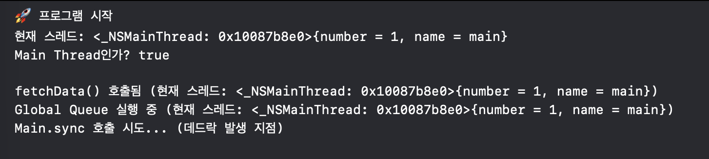
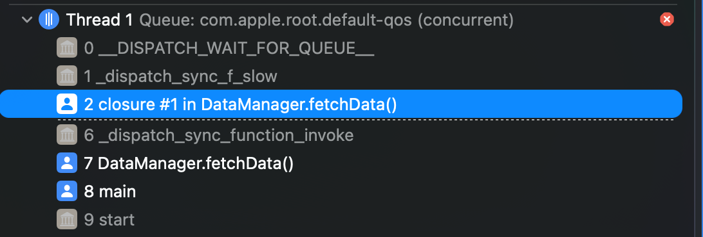

# 데드락과 실제 동기화 문제 상황

### 학습 키워드

- Deadlock (데드락)
- Lock Ordering (락 순서 규칙)
- Lock 락 경합
- Thread Sanitizer

## 1. 핵심 개념

### 데드락(Deadlock)이란?

**어떤 작업이 완료 신호를 기다리는데, 그 신호가 영원히 오지 않아 무한정 대기하는 상태**

### 전통적인 데드락: 락 순환 대기

```swift
// 두 스레드가 서로의 락을 기다리는 데드락
class BankAccount {
    private let lock = NSLock()
    private var balance: Int

    func transfer(to: BankAccount, amount: Int) {
        lock.lock()       // A 계좌 락 획득
        to.lock.lock()    // B 계좌 락 획득 시도 -> 데드락 발생

        self.balance -= amount
        to.balance += amount

        to.lock.unlock()
        lock.unlock()
    }
}

// Thread 1: accountA.transfer(to: accountB, 100)
// Thread 2: accountB.transfer(to: accountA, 50)
// -> Thread 1은 A 락 보유 + B 락 대기
// -> Thread 2는 B 락 보유 + A 락 대기
// -> 서로 영원히 대기
```

### 데드락 필요조건

데드락은 다음 **4가지 조건이 모두 만족**될 때만 발생:

1. **Mutual Exclusion (상호 배제)**
   - 자원을 한 번에 하나의 스레드만 사용 가능

2. **Hold and Wait (점유와 대기)**
   - 자원을 보유한 채로 다른 자원을 기다림

3. **No Preemption (비선점)**
   - 다른 스레드의 자원을 강제로 빼앗을 수 없음

4. **Circular Wait (순환 대기)**
   - 스레드들이 원형으로 서로의 자원을 기다림

> 4가지 조건 중 하나만 깨뜨려도 데드락 방지 가능

### Lock 경합이란?

**여러 스레드가 동시에 같은 락을 획득하려고 경쟁하면서 대기 시간이 증가하는 현상**

```swift
class GlobalCache {
    private let lock = NSLock()
    private var storage: [String: Data] = [:]

    func get(_ key: String) -> Data? {
        lock.lock()  // 수백 개의 스레드가 이 락을 기다림
        defer { lock.unlock() }
        return storage[key]
    }
}

// 100개의 스레드가 동시에 호출하면
// -> 99개는 대기, 1개만 실행
// -> 순차적 처리로 인한 성능 저하
```

---

## 2. 탐구 내용 (실무 / iOS 연결)

### 문제 상황

#### 1) Main Thread Deadlock

```swift
class DataManager {
    func fetchData() {
        DispatchQueue.global().async {
            let data = self.loadFromNetwork()

            // Main thread에서 완료를 기다림
            DispatchQueue.main.sync {
                self.updateUI(data)
            }
        }
    }
}

// Main thread에서 fetchData() 호출 시:
// 1. Main thread -> global queue의 작업 완료 대기
// 2. global queue -> Main thread에서 sync 실행 대기
// 3. 서로 영원히 기다림
```

<details><summary>실제 실험 분석</summary>

```swift
//
//  main.swift
//  SwiftAlgorithm
//
//  Created by 강윤서 on 3/13/26.
//

import Foundation

class DataManager {
    func loadFromNetwork() -> String {
        // 네트워크 I/O 시뮬레이션
        Thread.sleep(forTimeInterval: 0.1)
        return "Fetched Data"
    }

    func updateUI(_ data: String) {
        print("UI 업데이트 완료: \(data)")
    }

    func fetchData() {
        print("fetchData() 호출됨 (현재 스레드: \(Thread.current))")

        // Main Thread에서 호출
        DispatchQueue.global().sync {  // 1. Main이 global 작업 완료 대기
            print("Global Queue 실행 중 (현재 스레드: \(Thread.current))")
            let data = self.loadFromNetwork()

            // Global Queue 내에서 Main으로 동기 호출
            print("Main.sync 호출 시도... (데드락 발생 지점)")
            DispatchQueue.main.sync {   // 2. Global이 Main 대기
                self.updateUI(data)     // 데드락 발생
            }

            print("이 메시지는 데드락으로 인해 절대 출력되지 않음")
        }

        print("🎉 fetchData() 완료")
    }
}

// ========================================
// 실행 코드
// ========================================

let manager = DataManager()

print("🚀 프로그램 시작")
print("현재 스레드: \(Thread.current)")
print("Main Thread인가? \(Thread.isMainThread)")
print("")

// Main Thread에서 호출 -> 데드락 발생
manager.fetchData()

print("이 줄은 실행되지 않음 (데드락으로 프로그램 멈춤)")

```

**실행 결과**





- `__DISPATCH_WAIT_FOR_QUEUE__`: 큐를 기다리고 있음
- `_dispatch_sync_f_slow`: sync 호출이 blocking되어 느려짐 = 대기 중

</details>

#### 2) Recursive Lock

```swift
class Cache {
    private let lock = NSLock()
    private var storage: [String: Any] = [:]

    func get(_ key: String) -> Any? {
        lock.lock()
        defer { lock.unlock() }
        return storage[key]
    }

    func getOrCreate(_ key: String, factory: () -> Any) -> Any {
        lock.lock()  // 첫 번째 락 획득
        defer { lock.unlock() }

        if let value = get(key) {  // get()에서 다시 락 시도 -> 데드락
            return value
        }

        let newValue = factory()
        storage[key] = newValue
        return newValue
    }
}
```

#### 3) DispatchQueue + Lock 이중 동기화

```swift
class UserService {
    private let queue = DispatchQueue(label: "user.service")
    private let lock = NSLock()
    private var users: [User] = []

    func addUser(_ user: User) {
        queue.sync {  // Serial queue로 이미 동기화됨
            lock.lock()  // 불필요한 추가 락
            users.append(user)
            lock.unlock()
        }
    }
}
```

---

### 동작 원리 / 메커니즘

#### Lock Ordering (락 순서 규칙)

**원칙**: 모든 스레드가 동일한 순서로 락을 획득하면 Circular Wait 조건을 깨뜨려 데드락 방지

```swift
class BankAccount {
    let id: Int  // 계좌 고유 ID
    private let lock = NSLock()
    private var balance: Int

    // ✅ ID 순서로 락 획득
    func transfer(to: BankAccount, amount: Int) {
        // 항상 작은 ID의 계좌부터 락 획득
        let (first, second) = self.id < to.id ? (self, to) : (to, self)

        first.lock.lock()
        second.lock.lock()

        self.balance -= amount
        to.balance += amount

        second.lock.unlock()
        first.lock.unlock()
    }
}

// Thread 1: accountA(id:1).transfer(to: accountB(id:2), 100)
//   -> 1번 락 -> 2번 락 획득
// Thread 2: accountB(id:2).transfer(to: accountA(id:1), 50)
//   -> 1번 락 대기 -> 1번 락 획득 후 2번 락 획득
// ✅ 순환 대기 발생 안 함!
```

#### Timeout 메커니즘

```swift
class ResourceManager {
    private let lock = NSLock()

    func acquireResource() -> Resource? {
        // 100ms 내에 락 획득 실패 시 nil 반환
        guard lock.lock(before: Date(timeIntervalSinceNow: 0.1)) else {
            print("⚠️ Lock timeout - possible deadlock detected")
            // 데드락 의심 로그 전송
            Analytics.log("potential_deadlock", context: Thread.callStackSymbols)
            return nil
        }

        defer { lock.unlock() }
        return allocateResource()
    }
}
```

1. 락 획득 시도
2. Timeout 시간 내에 실패하면 즉시 반환
3. 무한 대기 방지 + 데드락 조기 감지

#### Lock-Free 설계 (Actor 모델)

```swift
actor UserRepository {
    private var users: [String: User] = [:]

    func addUser(_ user: User) {
        users[user.id] = user  // 자동으로 직렬화됨
    }

    func getUser(id: String) -> User? {
        return users[id]
    }
}

// 사용
Task {
    await repository.addUser(newUser)  // await으로 순차 접근 보장
}
```

1. 각 Actor는 내부적으로 Serial Executor를 가짐
2. 외부에서 Actor 메서드 호출 시 자동으로 작업 큐에 추가
3. 한 번에 하나의 작업만 실행되도록 Swift 런타임이 보장
4. 명시적 락 없이 Thread-Safety 달성

---

### 비용 / 성능 영향

#### 왜 느려지는가?

**1. Lock Contention (락 경합)**

```swift
// 성능 문제 예제
class GlobalCache {
    private let lock = NSLock()
    private var storage: [String: Data] = [:]

    func get(_ key: String) -> Data? {
        lock.lock()  // 🐌 병목 지점
        defer { lock.unlock() }
        return storage[key]
    }
}

// 1000개의 스레드가 동시 접근 시:
// - 999개는 대기 상태 (Blocked)
// - Context Switching 비용 증가
// - CPU는 놀고 있지만 처리량은 저하
```

**2. 병목 발생 지점**

```
Request → Lock 획득 대기 → Critical Section 실행 → Lock 해제
          ^^^^^^^^^^^^^^
          이 구간에서 대부분 시간 소비
```

#### 시스템 관점 영향

**Context Switching 비용**:

- 스레드가 락 대기 상태로 전환될 때마다 발생
- 레지스터 저장/복원, 캐시 무효화
- 락 경합이 심할수록 빈번한 Context Switch

**Memory Barrier**:

- 락 해제 시 CPU 캐시를 메인 메모리에 동기화
- 멀티코어 환경에서 추가 비용 발생

**해결 방법: Lock Striping (락 분할)**

```swift
// 하나의 큰 락 대신 여러 개의 작은 락
class ShardedCache {
    private let locks = (0..<16).map { _ in NSLock() }
    private var shards = (0..<16).map { _ in [String: Any]() }

    func set(_ key: String, value: Any) {
        let index = abs(key.hashValue) % 16  // 해시로 샤드 선택
        locks[index].lock()
        shards[index][key] = value
        locks[index].unlock()
    }
}

// 효과: 16개의 락 -> 평균 경합률 1/16로 감소
```

**해결 방법: Read-Write Lock**

```swift
class ConcurrentCache {
    private let queue = DispatchQueue(label: "cache", attributes: .concurrent)
    private var storage: [String: Any] = [:]

    func get(_ key: String) -> Any? {
        queue.sync {  // 읽기는 여러 스레드 동시 가능
            return storage[key]
        }
    }

    func set(_ key: String, value: Any) {
        queue.async(flags: .barrier) {  // 쓰기는 독점 실행
            storage[key] = value
        }
    }
}

// 읽기 작업이 90%인 캐시에서 효과적
// 성능 개선: 평균 응답 시간 2초 → 200ms (10배 향상)
```

---

### iOS에서의 동시성 문제

**완료 신호를 받지 못해서 발생하는 무한 대기**

```swift
func requestObjectAsync<T: Decodable>(_ target: API) async throws -> T {
    try await withUnsafeThrowingContinuation { [weak self] continuation in
        guard let self else {
            return  // 여기서 그냥 return
        }
        // 네트워크 요청...
    }
}
```

둘 다 **기다리던 신호가 오지 않아 영원히 멈춘 상태**

**차이점**

- 전통적 데드락: OS 레벨에서 스레드가 'Blocked' 상태가 되어 CPU 점유율이 0%가 됨
- Continuation Hang: Swift Runtime 레벨에서 Task가 'Suspended' 상태로 영원히 머묾. 스레드 자체는 다른 일을 할 수 있어 시스템은 돌아가지만, 해당 비즈니스 로직은 영원히 멈춤

**DateFormatter**

```swift
public final class DateFormatManager {
    public static let shared = DateFormatManager()

    private var formatter = DateFormatter()  // 여러 스레드가 공유

    public func setFormat(_ format: DateFormatType) {
        formatter.dateFormat = format.rawValue  // Race condition!
    }

    public func stringToDate(_ value: String) -> Date? {
        return formatter.date(from: value)  // 동시 접근 시 잘못된 결과
    }
}
```

- DateFormatter는 Thread-Safe하지 않음
- setFormat()으로 포맷 변경 → stringToDate() 호출 사이에 다른 스레드가 끼어들 수 있음
- 재현 어려움

---

## 3. 의문 / 논점

### Actor를 사용하면 데드락이 절대 안 생기는가?

**답변**: Actor 내부는 안전하지만, **Actor 간 상호 의존**에서는 여전히 데드락 가능

```swift
actor UserManager {
    func updateUser() async {
        await postManager.updatePosts()  // PostManager 대기
    }
}

actor PostManager {
    func updatePosts() async {
        await userManager.updateUser()  // UserManager 대기
    }
}

// Task 1: await userManager.updateUser()
// Task 2: await postManager.updatePosts()
// -> 서로 영원히 대기 가능 (Actor Deadlock)
```

**Swift의 Actor Reentrancy 설계**:

- Actor는 데드락을 방지하기 위해 의도적으로 reentrancy를 허용
- `await` 지점에서 다른 작업이 끼어들 수 있음 (interleaving)
- 데드락은 회피하지만, 상태 일관성 문제 발생 가능
- 개발자가 각 `await` 후 Actor 상태가 변경될 수 있음을 인지해야 함

**Swift 런타임의 데드락 감지 능력**:

- **Actor 간 데드락은 감지하지 못함**
- Swift는 현재 런타임에 Actor 간 상호 의존성을 감지하는 메커니즘이 없음
- 개발자가 설계로 방지해야 함

### ❓ Thread Sanitizer(TSan)는 데드락을 감지할 수 있나?

**TSan이 감지할 수 있는 것**:

- `TSAN_OPTIONS=detect_deadlocks=1` 옵션으로 **lock-order-inversion** (잠재적 데드락) 감지
- pthread mutex 기반의 순환 대기 (A→B, B→A)
- NSLock 같은 전통적인 락의 데드락 패턴

**TSan의 한계**:

- **Swift Actor 간 데드락은 감지 못함** (Actor는 내부적으로 다른 동기화 메커니즘 사용)
- **Continuation resume 미호출 같은 무한 대기 현상은 감지 불가**
- 주로 data race 감지에 특화되어 있음

**현재 iOS/Swift에서 데드락을 감지하는 방법**:

| 도구                    | 감지 가능한 데드락        | 한계                          |
| ----------------------- | ------------------------- | ----------------------------- |
| **Thread Sanitizer**    | pthread 락 순환 대기      | Actor, Continuation 감지 못함 |
| **Main Thread Checker** | Main thread 데드락        | 기본 활성화, Main thread만    |
| **Xcode 디버깅**        | 수동으로 스레드 상태 확인 | 재현이 어려운 경우 곤란       |
| **Instruments**         | 락 대기 시간 측정         | 실시간 감지는 못함            |
| **Runtime 경고**        | Continuation 누수 감지    | 앱 실행 중에만 확인 가능      |

**결론**
완벽한 데드락 감지 도구는 없음. **설계와 코드 리뷰로 예방**

### ❓ Timeout을 설정하면 데드락이 해결되는가?

Timeout은 데드락을 **감지**할 뿐, **근본 원인**을 해결하지 못함

```swift
func transfer() {
    guard lock.lock(before: timeout) else {
        return  // 실패 처리
    }
    // ... 락 순서 문제는 여전히 존재
}
```
