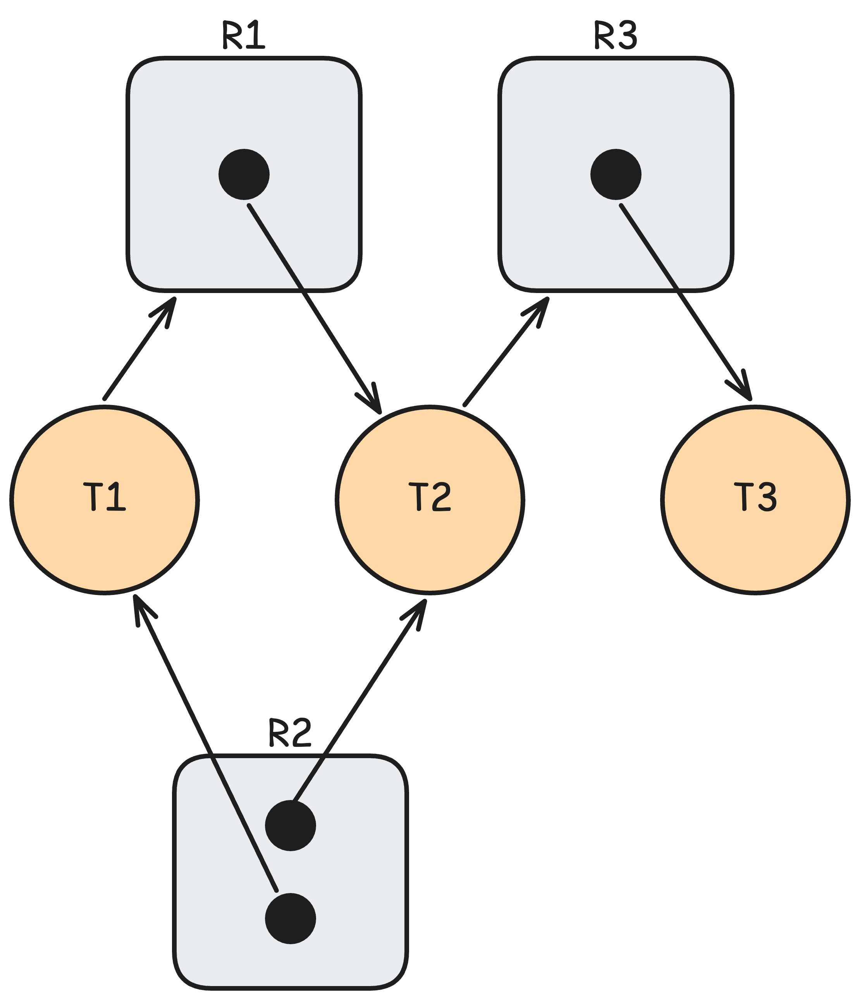
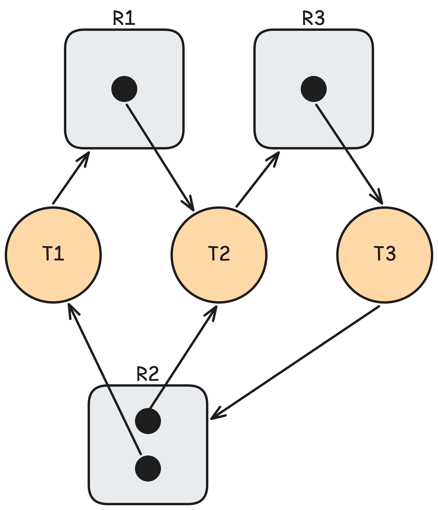
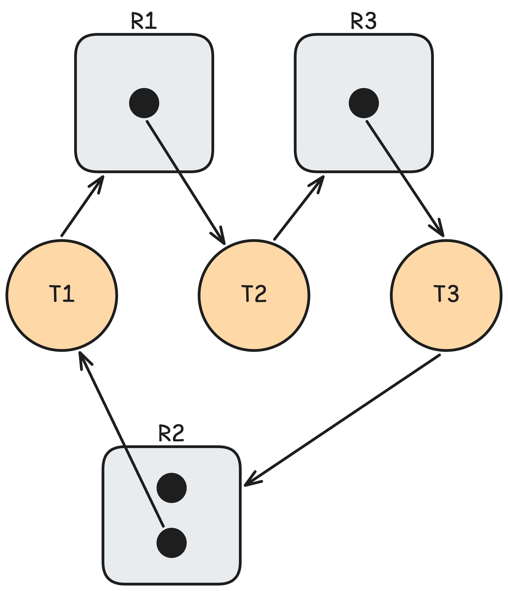

# Deadlock 발생 조건

### 학습 키워드

`# Deadlock`

## 1. 핵심 개념

### 교착 상태 (Deadlock)

한 스레드 (혹은 프로세스)가 **필요로 하는 자원을 다른 대기 상태의 스레드에서 가지고 있고**, **그 스레드도 또 다른 스레드를 기다리고 있어 영원히 대기하는 상태**를 의미한다.  
스레드 집합이 교착 상태라는 말은 집합 내 모든 스레드가 오직 집합 내의 다른 스레드가 발생시킬 수 있는 이벤트를 기다리고 있다는 걸 의미한다.

### 교착 상태 발생 조건

#### [1] 상호 배제 (Mutual exclusion)

최소 하나의 자원이 공유할 수 없는 상태로 유지되어야 한다.  
여기서 공유할 수 없다는 건 한 번에 하나의 스레드만 자원을 사용할 수 있다는 걸 의미한다.

#### [2] 점유와 대기 (Hold and wait)

스레드는 최소 하나의 자원을 가지고 있으며 현재 다른 스레드가 가지고 있는 자원을 얻기 위해 대기한다.

#### [3] 선점 금지 (No Preemption)

자원은 스레드가 작업을 완료한 후에만 자발적으로 해제된다.

#### [4] 순환 대기 (Circular wait)

대기 스레드 집합의 대기 방향 (자원 요청 방향)이 순환 형태를 띈다.  
`T0, T1, … Tn`의 집합에서 a 스레드가 b 스레드가 보유한 자원을 대기하는 것을 a->b로 표시한다고 가정했을 때, `T0 -> T1, T1 -> T2, …, Tn -> T0`의 형태를 띈다.

#### 해석

**이 4가지 조건을 모두 충족할 때만 교착 상태가 발생**한다.

1. `상호 배제`가 자원 독점을 만들고
2. `점유와 대기`가 독점하면서 추가 요구를 만들고
3. `선점 금지`가 강제 해제 불가를 만들고
4. `순환 대기`가 탈출 불가능한 순환 구조를 만듭니다.

> 순환 대기 조건은 점유와 대기 조건을 암시한다.  
> 이처럼 각 조건들은 독립적이지 않다.  
> 하지만 각 조건을 나눠서 생각하면 발생 여부를 쉽게 파악할 수 있을 듯 하다.

### 자원 할당 그래프 (Resource-Allocation Graph)

> 스레드와 자원 간의 할당/요청 상태를 시각화해 시스템의 교착 상태를 판별할 때 사용된다.

#### [1] 사전 지식: 시스템 모델

> 이어지는 내용에서 `자원 타입`, `자원 타입의 인스턴스`와 같은 말을 이해하기 위한 개념

시스템의 각 자원들은 타입들로 나뉘는데, 각 타입은 동일한 형태의 인스턴스들로 구성된다.  
여기서 자원 타입의 예시는 CPU cycle, 파일, 입출력 장치, mutex lock, 세마포어 등이 있다.  
스레드는 필요한만큼 자원을 요청하고, 요청에 대한 할당은 해당 자원 타입의 인스턴스가 할당된다.

#### [2] 구성 요소

1. **정점 (vertices)**
   - T: 시스템에서 활동 중인 스레드를 원으로 표현
   - R: 시스템의 자원 타입을 사각형으로 표현
     - 자원 타입의 각 인스턴스는 사각형 내부에 점으로 표현
2. **간선 (edges)**
   - 요청 간선: T -> R, 스레드 T가 R 타입의 인스턴스를 요청하고 대기 중인 상태
   - 할당 간선: R -> T, R 타입의 인스턴스 중 하나가 스레드 T에 할당된 상태

> 요청 간선은 사각형(타입) 자체를 가리키고, 할당 간선은 사각형 내부의 특정 점(인스턴스)에서 출발한다.  
> 즉 스레드는 "특정 인스턴스"를 지목해서 기다리는 게 아니라 "그 타입 중 아무거나"를 기다린다.

#### [3] 그래프 해석하기

그래프에 사이클이 존재하지 않으면 교착 상태가 아닌 것은 확정이다.  
반면 사이클이 존재할 때는 교착 상태일 수도 아닐 수도 있다.

- 모든 자원 타입의 인스턴스가 하나인 경우
  - 사이클이 존재하면 교착 상태임이 확실하다.
  - 해당 사이클에 속한 스레드만 교착 상태에 빠진 상황이다.
- 인스턴스가 복수인 자원 타입이 존재하는 경우
  - 사이클이 존재해도 교착 상태가 아닐 수 있다.
  - 요청 간선이 타입 전체를 가리키기 때문에, 사이클에 속하지 않은 다른 인스턴스가 해제되면 그것을 받아 진행할 수 있게 된다.
  - 물론 모든 인스턴스가 사이클 내에 묶여 있다면 교착 상태가 발생한다.

**정리하면**, 사이클 없음은 `교착 상태 아님`의 충분조건이고, 단일 인스턴스 환경에서 사이클 존재는 `교착 상태`의 필요충분조건이며, 복수 인스턴스 환경에서 사이클 존재는 `교착 상태 가능성`의 필요조건일 뿐이다.

#### [4] 예시

| **그래프**              |  |                  |  |
| ----------------------- | ------------------------------------------------------------- | ----------------------------------------------------------------------------- | ------------------------------------------------------------- |
| **존재하는 사이클**     | -                                                             | (1) T1 -> R1 -> T2 -> R3 -> T3 -> R2 -> T1 <br>(2) T2 -> R3 -> T3 -> R2 -> T2 | T1 -> R1 -> T2 -> R3 -> T3 -> R2 -> T1                        |
| **교착 상태 발생 여부** | 발생하지 않음                                                 | **🚨 교착 상태 발생**                                                         | 발생하지 않음                                                 |

## 2. 탐구 내용 (실무 / iOS 연결)

### 패턴 A — Main Queue에서 sync 호출

```swift
// 메인 스레드에서 실행 중일 때
DispatchQueue.main.sync {
    print("이 코드는 영원히 실행되지 않습니다")
}
```

메인 큐는 직렬 큐이므로 한 번에 하나의 블록만 실행한다.  
원래 실행되면 블록(작업)을 A, 위 `print`을 포함하는 블록은 B라고 했을 때,

- **sync** -> A가 끝나려면 B가 끝나야 한다. (새 블록 B를 큐에 넣고 B가 끝날 때까지 현재 스레드를 멈춤)
- **직렬 큐** -> B가 실행되려면 A가 먼저 끝나야 한다.

#### 발생 조건 확인

1. 상호 배제: 직렬 큐라서 한 번에 하나의 블록만 실행
2. 점유와 대기: A가 큐를 점유한 채 B의 완료를 기다림
3. 선점 금지: A를 강제로 밀어내고 B를 먼저 실행할 수 없음
4. 순환 대기: A와 B가 서로를 기다림

### 패턴 B — Serial Queue 간 상호 sync 호출

```swift
let queueA = DispatchQueue(label: "A")
let queueB = DispatchQueue(label: "B")

queueA.async { // 블록 1
    queueB.sync { // 블록 2
        queueA.sync { // 블록 3
            print("Deadlock")
        }
    }
}
```

`queueA`의 작업이 `queueB.sync`를 호출하며 블로킹되고, 그 안에서 다시 `queueA.sync`를 호출하면 `queueA`는 현재 `블록 1`이 끝나길 기다리고 있으므로 순환 대기가 완성된다.  
`블록 1`은 `async`든 `sync`든 상관 없고, `블록 3`을 `sync`로 호출하는 것이 문제다.  
`queueA`의 실행 슬롯은 `블록 1`이 점유하고 있는데, 해당 큐에 `블록 3`을 `sync`로 넣어버리니 `블록 3`은 `블록 1`을 기다리는 형태가 된다.

#### 발생 조건 확인

1. 상호 배제: 직렬 큐라서 한 번에 하나의 블록만 실행
2. 점유와 대기: `블록 1`이 큐를 점유한 채 `블록 2`의 완료를 기다림
3. 선점 금지: `블록 1`을 강제로 밀어내고 `블록 2/3`을 실행할 수 없음
4. 순환 대기: 대기 사이클 존재 - `블록 1` → `블록 2` → `블록 3` → `블록 1`

### 패턴 C — NSLock 재진입 문제

```swift
let lock = NSLock()

func doSomething() {
    lock.lock()
    doSomethingElse()  // 이 안에서 다시 lock을 잡으려 함
    lock.unlock()
}

func doSomethingElse() {
    lock.lock()    // 여기서 deadlock
    // ...
    lock.unlock()
}
```

`NSLock`은 같은 스레드에서 두 번 `lock`하면 자기 자신이 `unlock`하길 기다리는 구조가 된다.

#### 발생 조건 확인

1. 상호 배제: `NSLock`은 한 번에 하나만 획득할 수 있음
2. 점유와 대기: 스레드가 lock을 보유한 채로 다시 같은 lock을 요청하며 기다림
3. 선점 금지: lock을 강제로 빼앗아 해제할 수 없음
4. 순환 대기: 스레드가 자기 자신의 unlock을 기다리는데, 실행될 수 없음

### 실제로 자주 실수할 수 있는 부분: sync 사용 조심

> 백그라운드에서 데이터 파싱 같은 무거운 작업을 하다가, "어? UI를 업데이트해야 하네? Main.sync로 값을 바로 받아와야지."  
> 메인 스레드에서 "그 데이터가 잘 처리되고 있는지 확인하고 다음 단계로 가야 하니까, backgroundQueue.sync로 상태를 체크해야지."
>
> 이렇게 서로의 결과값이 즉시 필요해서 **sync**를 마구 사용할 때 교착 상태의 위험에 빠질 수 있다.

```swift
import Foundation

// MARK: - 테스트 설정
let useConcurrent = false // 백그라운드 큐의 concurrent 설정 여부
let useBackgroundSync = false // 메인 스레드에서 두 번째 백그라운드 작업을 추가할 때 동기/비동기 여부

let queueAttributes = useConcurrent ? DispatchQueue.Attributes.concurrent : []
let backgroundQueue = DispatchQueue(label: "com.example.background", attributes: queueAttributes)

print("--- 테스트 시작 (Mode: \(useConcurrent ? "Concurrent" : "Serial")) ---")

// MARK: - 1. 백그라운드에서 먼저 작업을 시작합니다.
backgroundQueue.async {
    print("🎬 [Background] 작업 시작")

    print("⏳ [Background] Main.sync 호출 시도 중...")

    // 🚩 데드락 발생 가능 지점: 메인 스레드가 비기를 기다립니다.
    DispatchQueue.main.sync {
        print("✅ [Background] Main.sync 성공!")
    }
}

// MARK: - 메인 스레드의 추가 작업

if useBackgroundSync {
    // 2.1. 메인 스레드에서 백그라운드 큐로 동기 작업을 보냅니다.
    print("🎬 [Main] Background.sync 호출 시도 중...")
    // 🚩 데드락 발생 가능 지점: 백그라운드 큐가 비기를 기다립니다.
    backgroundQueue.sync {
        print("✅ [Main] Background.sync 성공!")
    }
} else {
    // 2.2. 메인 스레드에서 백그라운드 큐로 비동기 작업을 보냅니다.
    print("🎬 [Main] Background.async 호출")
    backgroundQueue.async {
        print("✅ [Main] Background.async 성공!")
    }
}

print("🏁 Main의 1번 작업 완료!")
```

#### 해석

백그라운드 큐가 직렬 큐이면서, 메인에서 두 번째 백그라운드 작업을 넣을 때 sync로 넣는다는 두 조건이 성립될 때 교착 상태가 발생한다.
| useConcurrent | useBackgroundSync | **큐 종류** | **메인→백 호출** | **결과** |
|:-------------:|:-----------------:|:----------:|:-----------:|:---------:|
| false | true | Serial | sync | **교착 상태** |
| false | false | Serial | async | 정상 |
| true | true | Concurrent | sync | 정상 |
| true | false | Concurrent | async | 정상 |

**조건 1: 직렬 큐 = `상호 배제`**  
백그라운드 큐의 실행 슬롯이라는 자원에 대한 상호 배제 충족

**조건 2: sync 호출 = `점유와 대기` 와 `순환 대기`**  
`backgroundQueue.sync`는 메인 스레드를 점유한 채로 앞선 백그라운드 큐의 작업이 완료되길 기다린다.  
동시에 `DispatchQueue.main.sync`는 백그라운드 큐의 실행 슬롯을 점유한 채로 먼저 시작된 메인 스레드의 작업이 완료되기를 기다린다.

## 3. 의문 / 논점

### Swift Actor 간 순환 호출은 어떨까?

```swift
actor AccountManager {
    func process() async {
        await orderManager.validate()
    }
}

actor OrderManager {
    func validate() async {
        await accountManager.process()
    }
}
```

#### 발생 조건 확인

1. 상호 배제: 각 `actor`는 한 번에 하나의 작업만 처리할 수 있음
2. 점유와 대기: `await`에서 suspend되는 순간 `actor`의 실행 슬롯을 반납 -> **성립하지 않음**
3. 선점 금지: `actor`에서 실행 중인 작업을 강제로 밀어내고 다른 작업을 처리하는 것은 불가능
4. 순환 대기: 호출 구조는 순환이지만, 실행 슬롯을 보유한 채 대기하지 않음 -> **성립하지 않음**

#### 나의 해석

교착 상태라기보다는 서로를 무한히 호출하는 무한 재귀 상태로 보인다.  
Livelock으로 언뜻 보이기도 하지만, 실패한 작업을 계속 시도하는 것이 아닌 특정 작업을 계속 시도하며 그 작업은 완료되지 않는 상태다. 그래서 Livelock도 아니지 않을까 싶다.  
스레드 혹은 프로세스의 대기로 이어지진 않지만, 무한 재귀와 함께 추가되는 작업들이 완료되지 않는 상태라고 보인다.

> actor의 메소드인지를 따지기 이전에 메소드가 서로를 호출하면 항상 무한 재귀 아닌가?  
> 그래도 알아가는 포인트는 actor의 메소드 호출은 주로 스레드를 점유하지 않아 교착 상태 위험이 적다는 것

### 시스템 자원 타입의 인스턴스가 복수면 데이터 경쟁의 위험이 없을까?

해당 자원을 사용할 때 어떤 작업을 하는지에 따라 다르다.  
당연히 모두가 읽기 작업만 수행하면 문제가 없다.  
하지만 쓰기 작업을 진행할 때는 따로 동기화 처리가 없다면 데이터 경쟁의 위험이 존재한다.  
어떤 인스턴스가 사용가능한지 확인하는 작업 자체도 위험하다.  
인스턴스가 여러 개가 되면서 병렬 처리의 장점을 가져가지만, 동기화 문제를 해결하는 비용이 늘어날 수 있다.

## 4. 참고 자료

[Operating System Concepts](https://product.kyobobook.co.kr/detail/S000003114660)  
[OS Deadlock Deep Dive: Necessary Conditions, Prevention & Detection](https://medium.com/@bharathan.m.blr/os-deadlock-deep-dive-necessary-conditions-prevention-detection-7cb3783988e0)  
[\[iOS - swift\] DispatchQueue.main.sync 사용 시 주의사항 \(Deadlock\)](https://ios-development.tistory.com/598)
