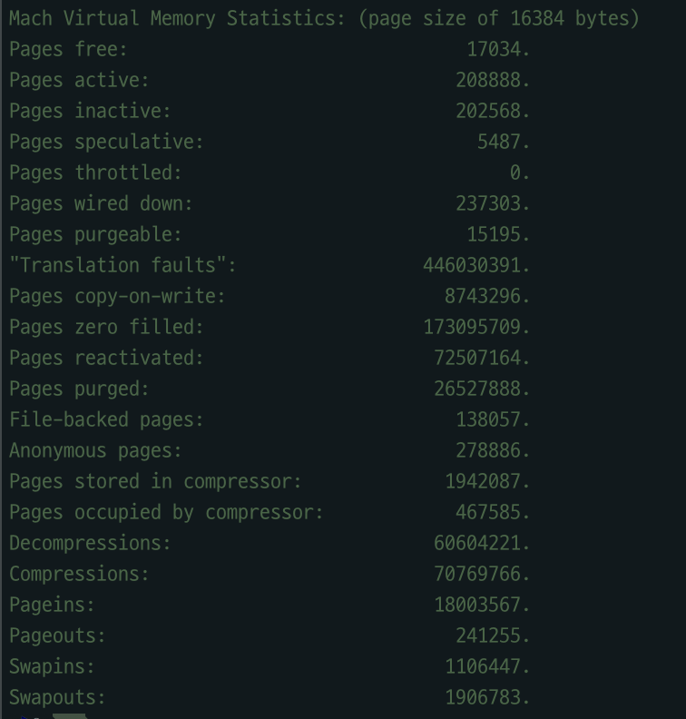
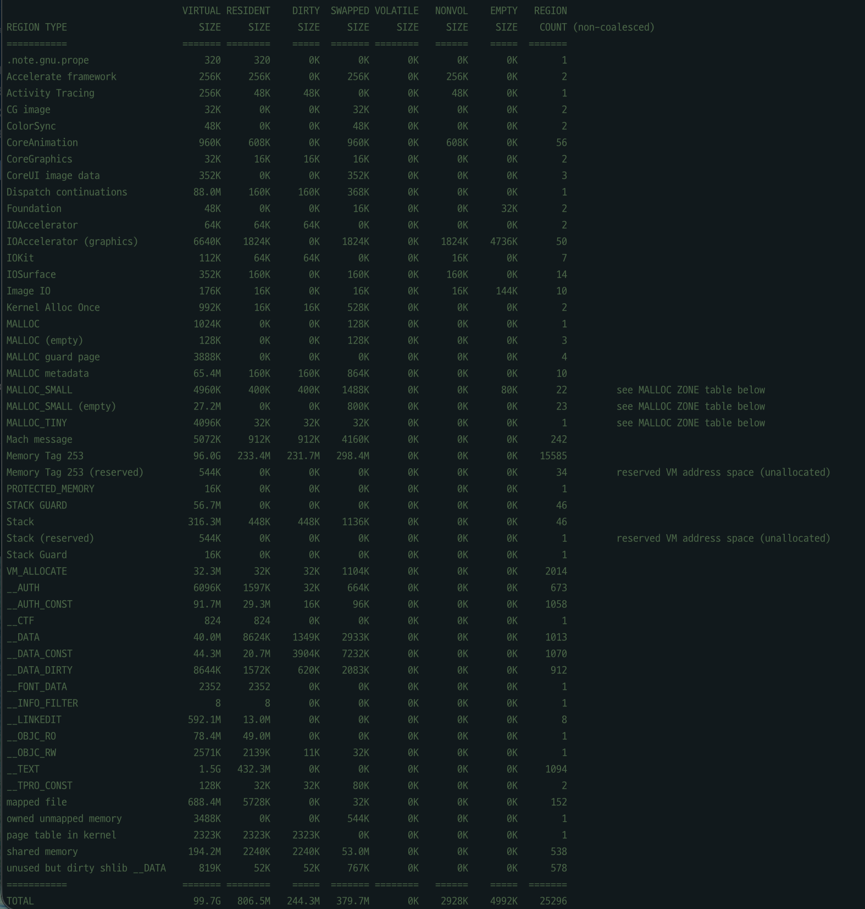

# 논리 주소에서 물리 주소로: 메모리 변환의 여정

### 학습 키워드

- Logical Address(Virtual Address), Physical Address
- MMU, Page Table, Paging, TLB
- Page Fault, Demand Paging, Memory Protection
- IOMMU, DMA

## 1. 핵심 개념

### 1) 집중 탐구 A: 프로그램이 보는 주소 vs 실제 메모리

프로그램은 실행될 때 "내가 메모리 어디에 실제로 올라갔는지"를 몰라도 동작해야 합니다.  
그래서 프로그램은 자기 기준의 주소(논리/가상 주소)를 사용하고, 하드웨어는 실제 RAM 위치(물리 주소)를 사용합니다.

이 구조의 핵심 목적은 3가지입니다.

- **재배치(Relocation)**: 프로그램을 매번 다른 물리 위치에 올려도 동일하게 실행
- **보호(Protection)**: 프로세스끼리, 또는 사용자 코드와 커널 메모리를 격리
- **효율(Utilization)**: 물리 메모리를 페이지 단위로 유연하게 배치

| 구분 | 논리 주소 (Logical/Virtual) | 물리 주소 (Physical) |
| --- | --- | --- |
| 관점 | 실행 중인 프로그램 | 실제 메모리 하드웨어 |
| 누가 생성/결정하나 | CPU가 생성한 주소 | MMU가 변환한 실제 위치 |
| 특징 | 연속적인 큰 공간처럼 보임 | 실제로는 불연속 배치 가능 |


출처: [Wikimedia Commons](https://commons.wikimedia.org/wiki/File:Virtual_address_space_and_physical_address_space_relationship.svg)

- 프로세스 입장에서는 연속 공간처럼 보이지만, 물리 메모리는 페이지 단위로 흩어져 있을 수 있습니다.
- 같은 가상 주소라도 프로세스가 다르면 다른 물리 주소로 매핑될 수 있습니다.

#### 같은 가상 주소, 다른 물리 주소

예를 들어 `Process A`와 `Process B`가 둘 다 `0x1000`을 읽더라도:

- A의 `0x1000` -> 물리 프레임 `0xA7...`
- B의 `0x1000` -> 물리 프레임 `0x3C...`

즉 주소 값은 같아도, 각 프로세스가 보는 "주소 공간"이 다르기 때문에 실제 대상 데이터는 다르고  
이 덕분에 프로세스 격리(보안/안정성)가 성립합니다.

#### 왜 이 관점이 중요한가?

- 앱 개발자는 "내 메모리"만 신경 쓰면 되고, 물리 배치는 OS가 책임.
- 크래시 분석에서는 반대로 가상 주소를 실제 매핑/권한 관점으로 해석해야 원인을 잡을 수 있습니다.


### 2) 집중 탐구 B: OS와 MMU 역할 분담

MMU(Memory Management Unit)는 CPU가 낸 가상 주소를 물리 주소로 바꿔 주는 하드웨어.  
동시에 "이 주소 접근이 허용되는가?"를 검사하는 보호 장치이기도 합니다.

MMU가 수행하는 핵심 동작:

- 주소 변환: `VA -> PA`
- 권한 검사: Read/Write/Execute 비트 확인
- 예외 전달: 매핑 부재/권한 위반 시 page fault 예외 발생

즉, OS가 페이지 테이블이라는 규칙을 준비하고, MMU가 매 메모리 접근마다 그 규칙을 집행.

#### 누가 무엇을 책임지나?

| 구분 | OS(커널) | MMU(하드웨어) |
| --- | --- | --- |
| 페이지 테이블 | 생성/수정/해제 | 읽어서 변환에 사용 |
| 접근 권한 정책 | 각 페이지의 R/W/X 권한 설정 | 실제 접근 시 권한 검사 |
| 프로세스 전환 | PTBR/TTBR 등 기준값 교체 | 새 기준으로 즉시 변환 수행 |
| fault 처리 | 원인 분석 후 복구/종료 결정 | fault 트랩 발생시켜 커널로 이관 |

#### 실행 시점 기준 흐름

1. 프로세스 시작: OS가 주소 공간/페이지 테이블 생성
2. 실행 중 메모리 접근: MMU가 `VA -> PA` 변환 + 권한 검사
3. context switch: OS가 다음 프로세스의 페이지 테이블 기준으로 교체
4. fault 발생 시: MMU가 트랩, OS가 복구(페이지 적재/COW) 또는 종료(`EXC_BAD_ACCESS`)


### 3) 주소 변환의 본체: Paging

페이징은 가상 메모리를 페이지(Page), 물리 메모리를 프레임(Frame)으로 같은 크기로 나눠 매핑하는 방식입니다.


출처: <https://velog.io/@codemcd/%EC%9A%B4%EC%98%81%EC%B2%B4%EC%A0%9COS-13.-%ED%8E%98%EC%9D%B4%EC%A7%95>

주소 변환 3단계:

1. 가상 주소를 `VPN(가상 페이지 번호) + Offset(페이지 내부 위치)`로 분해
2. 페이지 테이블에서 `VPN -> PFN(물리 프레임 번호)` 조회
3. `PFN + Offset` 결합해 최종 물리 주소 생성

핵심 포인트는 **Offset은 그대로 유지**된다는 점입니다.

#### 예시 1: 16KB 페이지에서 분해/결합

- 페이지 크기 `16KB = 2^14` 이므로 하위 14비트는 `Offset`, 상위 비트는 `VPN`
- 가상 주소 `VA = 0x12345`

```text
VPN    = VA >> 14                 = 0x4
Offset = VA & (2^14 - 1)          = 0x2345
```

왜 `0x12345 >> 14 = 0x4` 인가?

1. `>> 14`는 "2^14(=16384)로 나눈 몫"을 구하는 것과 같다.
2. `0x12345 = 74565(10진수)` 이므로 `74565 / 16384 = 4 ... 9029`
3. 몫 `4`가 VPN, 나머지 `9029(=0x2345)`가 Offset이 된다.

비트로 보면 더 직관적으로 볼 수 있습니다.

```text
VA(0x12345) = 0001 0010 0011 0100 0101
               [  VPN  ][    Offset(14bit)   ]
               [000100 ][10 0011 0100 0101]
```

- 오른쪽 14비트를 잘라내면(shift) `000100(2) = 0x4`가 남는다.
- 잘라낸 하위 14비트가 `0x2345`라서 Offset이 된다.

페이지 테이블 조회 결과가 `VPN 0x4 -> PFN 0x9A` 라고 가정하면:

```text
PA = (PFN << 14) | Offset
   = (0x9A << 14) | 0x2345
   = 0x26A345
```

즉, 같은 `Offset(0x2345)`를 유지한 채 "어느 프레임인지(PFN)"만 바뀌어서 물리 주소가 결정됩니다.

#### 예시 2: 같은 주소를 4KB 페이지로 보면

- 페이지 크기 `4KB = 2^12` 이므로 하위 12비트가 Offset
- 같은 `VA = 0x12345`를 분해하면:

```text
VPN    = VA >> 12 = 0x12
Offset = VA & 0xFFF = 0x345
```

페이지 크기가 바뀌면 `VPN/Offset` 경계(비트 경계)가 달라진다는 점이 핵심.

- 장점: 외부 단편화 완화
- 한계: 페이지 마지막 조각에서 내부 단편화 발생 가능

### 3-1) 페이지 테이블은 어디에 있고, 한계는 무엇인가?

그래서 이 페이지 테이블이 어디에 있나 살펴보았습니다. 

 **페이지 테이블 "본체"는 RAM(커널 메모리)에 있고 MMU/CPU 안에는 보통 없다.**

- CPU/MMU가 갖는 것: 페이지 테이블 시작 주소를 담은 레지스터(예: PTBR/TTBR/CR3) + TLB 캐시
- RAM이 갖는 것: 실제 페이지 테이블 엔트리들 

왜 CPU 안에 페이지 테이블 전체를 넣지 않을까?

- 프로세스마다 테이블이 달라 용량이 매우 커짐
- context switch 때마다 큰 테이블을 통째로 바꿔야 해서 비현실적
- 하드웨어 면적/전력 비용이 과도하게 증가

그럼 RAM에만 두면 끝일까? 그것도 한계가 있다.

- 매 주소 접근마다 페이지 테이블을 보러 가면 메모리 접근이 추가됨
- 다단계 페이지 테이블에서는 page walk 단계가 늘어 지연이 커질 수 있음
- 즉, "메모리에만 둔 테이블"은 유연하지만 느릴 수 있습니다.

그래서 현실적인 절충이 **TLB + 다단계 페이지 테이블** 조합.

### 4) 더 빠른 길: TLB

TLB(Translation Lookaside Buffer)는 최근 주소 변환 결과를 저장하는 "주소 변환 전용 캐시".

TLB 도입 배경은 명확합니다.  
페이징에서는 주소 하나를 읽기 전에 먼저 페이지 테이블을 찾아야 하므로, 변환 정보가 캐시에 없으면 메모리 접근이 늘어나기 때문입니다.

- TLB가 없으면: `페이지 테이블 조회 + 실제 데이터 접근`으로 비용 증가
- TLB가 있으면: 자주 쓰는 변환을 바로 재사용
- 근거: 프로그램은 최근에 접근한 주소 주변을 다시 접근하는 경향(참조 지역성)이 큼

즉, TLB는 "가상 메모리의 유연성"을 유지하면서도 "주소 변환 오버헤드"를 줄이기 위해 도입된 장치.

```text
CPU가 VA 생성
 -> MMU가 TLB 조회
    -> hit: 즉시 PA 계산
    -> miss: 페이지 테이블 탐색(page walk)
       -> 매핑 존재: TLB 갱신 후 재실행
       -> 매핑 없음/권한 위반: page fault -> 커널 처리
```


출처: [Wikimedia Commons](https://commons.wikimedia.org/wiki/File:Page_table_actions.svg)

- `TLB hit` 비율이 높을수록 메모리 접근 비용이 적음.
- `TLB miss`가 늘면 page walk가 늘고, 체감 성능이 떨어짐.

## 2. 탐구 내용 (실무 / iOS 연결)

### 1) Page Fault가 EXC_BAD_ACCESS로 보이는 순간

iOS/macOS에서 `EXC_BAD_ACCESS`는 보통 아래와 같은 MMU 검사 실패로 나타납니다.

- 없는 가상 주소 접근
- 읽기 전용 페이지에 쓰기
- 잘못된 포인터 역참조

앱에서 보이는 증상은 포인터 오류지만, 시스템 관점에서는 주소 변환/권한 검사 실패.


### 2) `vm_stat`로 보는 VM 동작 흔적

- `Translation faults`
  - `vm_stat` 기준으로는 커널의 `vm_fault` 루틴이 호출된 누적 횟수.
  - 보통 CPU가 페이지 폴트 트랩을 올렸을 때 증가합니다. (TLB 미스 후 page walk에서 미해결, 미상주 페이지 접근, 권한 검사 필요 등)
  - OS 처리 흐름은 대략 다음과 같습니다.
    1. CPU/MMU가 fault 트랩 발생
    2. 커널 `vm_fault`가 해당 가상주소의 매핑/권한 확인
    3. 케이스별 처리
       - 유효 + 비상주: 디스크/압축 영역에서 페이지를 올려 매핑 후 재실행
       - 유효 + COW: 새 물리 페이지 복사 후 쓰기 가능한 매핑으로 교체
       - 무효/권한 위반: 프로세스에 `EXC_BAD_ACCESS` 전달
  - 즉, `Translation faults`가 늘었다고 모두 크래시는 아니고, 상당수는 커널이 복구 가능한 정상 fault입니다.

- `Pages copy-on-write`
  - 공유 페이지(예: fork 직후 메모리, 공유된 데이터)를 누군가 "쓰기" 시작할 때 실제 복사가 발생한 횟수.
  - 값이 크다는 것은 COW 최적화가 활발히 사용되었다는 뜻이기도 하지만, 동시에 쓰기 시점 복사 비용(메모리 대역폭/캐시 오염)이 누적됐다는 의미.

- `compressor` 관련 수치
  - 메모리 압박 시, 덜 사용되는 페이지를 디스크로 바로 내리기 전에 RAM 내 압축 저장소로 먼저 압축.
  - 그래서 `stored/occupied/decompressed` 수치가 크면 VM이 압축으로 여유 공간을 확보하고 있다는 신호.
  - 여기에 `pageouts/swapouts`까지 함께 크면 압박이 더 심해졌다고 해석할 수 있습니다.

### 3)`vmmap`으로 보는 가상/실메모리 차이


- Virtual: ~99GB
- Resident: ~806MB

- `Virtual Size`와 `Resident`가 다르면, 가상 공간 전체가 RAM에 올라온 상태가 아님을 의미.
- 이 차이가 바로 demand paging의 실제 동작 결과입니다.

### 4) 확장: IOMMU는 왜 필요한가?

CPU 쪽 주소 변환이 MMU라면, DMA(Direct Memory Access)를 쓰는 장치(GPU/NIC 등) 쪽 주소 변환은 IOMMU가 담당.

- 장치 메모리 접근에 대한 주소 변환/보호 제공
- 파편화된 물리 버퍼를 장치에는 연속 공간처럼 보이게 제공
- 잘못된 DMA 접근이 시스템 메모리를 훼손하지 않도록 격리

가상화 환경에서는 게스트 OS와 장치 사이를 안전하게 연결해 주는 핵심 구성 요소입니다.

## 3. 의문 / 논점 답변

### 1) 페이지 크기(4KB/16KB/64KB)와 워크로드의 균형

핵심은 **"TLB miss 감소" vs "내부 단편화 증가"** 의 트레이드오프입니다.

- `4KB`가 유리한 경우
  - 작은 객체를 랜덤하게 많이 만지는 워크로드
  - 메모리 낭비(내부 단편화)를 최소화해야 하는 경우
- `16KB`가 유리한 경우
  - 모바일/일반 앱에서 무난한 절충안
  - TLB 효율과 단편화 사이 균형이 비교적 좋음
- `64KB`가 유리한 경우
  - 대용량 배열/순차 스캔/스트리밍처럼 공간 지역성이 큰 워크로드
  - 단편화 비용을 감수하고 TLB miss를 크게 줄이고 싶은 경우

실무에서는 "전역적으로 큰 페이지"보다, 일부 핫한 영역에 선택적으로 적용하는 방식이 현실적

### 2) Swift에서 `EXC_BAD_ACCESS`가 자주 나는 패턴

대표 패턴은 "수명(lifetime) 위반"과 "unsafe 메모리 접근"입니다.

- `UnsafePointer/UnsafeMutablePointer` 오용
  - 해제된 메모리 접근(use-after-free)
  - 유효 범위 밖 인덱스 접근(out-of-bounds)
- 객체 수명 관리 실수
  - `unowned` 참조 대상이 먼저 해제된 경우
  - 비동기 작업에서 캡처한 객체가 이미 소멸된 경우
- 브리징 실수 (Swift <-> CoreFoundation/C)
  - `Unmanaged` retain/release 불균형
  - C API에 넘긴 포인터의 생존 기간을 보장하지 못한 경우

재현 포인트는 대체로 동일: "해제 이후 접근" 또는 "권한/범위 밖 접근"을 만들면 MMU 권한/매핑 검사에서 실패하고 `EXC_BAD_ACCESS`로 관찰.

## 4. 참고 자료
- Wikipedia: Page table (<https://en.wikipedia.org/wiki/Page_table>)
- Wikimedia Commons
  - <https://commons.wikimedia.org/wiki/File:Virtual_address_space_and_physical_address_space_relationship.svg>
  - <https://commons.wikimedia.org/wiki/File:Page_table_actions.svg>
