# 페이징

### 학습 키워드

- 페이징
- 단편화
- 가상 메모리
- 논리 메모리
- 물리 메모리

## 1. 핵심 개념

### 페이징이란?

물리 주소 공간을 비연속적으로 할당하여 외부 단편화를 방지하는 메모리 관리 기법

**기본 용어**

- `Page`: 논리 메모리를 고정 크기로 나눈 블록 (프로그램의 조각)
- `Frame`: 물리 메모리를 페이지와 같은 크기로 나눈 블록
- `Block`: 메모리와 디스크 사이에서 전송되는 단위
- `Page Size`: 하드웨어에 의해 정의 (4KB ~ 1GB, 2의 배수)

Intel Mac: 4KB
Apple Silicon: 16KB

### 페이징 vs 세그멘테이션

- 페이징: 모든 조각이 같은 크기 → Page
- 세그멘테이션: 조각 크기가 다름 → Segment

### 페이징의 필요성

**전통적 메모리 관리의 문제점**

새로운 25MB 프로세스를 로드하려면?  
→ 총 30MB 공간이 있지만 연속되지 않아 할당 불가  
→ 외부 단편화 발생

반대로 공간이 남으면 내부 단편화 발생

- 프로그램 전체가 연속적인 메모리에 적재되어야 함
- 다중 프로그래밍에 비효율적

### 페이지 주소


어떤 CPU가 어떤 주소를 만들었을 때 `0xFFFF` 라고 표현할 필요 없이 간단하게 표현 가능

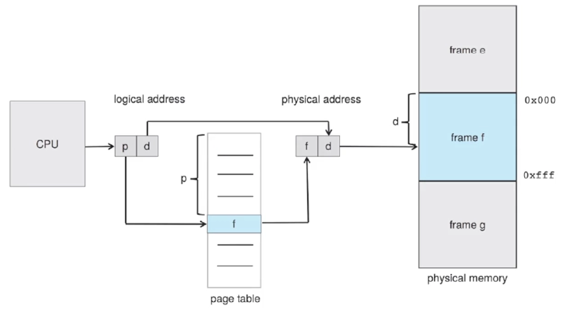
p: 2, d: 34라고 할 때 페이지 테이블에 가면 실제 물리 주소인 f를 얻을 수 있음

### 페이지 사이즈는 어떻게 정할까?

- 하드웨어에 의해 정의됨
- 2의 배수여야 함 4KB ~ 1GB 사이

> 페이지 사이즈가 2^n이고, 논리적 주소 크기가 2^m이면 `page number는 m-n`, `page offset 은 n`만큼의 크기여야 함  
> 페이지 사이즈가 n이니까 offset도 2^n만큼을 나타낼 수 있어야 하기 때문

### 페이지 테이블 역할

- 각 프로세스마다 하나의 페이지 테이블 존재
- Logical Address → Physical Address 매핑 정보 저장
- 테이블 크기는 프로세스의 페이지 개수에 비례

**Context Switch 시(프로세스 전환 시) 문제점**

1. 새로운 프로세스 실행
2. 페이지 테이블도 다시 로드 필요
3. 페이지 테이블이 매우 크면 직접 관리 어려움

### PTBR(Page-Table-Base-Register)

페이지 테이블의 시작점을 알려주는 레지스터

- Context Switch 시 PTBR만 수정하면 되기 때문에 상대적으로 빠름
- 만약 PTBR이 `0xFF`면, `0xFF`부터 페이지 테이블 용도로 사용하겠다는 의미

### 페이지 테이블의 문제점과 TLB

메모리 접근이 2배로 증가한다.

1. 실제 물리 주소를 찾기 위해 페이지 테이블에 접근 (Frame 번호 찾기)
2. 실제 Frame 접근 (데이터 읽기)

**TLB(Translation Look-aside Buffer)**  
캐시 메모리의 일종으로 메모리 접근 시간을 단축


- TLB Hit: 물리 메모리에 1회 접근
- TLB Miss: 페이지 테이블 접근 후 물리 메모리에 접근

### 메모리 보호와 Valid/Invalid Bit

**기존 방식**

- 0번지 ~ 끝번지 = Valid
- 그 외 = Illegal

**페이징 방식**

- 각 페이지마다 유효한 페이지인지 아닌지 판단이 필요
- Valid/Invalid Bit으로 접근 유효성 판단
  

### Shared Page

여러 프로세스가 공유하는 페이지

- 여러 프로세스가 동일한 코드를 공유
- 실행 중 변경되지 않는 Read-Only 코드
  - print() 함수, 시스템 라이브러리

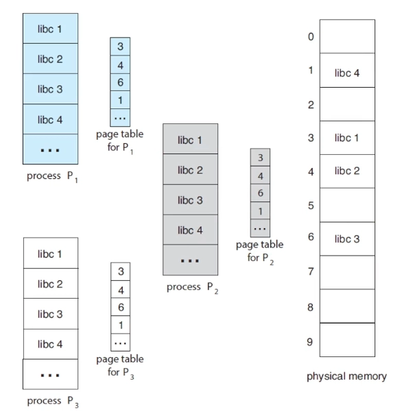  
물리적인 공간은 하나만 쓰는 대신 여러 프로세스의 페이지 테이블이 같은 주소를 가리키고 있음

### 페이지 테이블이 너무 커진다면?

- Hierarchical Paging
- Hashed Page Table
- Inverted Page Table

**Hierarchical Paging(계층적 페이지)**
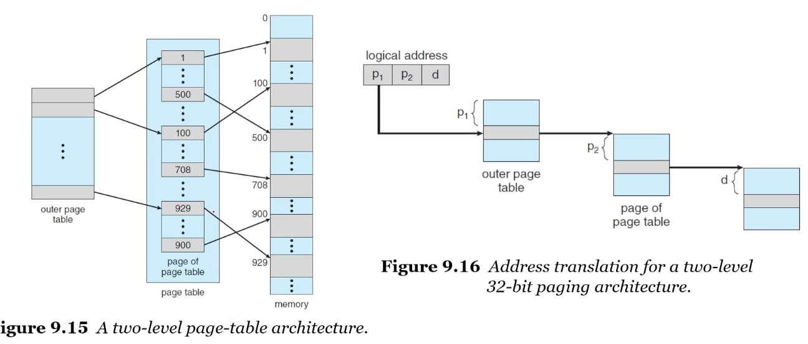

- 페이지 테이블에 대한 페이지 테이블을 또 만듦

<br>

**Hashed Page Table(해시된 페이지 테이블)**  
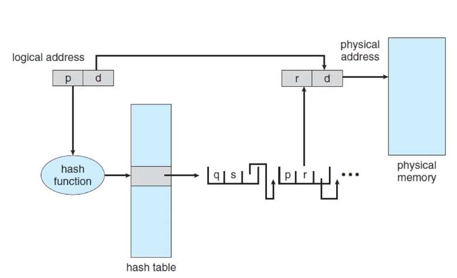

- 해시테이블은 대부분 read의 시간복잡도가 O(1)이기 때문에 물리적 페이지 매핑 번호를 해시 테이블 값으로 결정
- 주소 공간이 32bit보다 큰 경우 사용 권장

<br>

**Inverted Page Table(역페이지 테이블)**  
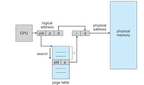

- 어떤 pid가 어떤 페이지 주소를 가지고 있는지 역으로 저장
- 모든 페이지가 아니라 pid마다 하나 저장하기 때문에 크기가 줄어듦

### Swapping

모든 프로세스의 논리적 주소와 물리적 주소를 분리하면 실제 물리 메모리 크기보다 커지지 않을까?
프로그램이 5GB인데, 메모리가 4GB이면?

> 어떤 프로세스간에 지금 당장 필요한 한 페이지만 적재되어있으면 됨 → 멀티 프로그래밍 가능

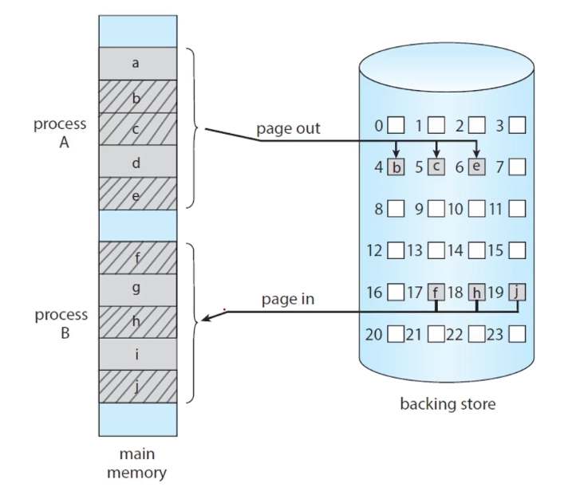

- 프로세스 전체를 `swap in`, `swap out`하면 비용이 너무 큼
- 그래서 페이지 단위로 swapping(`page in`, `page out`)

### Virtual Memory

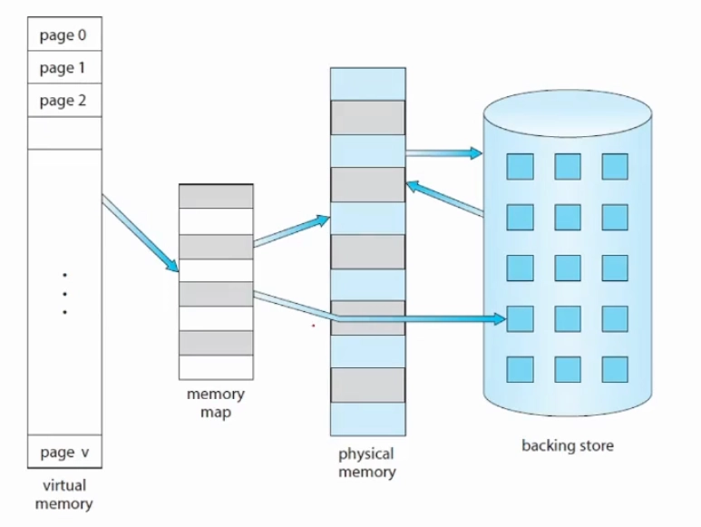  
물리 메모리보다 큰 프로그램을 실행할 수 있도록 메인 메모리를 무한대의 가상 메모리처럼 사용

**장점**

- 프로그램 크기 > 물리 메모리 크기 구조 가능
- 동시 실행 프로그램 수 증가(멀티프로그래밍)
- 파일/라이브러리 공유 용이

### Demand Paging

필요할 때 페이지를 적재하는 방식

- 어떤 프로세스가 실행중일 때, 필요한 페이지가 메모리에 있거나 secondary 메모리에 있어야 함
- `valid / invalid bit`로 관리
  - `valid`: 페이지가 유요하면서도 메인 메모리에 있음
  - `invalid`: 페이지가 유효하지 않거나 secondary에 있음
  - `dirty bit`로 따로 구분하기도 함

**inavlid의 경우 swapping 필요**

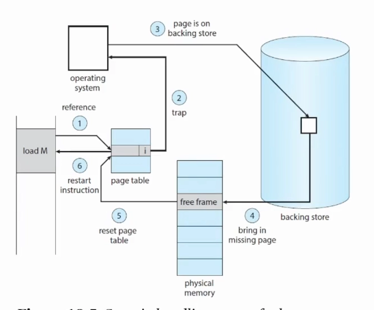

1. valid / invalid 확인
2. invalid의 경우 page in 필요
3. 그러면 free frame을 찾아야 함
4. 메모리 영역에서 특정 영역이 비어있다면 secondary에 있는 페이지를 적재
5. secondary에 페이지를 가져와서 새로운 프레임에 페이지 적재
6. 페이지 테이블에 가서 valid로 변경

### Pure Demaind Paging

요청하지 않으면 절대 페이지를 가져오지 않는 방식으로, 가장 처음 시작할 때 메모리에 아무 페이지도 로드되지 않는다.

- 첫번째 Instruction은 무조건 page fault
- 그 다음 명령어도 계속 fault
- 그렇기 때문에 참조 지역성을 잘 활용해서 미리 로드하는 것이 좋음

**예시**  
ADD, A, B, C가 있을 때

1. ADD instruction 가져오기
2. Fetch A
3. Fetch B
4. Add A, B
5. Store C

## 2. 탐구 내용 (실무 / iOS 연결)

### Copy on Write

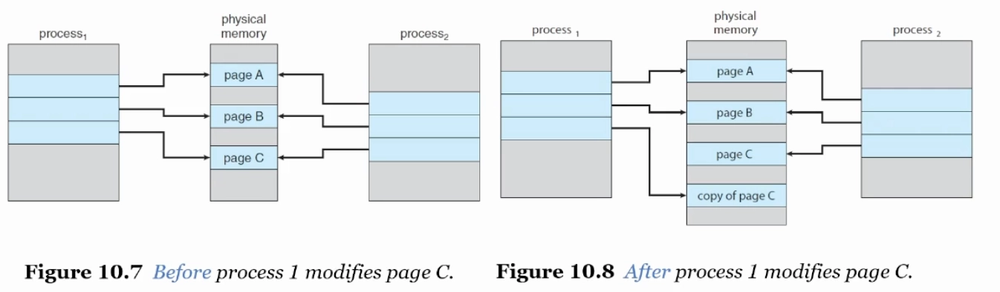  
공유하다가 수정 시에만 복사하는 방식

**프로세스 fork() 예시**

1. Page Table만 복사
2. 실제 메모리는 공유 (Write 권한 제거)
3. 자식이 수정 시도 → Minor Page Fault
4. 해당 페이지만 복사
5. Write 권한 부여

```swift
var array1 = [1,2,3]
var array2 = array1      // 공유
array2.append(4)         // 이때 복사
```

### page fault 확인

<details><summary>실습 코드</summary>

```c
#include <stdio.h>
#include <stdlib.h>
#include <unistd.h>
#include <sys/time.h>

int global_var = 100;
#define MB (1024 * 1024)

int main() {
    long page_size = sysconf(_SC_PAGESIZE);
    printf("=== System Info ===\n");
    printf("Page Size: %ld bytes (%ld KB)\n\n", page_size, page_size / 1024);

    // 1. 메모리 레이아웃 확인
    int stack_var = 300;
    int *heap_var = malloc(sizeof(int));
    *heap_var = 400;

    printf("=== Memory Layout ===\n");
    printf("Code  : %p (main)\n", (void*)main);
    printf("Data  : %p (global_var)\n", (void*)&global_var);
    printf("Stack : %p (stack_var)\n", (void*)&stack_var);
    printf("Heap  : %p (heap_var)\n\n", (void*)heap_var);
    free(heap_var);

    // 2. Page Fault 비용 측정
    printf("=== Page Fault Cost ===\n");
    size_t size = 500 * MB;  // 500MB
    char *buffer = malloc(size);
    if (!buffer) {
        perror("malloc failed");
        return 1;
    }

    printf("Allocated %zu MB (virtual memory)\n", size / MB);

    // 첫 번째 접근 (Page Fault 발생)
    struct timeval start, end;
    gettimeofday(&start, NULL);

    for (size_t i = 0; i < size; i += page_size) {
        buffer[i] = 0;
    }

    gettimeofday(&end, NULL);
    double first_access = (end.tv_sec - start.tv_sec) +
                          (end.tv_usec - start.tv_usec) / 1000000.0;

    // 두 번째 접근 (Page Fault 없음)
    gettimeofday(&start, NULL);

    for (size_t i = 0; i < size; i += page_size) {
        buffer[i] = 1;
    }

    gettimeofday(&end, NULL);
    double second_access = (end.tv_sec - start.tv_sec) +
                           (end.tv_usec - start.tv_usec) / 1000000.0;

    printf("First access (with Page Faults):  %.3f sec\n", first_access);
    printf("Second access (no Page Faults):   %.3f sec\n", second_access);
    printf("Difference: %.1fx slower\n\n", first_access / second_access);

    free(buffer);
    return 0;
}
```

</details>

**실험 결과**  
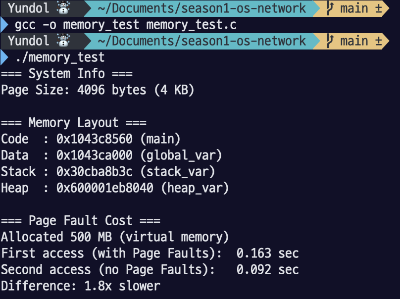

### vm_stat으로 실시간 Page 모니터링

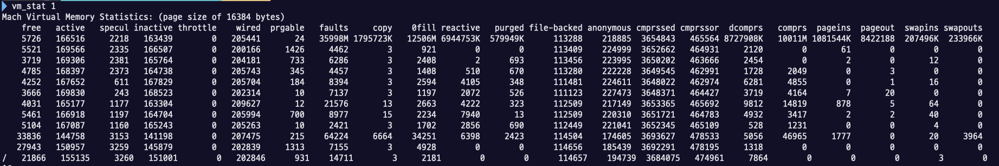

<details><summary>분석 결과 요약</summary>

#### Mach Virtual Memory Statistics 분석

**시스템 정보**  
Page Size = 16,384 bytes (16KB) - Apple Silicon

---

## 1. 메모리 페이지 상태 (Memory Pages Status)

| 항목            | 값 (pages) | 크기 (GB) | 설명                                                                                            |
| --------------- | ---------- | --------- | ----------------------------------------------------------------------------------------------- |
| **free**        | 5,076      | 0.08 GB   | 사용 가능한 빈 페이지. 즉시 할당 가능한 메모리                                                  |
| **active**      | 166,992    | 2.55 GB   | 최근에 사용되었고 현재 활발히 사용 중인 페이지. 메모리에서 쫓아내기 어려움                      |
| **speculative** | 1,694      | 0.03 GB   | 투기적으로 읽어온 페이지. 사용될 것으로 예상되지만 아직 참조되지 않음. 필요 시 즉시 재사용 가능 |
| **inactive**    | 164,734    | 2.52 GB   | 사용되지 않는 페이지지만 여전히 메모리에 있음. 재사용 시 빠르게 활성화 가능. Page-out 대상      |
| **throttle**    | 0          | 0.00 GB   | I/O 쓰로틀링으로 인해 대기 중인 페이지 (보통 0)                                                 |
| **wired**       | 200,497    | 3.06 GB   | 커널이 사용하는 페이지. 절대 Swap-out 되지 않음. 물리 메모리에 고정됨                           |
| **purgeable**   | 82         | 0.00 GB   | 제거 가능한 페이지. 앱이 "필요하면 삭제해도 됨"으로 표시. 메모리 압박 시 우선 제거              |

**총 메모리**  
(5,076 + 166,992 + 1,694 + 164,734 + 200,497) × 16KB = **8.24 GB**

---

## 2. 페이지 활동 통계 (Page Activity Statistics)

| 항목         | 값         | 의미                                                                                                                               |
| ------------ | ---------- | ---------------------------------------------------------------------------------------------------------------------------------- |
| **faults**   | 35,998M    | **Page Fault 총 발생 횟수** (35,998,000,000회). CPU가 메모리 접근 시도했으나 페이지가 없어서 발생한 예외. Minor + Major Fault 포함 |
| **copy**     | 1,795,737K | **Copy-on-Write 발생 횟수** (1,795,737,000회). fork() 후 자식 프로세스가 페이지 수정 시 복사된 횟수                                |
| **0fill**    | 12,506M    | **Zero-fill 페이지 수** (12,506,000,000). 새로 할당된 메모리를 0으로 초기화한 페이지 수                                            |
| **reactive** | 6,944,808K | **Reactivation 횟수** (6,944,808,000). Inactive → Active로 재활성화된 페이지 수. 캐시 효과 측정 지표                               |
| **purged**   | 579,957K   | **제거된 페이지 수** (579,957,000). Purgeable 메모리가 실제로 제거된 횟수                                                          |

---

## 3. 메모리 타입별 분류 (Memory Type Classification)

| 항목            | 값 (pages) | 크기 (GB) | 설명                                                                                                                       |
| --------------- | ---------- | --------- | -------------------------------------------------------------------------------------------------------------------------- |
| **file-backed** | 115,171    | 1.76 GB   | **파일 기반 페이지**. 디스크의 파일과 연결된 메모리 (Code, Framework, mmap). 메모리 부족 시 다시 읽으면 되므로 저장 불필요 |
| **anonymous**   | 218,249    | 3.33 GB   | **익명 페이지**. 디스크 파일과 연결 없음 (Heap, Stack). 메모리 부족 시 압축 또는 Swap 필요                                 |

**메모리 구성:**

- File-backed (34.6%): 제거 쉬움 (다시 로드 가능)
- Anonymous (65.4%): 제거 어려움 (압축/Swap 필요)

---

## 4. 압축 메모리 (Compressed Memory)

| 항목                 | 값              | 크기     | 설명                                                                           |
| -------------------- | --------------- | -------- | ------------------------------------------------------------------------------ |
| **compressed**       | 3,670,978 pages | 56.06 GB | **압축된 페이지 수**. 물리 메모리를 절약하기 위해 압축된 원본 데이터 크기      |
| **compressor**       | 469,920 pages   | 7.18 GB  | **압축 데이터가 차지하는 실제 메모리**. 압축 후 크기                           |
| **decompressed**     | 8,727,970K      | -        | **압축 해제 횟수** (8,727,970,000). Compressed Memory에서 페이지를 읽어온 횟수 |
| **compressed (ops)** | 10,011M         | -        | **압축 수행 횟수** (10,011,000,000). 페이지를 압축한 총 횟수                   |

**압축률:** 56.06 GB → 7.18 GB = **약 7.8:1** (매우 효율적!)

**압축 메모리 효과:**

- 원래 필요한 메모리: 56.06 GB
- 실제 사용 메모리: 7.18 GB
- **절약된 메모리: 48.88 GB**

---

## 5. Swap 활동 (macOS만 해당)

| 항목         | 값         | 크기    | 설명                                                                                   |
| ------------ | ---------- | ------- | -------------------------------------------------------------------------------------- |
| **pageins**  | 1,081,549K | -       | **디스크에서 메모리로 읽어온 페이지 수** (1,081,549,000). Major Page Fault 발생 횟수   |
| **pageout**  | 8,422,231  | -       | **메모리에서 디스크로 내보낸 페이지 수** (8,422,231). Page Replacement로 디스크에 저장 |
| **swapins**  | 207,497K   | 3.17 GB | **Swap 파일에서 읽어온 데이터 크기**                                                   |
| **swapouts** | 233,970K   | 3.57 GB | **Swap 파일로 내보낸 데이터 크기**                                                     |

**Swap 활동 분석:**

- Swap-out > Swap-in: 메모리 압박이 있었고 디스크로 많이 내보냄
- Pageout 8.4M vs Pagein 1.0M: 압축 메모리 덕분에 Swap-in 줄어듦

---

## 6. 종합 분석 및 인사이트

### 메모리 상태 요약

```
총 물리 메모리: ~8.24 GB
├─ Wired (고정):        3.06 GB (37.1%) ← 커널 사용
├─ Active (활성):       2.55 GB (30.9%) ← 앱 실행 중
├─ Inactive (비활성):   2.52 GB (30.6%) ← 재사용 대기
├─ Free (여유):         0.08 GB ( 1.0%) ← 거의 없음
└─ Speculative:         0.03 GB ( 0.4%)

압축 메모리: 7.18 GB (실제는 56GB 분량!)
```

### iOS vs macOS 비교

**이 시스템은 macOS** (Swap 활동 있음)

| 항목           | iOS              | macOS (현재 시스템) |
| -------------- | ---------------- | ------------------- |
| 메모리 부족 시 | Jetsam (앱 종료) | Swap 사용           |

**만약 iOS였다면:**

- Swap-out 3.57 GB → Memory Warning 발송
- Background 앱 강제 종료
- 계속 부족 시 Foreground 앱도 종료

</details>
