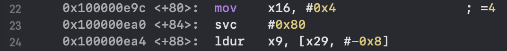
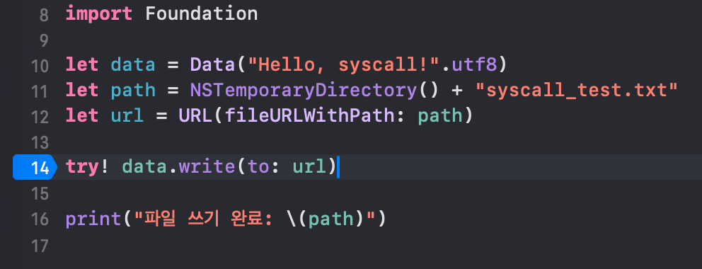
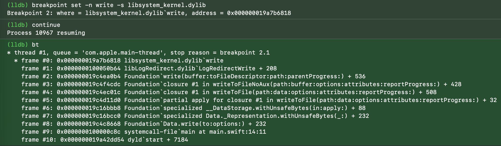
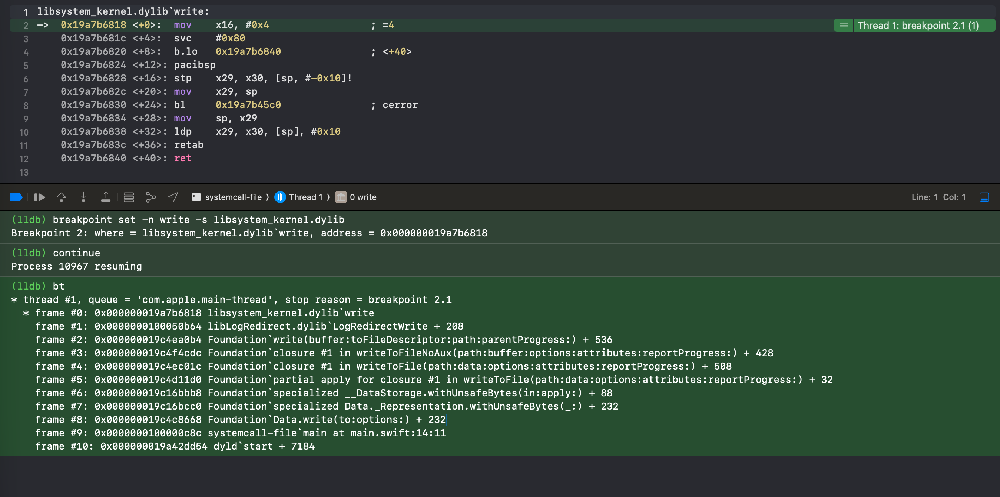
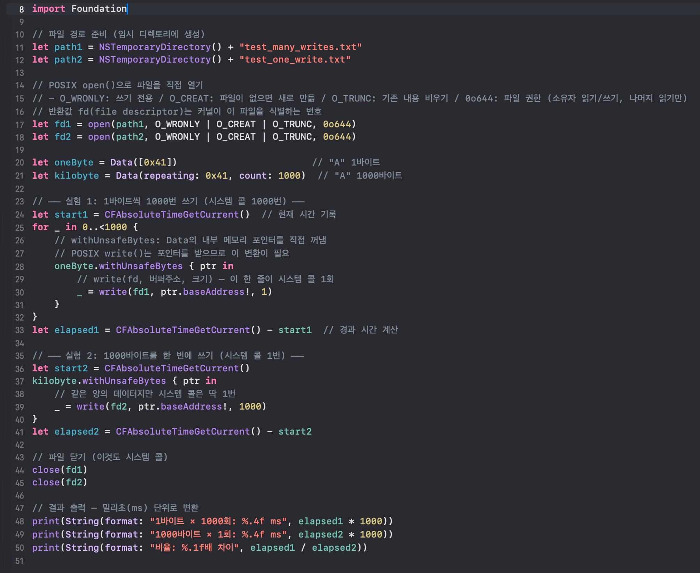
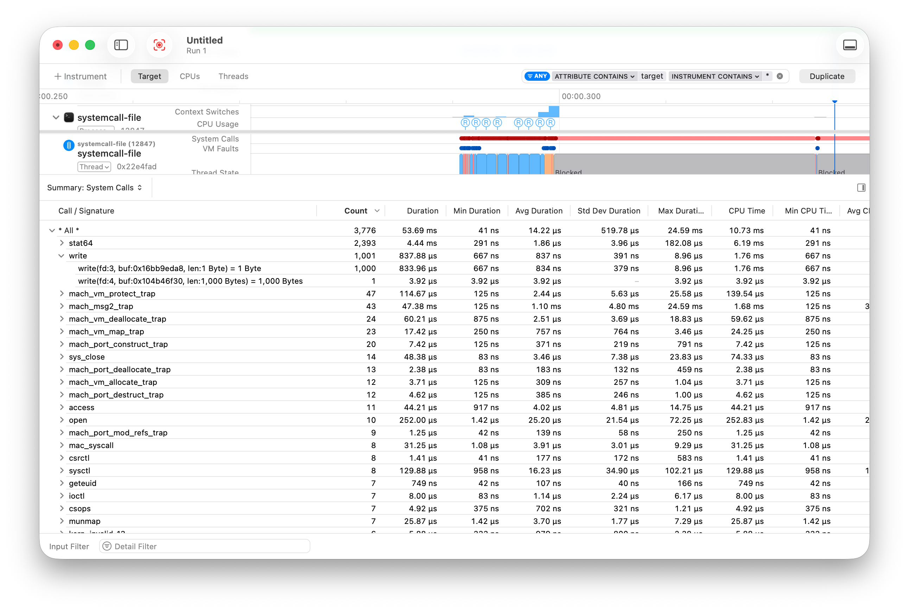
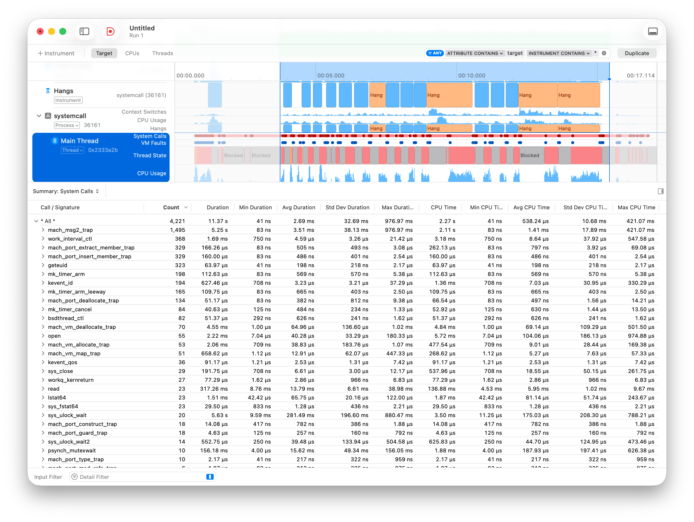
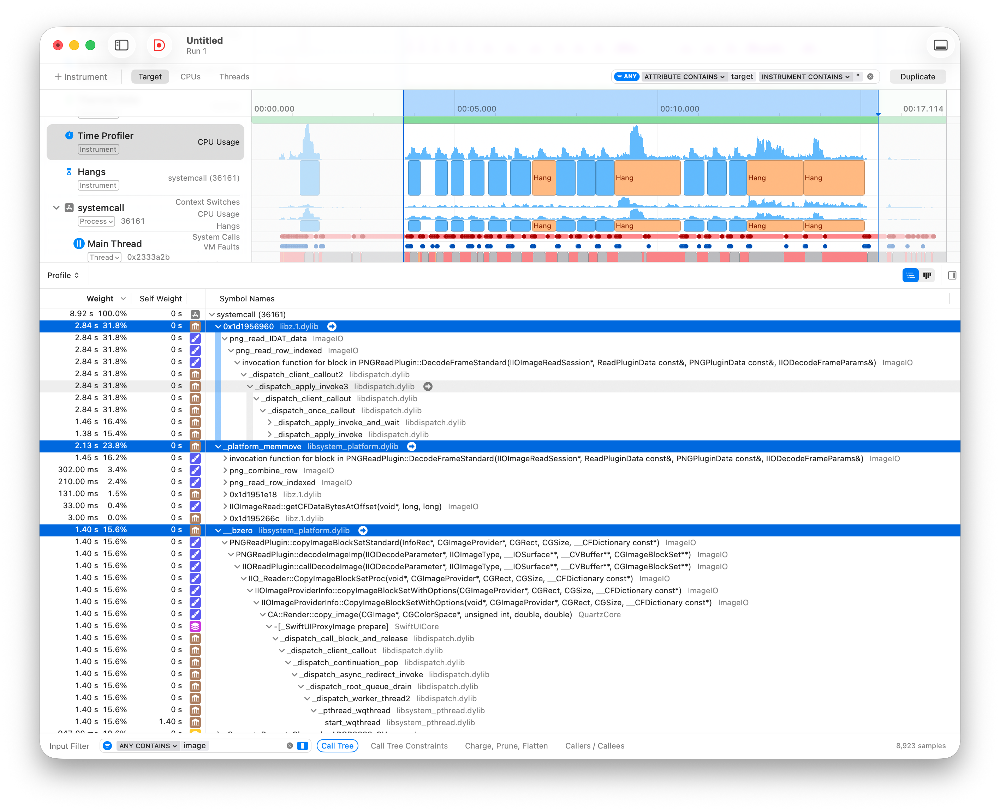
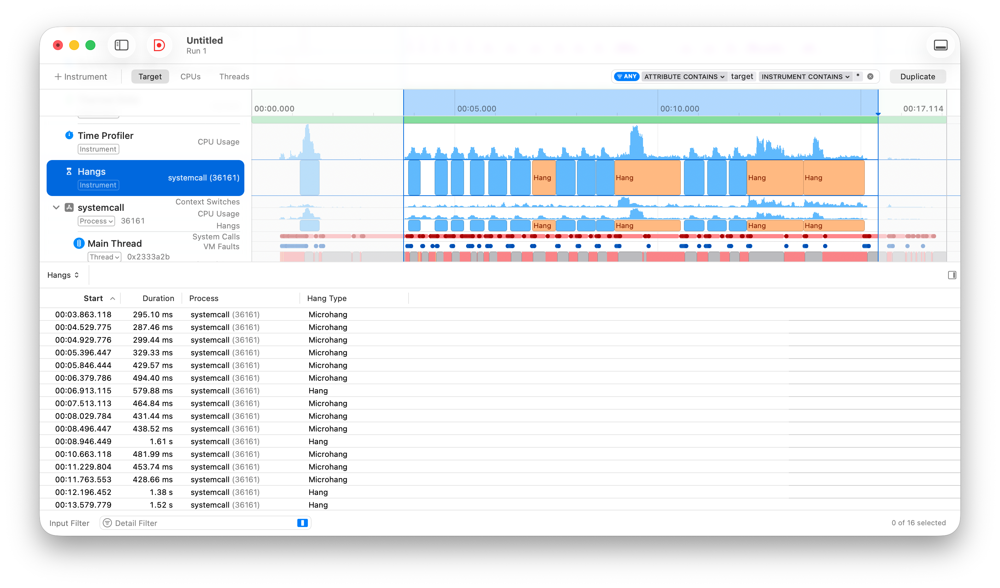

## 1. 내가 학습한 주제 / 작업

- 학습 주제: **시스템 콜 메커니즘**
  > 아래 내용에서 시스템 콜과 시스템 호출을 같은 용어로 이해해주시길 바랍니다!

## 2. 핵심 개념

### 키워드 정리

- **커널(Kernel)**: 운영체제의 중심. 소프트웨어와 하드웨어 사이의 다리 역할을 수행.
- **XNU**: 애플의 운영체제에서 사용하는 커널의 이름. Mach와 BSD를 결합한 하이브리드 커널.
- **CPU 모드**: CPU가 명령을 실행할 때 가지는 권한 수준.
  - 사용자 모드: 일반 앱이 실행되는 단계. 시스템의 핵심 영역에 접근할 수 없음.
  - 커널 모드: 커널이 실행되는 단계. 모든 하드웨어와 메모리에 접근할 수 있음.
- **시스템 호출(System Call)**: 사용자 프로그램이 사용하는 운영체제 인터페이스
- **svc(Supervisor Call)**: 사용자 모드에서 커널 모드로 진입하기 위한 CPU 명령어

## 3. 탐구 내용

### 1️⃣ iOS에서의 시스템 호출이 발생하는 과정

Swift 코드 -> Foundation 프레임워크 -> **💡 시스템 콜** -> 하드웨어 (파일 읽기, 네트워크 전송 등)

### 2️⃣ 시스템 호출 정리

#### 🔍 시스템 호출과 함수 호출의 관계

**시스템 호출은 사용자 모드에서 시작되지만, CPU의 트랩 명령어를 통해 커널 모드로 전환된 뒤 커널 내부 코드가 실행됩니다.**  
반면, **일반 함수 호출은 사용자 모드를 유지한 채 실행됩니다.**  
높은 권한이 필요한 작업은 시스템 호출을 통해서만 수행되며, 이를 통해 일반 애플리케이션이 하드웨어에 직접 접근하는 상황을 방지합니다.  
함수 호출 또한 내부적으로 시스템 호출을 유발할 수 있습니다. (e.g. `print(“”)`)  
라이브러리 함수는 **표준화된 인터페이스를 제공하므로 이식성이 높지만**, 실제 내부 구현은 운영체제에 의존합니다. (e.g. C의 `printf()`는 동일한 방식으로 사용 가능하지만 내부적으로는 OS의 시스템 호출을 사용함)

#### 🔍 예시 살펴보기: Swift의 print()에서 커널까지의 여행

1. **Swift 코드**(`print()`): 사람이 사용하는 고수준 함수
2. **Swift 표준 라이브러리**
   - Swift - Misc (cf. `print(“”)`를 `cmd+클릭`해 확인 가능)
   - 이곳에서 LibSystem의 `write()` 호출
3. **LibSystem (C 라이브러리)**: 애플의 시스템 라이브러리 (아직 사용자 수준임!)
   - `write()` 실행 -> 내부에서 `svc`(시스템 콜 트랩) 명령 실행
   - 출력을 하거나 파일에 저장을 할 때 이 라이브러리 `write()`과 커널의 `write`이 둘 다 사용되는 것은 맞으나 이름만 같을 뿐, 사용 영역은 사용자/커널로 다름.
4. **시스템 호출**
5. **CPU 모드 전환**: 사용자 모드 -> 커널 모드
6. **XNU 커널에서 하드웨어 및 파일 시스템 처리**

#### 🔍 시스템 호출의 비용 산정

- 사용자 모드와 커널 모드 간의 전환
  - 들어갈 때 한 번, 돌아올 때 한 번, 왕복으로 발생합니다.
- 레지스터 저장/복원
  - CPU 모드가 전환되면 커널도 같은 CPU 레지스터를 사용합니다.
  - CPU 상태 전체를 메모리에 백업하고 복원하는 과정이 필요합니다.
- 커널 코드 실행
  - 실제로 요청한 작업(파일 쓰기, 네트워크 전송 등)을 커널이 실제로 수행합니다.
- TLB flush / 캐시 오염
  - TLB(Translation Lookaside Buffer)는 가상 주소 → 물리 주소 변환 결과를 캐싱해두는 CPU 내부 버퍼입니다.
  - 모드가 전환되면 커널은 앱과 다른 메모리 영역을 사용하므로, 앱이 올려뒀던 TLB와 CPU 캐시가 밀려나거나 무효화됩니다.
  - 돌아왔을 때 다시 느린 경로(페이지 테이블 탐색, 메모리 재로딩)를 타게 되어 비용이 늘어납니다.
- Spectre/Meltdown 이후 추가 비용
  - 2018년에 발견된 CPU 보안 취약점입니다.
  - 악의적인 코드가 커널 메모리를 엿볼 수 있는 문제였는데, 이를 막기 위해 커널 페이지 테이블 격리(KPTI) 등의 방어 기법이 도입됐습니다.
  - 쉽게 말하면 모드 전환할 때 페이지 테이블까지 갈아끼우는 작업이 추가된 거라, 시스템 콜의 왕복 비용이 이전보다 더 커졌습니다.
- 파라미터 검증
  - 커널은 앱이 넘긴 데이터를 절대 신뢰하지 않습니다.
  - 예를 들어 `write(fd, buffer, size)`를 호출하면, 커널은 "이 fd가 유효한가?", "이 buffer 주소가 이 프로세스의 합법적인 메모리 범위 안인가?", "size가 비정상적이지 않은가?"를 전부 확인합니다.
  - 이 검증 과정이 매 시스템 콜마다 반복됩니다.

#### 🔍 시스템 호출의 종류

> 시스템 호출의 종류가 **프로세스 제어**/**파일 조작**/**장치 관리**/**정보 유지**/**통신**/**보호** 로 구성되어있다는 점을 확인했습니다.  
> XNU를 살펴보며 Mach와 BSD가 존재한다는 점을 확인했고, 각 레이어에 어떤 역할이 있는지까지 학습해봤습니다.  
> 우리가 사용하는 고수준 API가 최종적으로는 **BSD의 서비스 정책**이나 **Mach의 하드웨어 추상화 메커니즘**을 실행하는 **시스템 호출**로 연결되어 커널의 실제 동작을 유발합니다.  
> Darwin, XNU, Mach와 BSD에 대한 추가 학습 내용은 `4️⃣ 추가학습`을 참고해주시길 바랍니다.

iOS의 커널(XNU)은 **Mach**라는 기초 위에 **BSD**라는 표준 운영체제 환경을 얹은 **하이브리드 구조**이기 때문에 시스템 호출이 이원화되어 있습니다. (macOS 또한 동일합니다.).

- Mach (메커니즘 담당): 하드웨어와 가장 가까운 층에서 CPU와 메모리라는 자원을 어떻게 안전하게 나눌 것인가라는 기초적인 규칙을 만듭니다.
- BSD (정책 및 인터페이스 담당): Mach가 만든 기초 자원 위에 사용자가 파일, 네트워크, 프로세스를 어떻게 편리하게 쓸 것인가라는 구체적인 기능과 산업 표준(POSIX) API를 제공합니다.

**자원을 실제로 움직이는 하드웨어 제어권**은 **Mach**가 쥐고 있고, **우리가 흔히 쓰는 파일 생성, 네트워크 연결 등 프로그래밍 규격**은 **BSD**가 담당한다고 이해하면 됩니다.

|  **구분**  |          **BSD**          |             **Mach**             |
| :--------: | :-----------------------: | :------------------------------: |
|  프로세스  |    프로세스 ID, 시그널    |        스케줄링, CPU 할당        |
|   메모리   | POSIX 메모리 API(mmap 등) | 가상 메모리, 메모리 보호, 페이저 |
| 파일시스템 |      파일시스템 전반      |                -                 |
|  네트워킹  |   TCP/IP 소켓 API, 보안   |                -                 |
|    IPC     |             -             |         메시지 패싱, RPC         |
|   스레드   |     pthreads (POSIX)      |   SMP 스케줄러, 실시간 서비스    |
|    보안    |  UNIX 보안 모델, syscall  |                -                 |

### 3️⃣ 추가 학습: Apple’s Darwin OS and XNU Kernel Deep Dive (✍️ 수정 예정)

### 4️⃣ 추가 학습: ARM 호출 규약 (svc 확인하기)

> 아래의 내용은 함수 호출 시 어떤 일이 일어나는지 추가 학습한 내용으로, 주요 주제에서 확장된 내용입니다.

**주요 주제인 시스템 콜과 연관된 점**은 어떤 호출이든 아래 규약을 따르지만, **시스템 콜일 경우 `svc #0x80`이라는 커널 모드 전환 명령어가 추가된다는 점**입니다.  
(`#0x80`라는 번호는 macOS x86_64에서 `int 0x80`으로 시스템 콜을 트리거하던 번호이고, ARM64에서는 관례적으로 작성해 실제로는 무시됩니다.)  
ARM64에서 실제 시스템 콜 번호는 `x16` 레지스터에 담깁니다.
**Xcode에서 디버깅 중 나오는 어셈블리 코드에서 해당 명령어가 확인될 경우 시스템 호출이 동작한다는 걸 확인할 수 있습니다.**



#### 🔍 ARM64 호출 규약 전체 정리: 함수 호출 시 발생하는 내부 동작

**1\. 인자 전달**

```
x0~x7 : 인자 8개까지 레지스터로 전달 (빠름)
스택   : 9번째부터는 메모리로 전달 (느림)
```

**2\. 반환값**

```
작은 값 (정수 등)  → x0에 넣어서 반환
큰 값 (구조체 등)  → caller가 x8에 버퍼 주소를 넘기고,
                     callee가 거기에 결과를 써넣음
```

**3\. 스택 프레임**  
함수가 호출될 때마다 스택에 프레임이 하나 생기고, 이런 패턴을 따릅니다:

```
; 프롤로그 (함수 시작)
sub sp, sp, #N              ← 스택 공간 확보
stp x29, x30, [sp, #offset] ← FP(프레임포인터)와 LR(리턴주소) 저장

; 에필로그 (함수 끝)
ldp x29, x30, [sp, #offset] ← FP와 LR 복원
add sp, sp, #N              ← 스택 해제
ret                          ← x30(LR)으로 점프하여 caller로 돌아감
```

**4\. 프레임 체인**  
함수가 호출된 곳으로 돌아갈 주소가 덮어씌워지는 것을 방지하기 위해 **이전 FP(x29)**를 스택에 백업합니다.  
그 백업들이 연결되며 체인이 만들어진다고 이해했습니다.  
스택에 저장되면서 연결 리스트가 만들어집니다:

```
frame_c의 x29 → frame_b의 x29 → frame_a의 x29 → ...
```

**5\. 레지스터 보존 규칙**  
누가 저장할지를 미리 약속해 불필요한 저장/복원을 없애기 위한 규칙입니다.

> Caller와 Callee의 담당 구간을 각각 나눈 이유가 궁금해 아래 내용을 추가로 찾아봤습니다.

**x0~x15**

- 인자로 넘기고, 반환값 받고, 임시 계산에 쓰는 값들입니다.
- 함수 호출 후 값이 바뀌어도 되는 임시용이라 caller가 필요할 때만 저장합니다.

**x19~x28**

- 루프 카운터, 누적 결과처럼 오래 들고 있어야 하는 값들입니다.
- 여러 함수 호출을 넘어서도 살아있어야 하는 값이라 callee가 쓸 때만 저장하고 반드시 복원합니다.

만약 caller와 callee가 담당하는 구간을 나누지 않았다면, 실제로 필요하지 않은 저장이 많이 발생합니다.

```
Callee-saved (x19~x28) : 호출된 함수가 책임
  → 사용 전 stp로 저장, 리턴 전 ldp로 복원
  → caller는 호출 전후로 값이 안 바뀐다고 믿을 수 있음

Caller-saved (x0~x15)  : 호출한 쪽이 책임
  → 함수 호출하면 바뀔 수 있음
  → 필요하면 caller가 직접 스택에 백업
```

**6\. 특수 레지스터 요약**  
함수 호출 직전에는 `x0`가 첫 번째 인자로 사용되며, 반환되기 직전에는 반환 값으로 사용됩니다.

```
x0~x7   : 인자 전달 + x0은 반환값
x8      : 큰 구조체 반환용 버퍼 주소
x9~x15  : 임시 (caller-saved)
x19~x28 : 보존 (callee-saved)
x29 (FP): 프레임 포인터 (프레임 체인 구성)
x30 (LR): 리턴 주소 (ret 시 여기로 점프)
sp      : 스택 포인터
```

**7\. Swift 추가 규칙**  
Swift 메서드의 self는 인자 레지스터(`x0~x7`)가 아닌 `x20`에 별도로 전달됩니다.  
이는 기존 Objective-C가 `x0`에 넣는 방식과는 다릅니다.  
레지스터 보존 규칙에 따라 `x20`은 Callee-saved 레지스터이기 때문에, 메서드 내부에서 함수를 아무리 호출해도 self가 자동으로 보존됩니다.  
인자 레지스터를 self 없이 온전히 파라미터 전용으로 쓸 수 있다는 장점도 있다.

> Caller-saved여도 똑같이 복원되는 것 아닌가 싶어 Claude와 대화를 진행해보고 아래 내용을 확인했습니다.

self를 Callee-saved인 `x20`에 두면, `x20`을 실제로 쓰는 함수만 저장/복원 코드를 생성하면 됩니다.  
Caller-saved 레지스터에 뒀을 경우 함수 호출 지점마다 저장/복원 코드가 생성되는 것과 비교하면 전체적으로 생성되는 코드량이 줄어듭니다.

```
일반 함수   : C와 동일 (x0~x7로 인자, x0으로 반환)
메서드의 self : x20에 배치 (Apple ABI 확장)
```

#### 💡 한 줄 요약: 함수 호출 = 인자를 x0~x7에 넣고, 리턴 주소를 x30에 백업하고, 스택 프레임을 만들고, 끝나면 복원하고 돌아오는 것.

## 4. 실무 연결 지점

> 샘플 코드는 Claude와 함께 작성하면서 탐구를 진행했습니다.

### 🔍 iOS에서 시스템 콜이 문제가 되는 주요 상황들

1. **메인 스레드에서 대용량 파일 I/O** : 이미지 같은 것들을 메인 스레드에서 동기적으로 읽거나 쓸 때. 스크롤 버벅임의 대표적 원인임. ← **재현해볼 것** ✅
2. **UserDefaults 루프 접근** : UserDefaults는 내부적으로 plist 파일 I/O. 루프에서 반복 호출하면 시스템 콜이 수백~수천 번 누적됨.
3. **FileManager의 빈번한 존재 확인** : `fileExists(atPath:)`는 내부적으로 `stat64`(파일 메타데이터 조회)를 호출. 반복 호출 시 시스템 콜이 누적됨.
4. **소량 데이터를 반복적으로 디스크에 쓰기** <- **재현해볼 것** ✅
5. **Core Data / SQLite를 메인 스레드에서 대량 조회** : 쿼리마다 파일 `read`, `fcntl`(잠금) 등 시스템 콜 발생.
6. **앱 시작 시 과도한 초기화** : 시작할 때 설정 파일, 캐시, 인증 토큰 등을 동기적으로 전부 읽으면 dyld 비용에 더해져서 런치 타임이 길어짐.
   - dyld (Dynamic Linker/Loader): 프로그램이 실행될 때 필요한 라이브러리들을 찾아서 메모리에 올려주는 시스템 프로그램.

### 🔍 Data.write(to:)가 내부적으로 유발하는 시스템 콜을 눈으로 확인하기

#### [1] 샘플 코드 작성



#### [2] libsystem_kernel의 write에 브레이크 포인트 걸고 콜스택 확인

`data.write()`에서 멈춘 상태에서 아래 명령어를 입력합니다.

1. `breakpoint set -n write -s libsystem_kernel.dylib` : libsystem_kernel의 `write`에 브레이크 포인트
2. `continue` : 다시 진행
3. (브레이크 포인트 걸어둔 kernel `write`에서 다시 정지)
4. `bt` : 콜 스택 확인



```
frame #9:  systemcall-file`main          ← Swift 코드 (try! data.write(to: url))
frame #8:  Foundation`Data.write(to:)     ← Foundation 프레임워크
frame #7~2: Foundation 내부               ← 버퍼 처리, 파일 경로 처리 등
frame #1:  libLogRedirect.dylib           ← (Xcode 디버그 환경의 로깅 리다이렉트)
frame #0:  libsystem_kernel.dylib`write   ← LibSystem의 write() — 여기서 svc가 실행됨
```

#### [3] 어셈블리 코드에서 svc 확인하기 + ARM 호출 규약 내용 확인

앞선 단계에서 kernel의 write에서 멈춘 상태에서 아래 두 방법 중 하나를 통해 어셈블리를 확인합니다.

1. Xcode의 Debug -> Debug workflow -> Always Show Disassembly 체크
2. lldb에 disassemble 입력



```
mov    x16, #0x4     ← 시스템 콜 번호 4(write)를 x16에 설정
svc    #0x80         ← 커널 모드 진입 트리거
```

> 정리했던 ARM 호출 규약(프롤로그/에필로그, `stp`/`ldp`, `x29`/`x30`)이 에러 처리 경로에서 그대로 쓰이고 있는 것도 확인할 수 있었습니다.

```
b.lo   0x19a7b6840   ← 성공하면(에러 없으면) +40의 ret으로 점프해서 바로 리턴
pacibsp              ← 에러일 경우 이쪽으로 진입. 포인터 인증(보안)
stp    x29, x30, ... ← 학습했던 ARM 호출 규약의 프롤로그 — FP와 LR 저장
bl     cerror        ← 에러 처리 함수 호출
ldp    x29, x30, ... ← 에필로그 — FP와 LR 복원
retab                ← 리턴 (포인터 인증 포함)
```

### 🔍 시스템 콜을 많이 호출하면 실제로 얼마나 느려지는가?

#### [1] 샘플 코드 교체

> 여기서 일부러 `Data.write(to:)`가 아니라 POSIX `write()`를 직접 쓴 이유는, Foundation의 내부 버퍼링을 거치지 않고 **시스템 콜 횟수를 정확히 통제**하기 위해서 입니다.



#### [2] 출력문으로 시간 차이 확인

```
1바이트 × 1000회: 1.2960 ms
1000바이트 × 1회: 0.0099 ms
비율: 131.0배 차이
Program ended with exit code: 0
```

#### [3] Instruments - System Trace로 시스템 콜 횟수 확인

- **write**
  - 호출 횟수가 의도했던대로 1000번 + 1번 발생했음을 확인했습니다.
  - 총 소요시간도 차이남을 확인할 수 있습니다.
- **이름 패턴**
  - BSD 시스템 콜: write, open, sys_close, etc.
  - Mach 트랩: mach_vm_protect_trap, mach_msg2_trap, etc.
- **csops + mac_syscall**
  - 보안 검증이 시스템 콜로 수행됨 → 비용 산정에서 학습한 "파라미터 검증"이 커널 레벨에서도 일어난다는 점을 확인했습니다.



### 🔍 메인 스레드에서 대용량 파일 I/O 재현 및 개선하기

#### [1] 문제 코드 작성

SwiftUI `body` 안에서 POSIX 시스템 콜을 직접 호출하여 파일을 읽고, PNG 디코딩까지 메인 스레드에서 수행하는 코드를 작성했습니다.

> 아래 두 버전은 내부에서 동일한 시스템 콜을 호출합니다!

```swift
// 작성한 코드 (POSIX 직접 호출)
let fd = open(path, O_RDONLY)
fstat(fd, &statInfo)
read(fd, buffer, fileSize)
close(fd)
let image = UIImage(data: data)

// 실제 개발에서 쓰는 코드 (한 줄)
let image = UIImage(contentsOfFile: path)
```

```swift
// 의도한 문제 상황
var body: some View {
    let image = UIImage(contentsOfFile: path)  // ← 메인 스레드에서 동기 I/O
    Image(uiImage: image!)
}
```

#### [2] 문제 코드 Instruments 분석

> System Trace 도구 선택 후 Main Thread, Time Profier, Hangs 부분을 확인해봤습니다.  
> 화면 스크롤 하는 상황을 재현했습니다. <- **재현 중에도 심각한 버벅임 확인**했습니다.

1️⃣ System Trace - Main Thread

- 아래 시스템 콜의 호출 횟수와 누적 시간을 확인했습니다.

|        시스템 콜        | 횟수  | 누적 시간 |                         의미                         |
| :---------------------: | :---: | :-------: | :--------------------------------------------------: |
|    `mach_msg2_trap`     | 1,495 |   5.25s   | Mach 메시지 대기 (런루프가 I/O 끝나길 기다리는 시간) |
|         `open`          |  55   |  2.22ms   |           파일 열기 - Max 180μs짜리도 있음           |
|         `read`          |  23   |   317ms   |         파일 읽기 - Avg 8.76ms, Max 38.98ms          |
|        `lstat64`        |  23   |  1.51ms   |              파일 경로 메타데이터 조회               |
|      `sys_fstat64`      |  23   |  29.50μs  |                fd 기반 파일 크기 조회                |
|       `sys_close`       |  29   |   191μs   |                      파일 닫기                       |
| `mach_vm_allocate_trap` |  53   |  2.06ms   |     메모리 할당 (비트맵 버퍼) - PNG 디코딩할 때      |



2️⃣ Time Profiler  
메인 스레드 8.92초의 시간 분배:

- `libz (inflate)` : 31.8% ← PNG 압축 해제 (zlib)
- `_platform_memmove` : 23.8% ← 디코딩된 픽셀 데이터 복사
- `__bzero` : 15.6% ← 비트맵 메모리 초기화  
  **선택한 기간의 메인 스레드 시간 71.2% (2.84 + 2.13 + 1.40 = 6.37초)가 PNG 디코딩 관련 작업**입니다.  
  `__bzero` → `_SwiftUIProxyImage prepare` 경로에서 SwiftUI가 `Image(uiImage:)`를 화면에 그리기 위해 `CA::Render::copy_image`를 호출하는데, 이때 4000×4000 비트맵을 또 한 번 복사합니다.  
  렌더링 파이프라인까지 메인 스레드에서 처리되는 것입니다.



3️⃣ Hangs  
총 16번의 Hang 중 **500ms 이상을 소요하는 Hang이 4회 발생했습니다. (579ms, 1.61s, 1.38s, 1.52s)**  
1초 이상 앱이 멈추는 문제를 확인했습니다. (실제로도 심각하게 버벅임을 확인했습니다.)



**4️⃣ 문제 분석**  
화면을 스크롤 하면서 **새로운 셀이 나타날 때마다 메인 스레드에서 `open`→`read`→`close`→`디코딩` 작업을 반복하는 것을 확인**했습니다.  
관련 시스템 콜의 **호출 횟수로 여러 번 반복되는 것을 알 수 있었고**, **디코딩 구간은 메인 스레드를 블로킹 하면서 심각한 버벅임까지 야기**하는 것을 확인했습니다.

#### [3] 개선 및 Instruments 분석 (✍️ 수정 예정)

## 5. 의문 / 논점 (✍️ 수정 예정)

- 이해가 애매했던 부분
- 토론하고 싶은 질문
- 관점 차이가 발생할 수 있는 부분

## 6. 참고 자료

[ARM64 Exception Level 기초 개념](https://medium.com/@om.nara/aarch64-exception-levels-60d3a74280e6)  
[Apple’s Darwin OS and XNU Kernel Deep Dive](https://tansanrao.com/blog/2025/04/xnu-kernel-and-darwin-evolution-and-architecture/)  
[ARM에서의 Exception Levels와 Security States 이해](https://pyjamacafe.com/posts/arm64-day0-exception-levels/)  
[라이브러리 함수와 시스템 콜 비교 분석](https://mdesign.tistory.com/entry/Unix-%EB%9D%BC%EC%9D%B4%EB%B8%8C%EB%9F%AC%EB%A6%AC-%ED%95%A8%EC%88%98%EC%99%80-%EC%8B%9C%EC%8A%A4%ED%85%9C-%EC%BD%9C-%EB%B9%84%EA%B5%90%EB%B6%84%EC%84%9D)  
[x86, x64, x86_64, arm](https://ts2ree.tistory.com/355)  
[\[Operating System\] \(iOS\) System Call \(시스템콜, 시스템 호출이란?\)](https://didu-story.tistory.com/311)  
[공식 Kernel Architecture 문서](https://developer.apple.com/library/archive/documentation/Darwin/Conceptual/KernelProgramming/Architecture/Architecture.html)  
[XNU Github - BSD syscall 확인](https://github.com/apple-oss-distributions/xnu/blob/main/bsd/kern/syscalls.master)
[XNU Github - Mach trap 확인](https://github.com/apple-oss-distributions/xnu/blob/main/osfmk/kern/syscall_sw.c)
