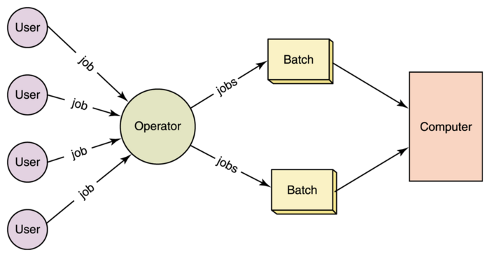
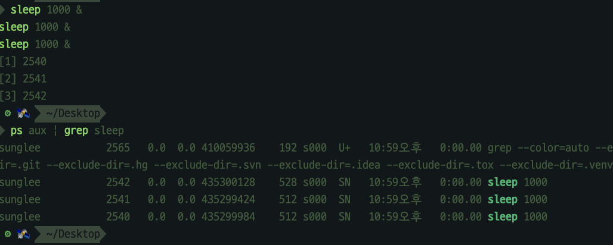
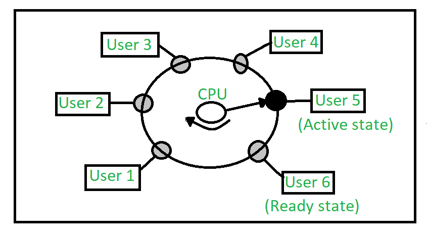
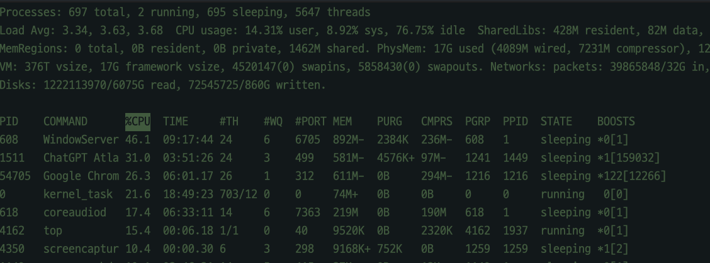
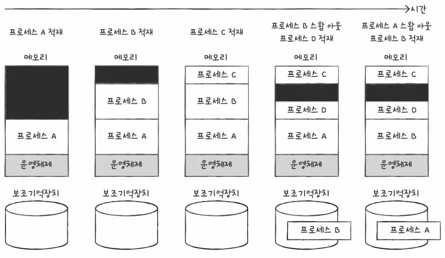
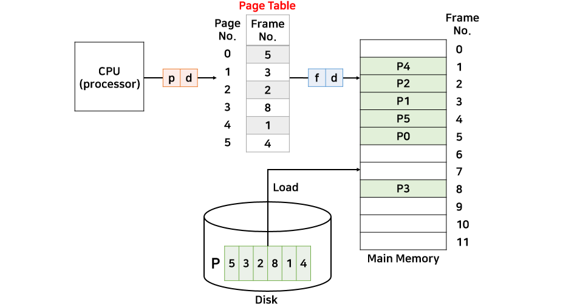
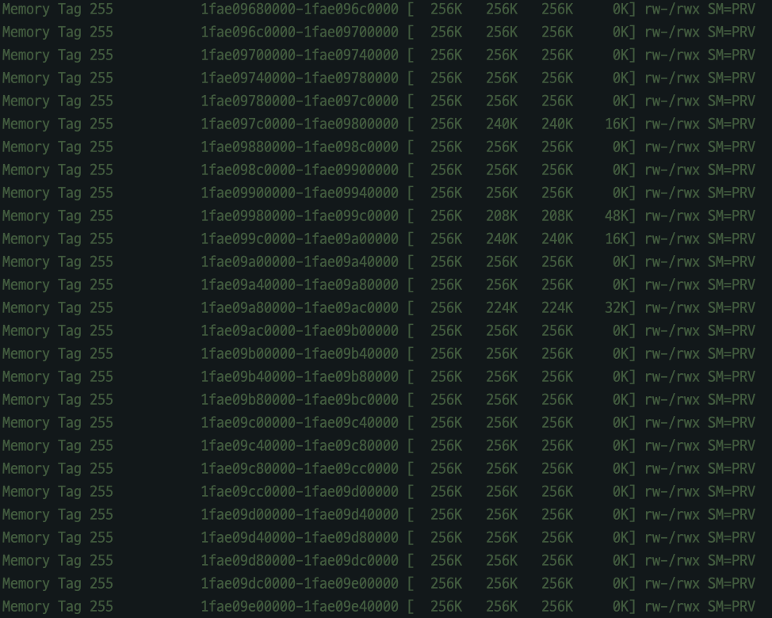
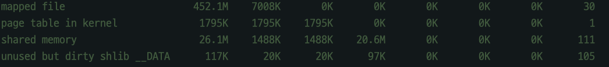

# 1. 주제
### 운영체제의 역할과 구조를 이해하고, 운영체제가 도입된 이유를 파악해보자.

<br/>

# 핵심 개념 및 문제
## 핵심 개념
### OS란?
운영체제(OS, Operating System)는 하드웨어와 응용 프로그램 사이에서 다리 역할을 수행하며, 시스템 자원을 효율적으로 관리하고 프로그램이 올바르게 실행되도록 돕는 핵심 시스템 소프트웨어입니다.

## 문제
### 운영체제는 왜 필요할까?
개발자 관점에서 운영체제가 없다면 다음과 같은 작업을 훨씬 더 직접적으로 처리해야 합니다.
1. 프로그램에서 사용하는 메모리를 직접 관리
2. CPU에 연산/출력 명령을 직접 전달하고 제어
3. 여러 프로그램이 동시에 하드웨어 자원을 사용하려 할 때 충돌 상황을 코드로 직접 처리

즉, 개발자가 신경 써야 할 범위가 크게 늘어납니다. 그렇다면 OS가 왜 필요해졌고 어떤 역할을 수행하는지 탐구해보겠습니다.

<br/>

# 탐구 내용

## 시스템 운영 방식의 발전 과정
"운영체제는 왜 필요할까?"라는 질문에 답하기 위해 OS가 등장한 배경을 먼저 정리했습니다.

### 초기 시스템 (No OS)
초기에는 운영체제 없이 사용자가 물리적 콘솔을 통해 하드웨어를 직접 제어했습니다.
이때 하나의 프로그램이 CPU 자원을 모두 점유하는 경우가 많아 시스템 활용도가 매우 낮았습니다.

### 일괄 처리 시스템 (Batch Processing)

CPU 활용도를 높이기 위해 유사한 작업을 한데 묶어 처리하는 일괄 처리 시스템이 도입되었습니다. 전체 처리량은 향상되었지만, 입출력(I/O) 작업 중 CPU가 쉬는 idle 상태가 여전히 잦았습니다.

### 다중 프로그래밍 (Multiprogramming)
다음으로 메모리에 여러 프로그램을 올려, 한 프로그램이 I/O 작업으로 대기할 때 다른 프로그램에 CPU를 할당하는 방식이 등장했습니다. 이 방식은 I/O 대기 시간에도 CPU를 활용할 수 있어 자원 효율과 CPU 활용도를 높입니다.

여기서 생기는 질문은 다음과 같습니다.
"왜 여러 프로그램을 메모리에 올리는 것이 I/O 처리 효율과 연결되는가?"

프로그램이 하나뿐인 경우:

```text
프로그램 -> 디스크 읽기 요청 -> 대기
```

이때 CPU는 할 일이 없어 유휴 상태가 됩니다.

멀티프로그래밍 상황:

```text
ProgramA (I/O 요청)
ProgramB (CPU 작업 가능)
ProgramC (대기)
```

ProgramA가 I/O를 요청하면 OS는 CPU를 ProgramB 실행에 사용합니다.

핵심은 I/O를 CPU가 직접 수행하는 것이 아니라 장치가 독립적으로 수행한다는 점입니다.

```text
프로세스 -> read 요청
CPU -> 다른 작업 수행
디스크 완료 -> 인터럽트 발생
CPU -> 프로세스 깨움
```

예를 들어 디스크 읽기에서 CPU는 디스크에 요청만 전달하고, 디스크가 작업을 마치면 인터럽트로 CPU에 완료를 알립니다.

#### 검증
- 멀티프로그래밍 메모리 사용량 확인



`sleep` 프로세스 3개를 실행해 상태를 확인했을 때, 각 프로세스가 PID를 부여받고 동시에 메모리를 점유하는 것을 확인할 수 있습니다.

### 시분할 시스템 (Time-sharing System)

다중 프로그래밍을 확장해 실시간 상호작용을 가능하게 만든 방식이 시분할 시스템입니다. CPU는 매우 짧은 주기로 여러 프로그램에 번갈아 할당되며, 사용자는 여러 프로그램이 동시에 동작하는 것처럼 느끼게 됩니다.

오늘날의 Windows, Linux 같은 현대 운영체제도 다중 프로그래밍과 시분할 개념을 기반으로 발전해 왔습니다.

#### 검증
- 프로세스 상태 확인

```bash
top
```

위 명령어를 실행하면 사용 중인 프로세스 상태를 확인할 수 있으며, Running <-> Sleeping 상태가 빠르게 전환되는 모습을 볼 수 있습니다.



<br/>

## 운영체제의 핵심 구조: 커널과 인터페이스
이제 운영체제의 다양한 서비스중 핵심이 되는 커널은 살펴보겠습니다.
커널(kernel)은 하드웨어 자원에 접근하고 이를 보호하는 본질적인 역할을 수행합니다.

이중모드(Dual Mode)와 시스템 콜(System Call) 운영체제는 자원을 안전하게 보호하기 위해 CPU가 실행하는 모드를 사용자 모드와 커널 모드로 분리합니다. 
| 구분 | 사용자 모드 (User Mode) | 커널 모드 (Kernel Mode) |
|------|-------------------------|--------------------------|
| 정의 | 일반 응용 프로그램이 실행되는 제한적인 영역 | 운영체제의 핵심 서비스가 실행되는 영역 |
| 자원 접근 | 하드웨어 자원에 직접 접근이 불가능함 | 모든 자원(CPU, 메모리 등)에 접근 및 제어 가능 |
| 보호 방식 | 시스템 콜을 통해서만 커널 서비스를 요청 가능 | 커널 영역의 코드를 제약 없이 직접 실행 가능 |

응용 프로그램이 자원에 접근해야 할 때는 '문지기' 역할을 하는 **시스템 콜(System Call)** 이라는 소프트웨어 인터럽트를 통해 운영체제에 도움을 요청해야 합니다.

## 프로세스 메모리 배치 방식
다음으로는 위에서 말한 OS가 프로세스를 어떻게 메모리에 배치하는지 살펴보겠습니다. 메모리에 프로세스를 배치하는 방식은 크게 프로세스를
통째로 연속된 공간에 배치하는 **연속 메모리 할당**과, 일정한 단위로 잘라 흩어지게 배치하는 **페이징(Paging) 기법**으로 나뉩니다. 이 두 방식은 메모리 낭비 문제(단편화)를 해결하는 발전 과정과 깊은 연관이 있습니다.

### 연속 메모리 할당과 외부 단편화 문제


[출처](https://velog.io/@localgaji/memory-contiguous)

연속 메모리 할당은 프로세스가 메모리 내의 빈 공간에 연속적인 덩어리로 통째로 적재되는 방식입니다. 운영체제는 프로세스를 적재할 빈 공간을 찾기 위해 최초 적합(First fit), 최적 적합(Best fit), 최악 적합(Worst fit) 등의 방식을 사용합니다.
- **외부 단편화(External Fragmentation)**

    프로세스들이 메모리에 적재되고, 실행이 끝나 종료되는 과정이 반복되면 메모리 사이사이에 작은 빈 공간들이 흩어지게 됩니다. 결과적으로 남아있는 빈 공간의 총합은 새로운 프로세스를 적재하기에 충분히 크지만, 공간들이 연속적으로 모여 있지 않고 조각나 있어서 프로세스를 할당하지 못해 메모리가 심각하게 낭비되는 현상이 발생합니다.

### 페이징(Paging) 기법을 통한 외부 단편화 해결
현대 운영체제는 연속 할당의 외부 단편화 문제를 해결하기 위해 가장 대중적인 가상 메모리 관리 기법인 페이징을 채택하고 있습니다.

[출처](https://velog.io/@codemcd/%EC%9A%B4%EC%98%81%EC%B2%B4%EC%A0%9COS-13.-%ED%8E%98%EC%9D%B4%EC%A7%95)

- 일정한 단위로 분할

    프로세스의 논리 주소 공간을 **페이지(Page)** 라는 일정한 크기로 자르고, 실제 물리 메모리 공간도 이와 완전히 똑같은 일정한 단위인 **프레임(Frame)** 으로 나눕니다.

- 불연속적 할당
    
    통째로 배치해야 했던 연속 할당과 달리, 페이징은 잘게 잘린 페이지 조각들을 빈 프레임이 있는 곳이라면 어디든 불연속적으로 할당합니다. 모든 적재 대상이 균일한 크기(페이지)를 가지며 불연속적으로 배치될 수 있기 때문에, 조각난 빈 공간에 프로세스를 할당하지 못하는 외부 단편화 문제가 사실상 발생하지 않습니다.

- 페이지 테이블의 도입

    물리 메모리 상에는 페이지들이 여기저기 흩어져 저장되지만, CPU는 이를 순차적으로 읽어들여야 합니다. 이를 위해 운영체제는 어떤 프로세스의 어떤 페이지가 메모리의 어떤 프레임에 적재되어 있는지를 짝지어 기록해 두는 이정표인 **페이지 테이블(Page Table)** 을 사용합니다.

- 페이징 기법의 한계 (내부 단편화)
    페이징은 외부 단편화를 훌륭하게 해결했지만, **내부 단편화(Internal Fragmentation)** 라는 새로운 부작용을 보입니다.
    - 프로세스의 전체 크기가 페이지 크기의 배수로 딱 나누어떨어지지 않을 수 있습니다.
    - 이 경우, 프로세스를 페이지 단위로 자르고 남은 마지막 페이지에는 데이터를 다 채우지 못한 잉여 공간이 생기게 되며, 이 하나의 페이지 크기보다 작은 메모리 공간이 낭비되는 현상을 내부 단편화라고 부릅니다. (단, 일반적으로 내부 단편화로 인한 낭비는 외부 단편화로 인한 낭비보다 그 크기가 훨씬 작습니다.)

### 검증


``` getconf PAGE_SIZE ```를 통해 운영체제에서 메모리 페이지 크기를 확인할 수 있습니다. 위에 이미지를 보면 현재 16384바이트 단위로 페이지가 쪼개져있다는 것을 알 수 있습니다.


``` vmmap PID ``` 를 통해 크롬 프로세스의 가상 메모리 상태를 조회해보면 위 이미지 같이 가상 메모리의 가상 주소 범위, 가상 크기, 실제 물리 메모리에 올라온 양 등 페이징 시스템을 직접 관찰 할 수 있습니다.

| 항목 | 의미 |
|------|------|
| Memory Tag 255 | 메모리 영역 타입 (heap/private 영역) |
| 13408920000-13408940000 | 가상 주소 범위 |
| 128K | 가상 크기 (Virtual Size) |
| 64K | Resident (실제 물리 메모리에 올라온 크기) |
| 64K | Dirty (수정된 메모리 크기) |
| 64K | Swapped or unused (스왑되었거나 아직 할당되지 않은 영역) |
| rw-/rwx | 메모리 접근 권한 |
| SM=PRV | Private memory (해당 프로세스 전용 메모리) |

여기서 확인해볼 수 있는건 메모리가 일정 크기 단위로 나뉘고 일부만 실제 메모리에 올라가고 일부는 스왑 및 미할당 되고 주소는 불연속으로 배치되는 것을 확인 할 수있습니다.


또한  `page table in kernel`을 보면 이 프로세스를 위한 페이지 테이블 메모리가 커널에 존재하는 것을 확인할 수 있습니다.
<br/>

## 자원 할당
(작성 예정)

# iOS 연결 지점
- (작성 예정)

# 의문/논점
- (작성 예정)

# 참고자료
[Operating Systems](https://youtu.be/yK1uBHPdp30?list=TLGGixpPJfZ41l8yNDAyMjAyNg)

[혼자공부하는컴퓨터구조+운영체제](https://youtu.be/isj4sZhoxjk?list=TLGGnj2ndpHTMTwyNDAyMjAyNg)

[시스템의 발전](https://youtu.be/5u7LXsfV_Io?list=TLGGQZVhKcXqX4MyNDAyMjAyNg)