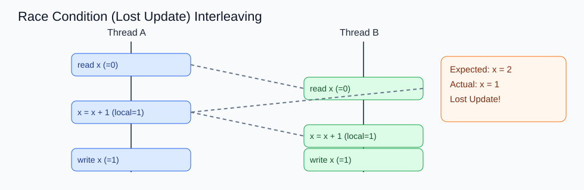
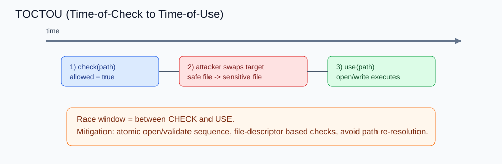
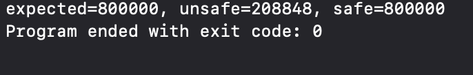
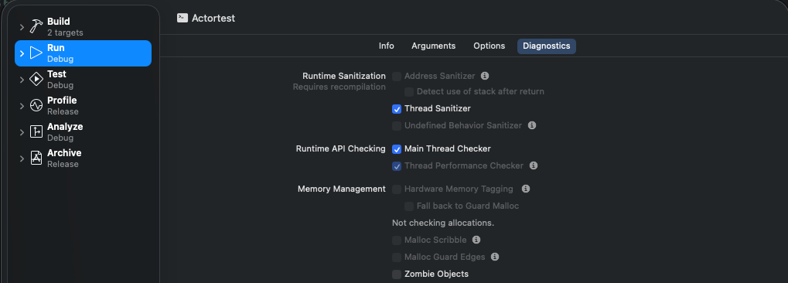
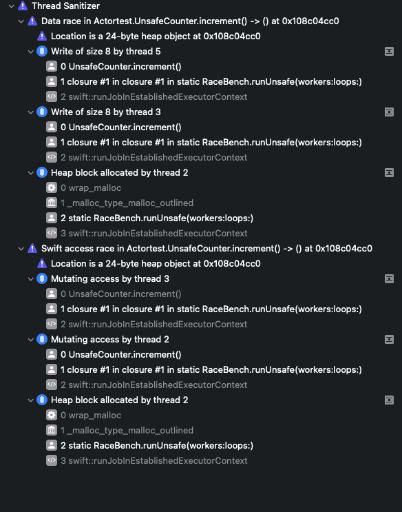

# Race Condition의 본질

### 학습 키워드
- Race Condition
- Data Race
- Shared Mutable State(공유 가변 상태)
- Atomicity(원자성), Happens-Before
- Lost Update, TOCTOU(Time-of-Check to Time-of-Use)

<br/>

## 1. 핵심 개념
### 1) Race Condition이란?
Race Condition은 여러 실행 흐름(스레드/프로세스/요청)이 같은 자원을 다룰 때, **실행 순서(타이밍)에 따라 결과가 달라지는 상태**입니다.

핵심은 "논리적으로 같아야 할 입력인데도, 타이밍 차이 때문에 결과가 달라진다"는 점입니다.

- 정상 실행에서는 재현되지 않다가, 부하/지연/코어 스케줄링 차이에서만 터지기도 함
- 테스트 환경에서 안 보이는데 운영에서만 발생하는 대표 원인

참고로 `Data Race`는 Race Condition의 하위 개념에 가깝습니다.
- Data Race: 동시 접근 + 최소 1개 write + 동기화 부재
- Race Condition: 데이터 충돌 외에도 TOCTOU(Time Of Check To Time Of Use)처럼 "검사 시점과 사용 시점 불일치"까지 포함하는 더 넓은 개념
    ##### TOCTOU: 보안 취약점의 한 종류로, 어떤 자원의 상태를 확인한 시점(Check)과 실제로 사용하는 시점(Use) 사이의 시간 차이를 이용해 공격이 발생하는 문제


### 2) 발생 조건
Race Condition은 보통 아래 조건이 겹칠 때 발생합니다.

#### (1) 공유 자원(Shared Resource)이 있다
- 예: 전역 변수, 캐시, 파일, DB row, 세션 상태, 결제/재고 카운터
- 여러 실행 주체가 같은 상태를 읽고/수정할 수 있음

#### (2) 동시 실행(Concurrency)이 있다
- 멀티스레드/멀티코어, 비동기 콜백, 인터럽트, 다중 요청 처리 환경
- "순서가 매번 동일하지 않음"이 본질

#### (3) 임계 연산이 원자적(Atomic)이지 않다
- `x++` 같은 단순 코드도 내부적으로는 `read -> modify -> write` 단계
- 중간에 다른 실행 흐름이 끼어들면 갱신 유실(Lost Update) 발생

#### (4) 올바른 동기화 또는 순서 보장이 없다
- 락/세마포어/원자 연산/트랜잭션 격리/버전 체크 같은 보호 장치 부재
- 또는 장치가 있어도 범위가 잘못되어 "보호되지 않은 창(window)"이 남아 있음

정리하면, Race Condition은 **공유 상태 + 동시성 + 비원자 연산 + 불완전한 동기화**의 결합 문제입니다.

### 3) 왜 위험한가?
#### (1) 비결정성 때문에 디버깅이 어렵다
- 같은 코드가 실행마다 다른 결과를 냄
- 로그를 추가하면 타이밍이 바뀌어 버그가 사라지는 Heisenbug 형태가 흔함

#### (2) 데이터 무결성이 깨진다
- 잔액/재고/카운터가 실제와 달라짐
- 중복 결제, 중복 주문, 통계 오염, 캐시-원본 불일치로 이어짐

#### (3) 가용성과 안정성을 해친다
- 충돌(메모리 재할당), deadlock 유사 증상(락상태가 race condition에 의해 꼬임), use-after-free 등 2차 장애 유발
- 간헐적 장애가 누적되어 장애 탐지/복구 시간이 길어짐

#### (4) 보안 취약점으로 확대될 수 있다
- TOCTOU 류 취약점은 권한 체크 우회로 이어질 수 있음
- 실제 CVE(공식 보안 취약점 목록) 다수가 Race Condition/Improper Locking과 연결됨

즉 Race Condition은 "가끔 틀리는 버그"가 아니라, **정합성·안정성·보안**을 동시에 훼손할 수 있는 구조적 결함입니다.

### 4) 버그 사례
#### 사례 A. 결제/재고 시스템의 Lost Update
- 상황: 두 요청이 동시에 같은 재고 수량(예: 1개)을 읽고 각각 차감
- 결과: 두 주문이 모두 성공해 재고 음수/초과 판매 발생
- 원인: `조회 -> 검증 -> 차감`이 하나의 원자적 트랜잭션으로 묶이지 않음
- 해결: DB 락, 낙관적 락(version), 원자적 업데이트(`WHERE version = ?`)가 필요

    #### 예시

    초기 데이터

    | id | stock | version |
    |----|------|--------|
    | 1  | 10   | 1      |

    두 요청이 동시에 조회
    ```
    A 요청 → stock=10, version=1
    B 요청 → stock=10, version=1
    ```
    업데이트 쿼리
    ```sql
    UPDATE product
    SET stock = stock - 1,
        version = version + 1
    WHERE id = 1 AND version = 1;
    ```
    결과
    ```
    A 요청 → 성공 (stock=9, version=2)
    B 요청 → 실패 (version이 달라 업데이트되지 않음)
    ```

#### 사례 B. TOCTOU 파일 접근 취약점
- 상황: 권한 검사 시점에는 안전한 파일이었지만, 실제 사용 직전에 다른 파일로 바뀜
- 결과: 의도하지 않은 파일 읽기/쓰기, 권한 상승 가능
- 분류: CWE-367(Time-of-check Time-of-use Race Condition)
- 해결: "검사 후 사용"을 분리하지 말고, 커널/파일 시스템이 보장하는 원자 연산 경로 사용
   **atomic open**

    검사와 사용을 하나의 시스템 호출로 처리

    예
    
    ```
    open(path, O_CREAT | O_EXCL)
    ```

    **file descriptor 기반 검증**

    파일 경로가 아니라 이미 열린 파일 descriptor를 기준으로 검증



#### 사례 C. Therac-25(1985-1987) 사고
- 안전이 중요한 의료 장비에서 동시성/상태 관리 결함이 치명적 사고로 연결된 대표 사례
- 단순 코딩 실수 1건이 아니라, 소프트웨어 안전장치 설계와 검증 체계 부재가 결합된 문제
- 교훈: 안전 필수 시스템에서는 "락 하나 추가"가 아니라 시스템 수준의 방어 계층과 검증이 필요

[위키 Therac-25](https://ko.wikipedia.org/wiki/Therac-25)

<br/>

## 2. 탐구하기 / iOS 연결지점
### 1) iOS/Swift에서 Race Condition이 잘 나는 지점
- `Dictionary`, `Array` 같은 일반 컬렉션을 여러 스레드에서 동시에 변경
- UI 상태를 메인 액터 보장 없이 백그라운드에서 읽고/쓰기
- 콜백 기반 코드에서 동일 상태를 여러 경로가 동시에 갱신

### 2) iOS 예제 코드 (Race 재현 + 안전 버전 비교)
아래 코드는 `UnsafeCounter`(의도적 레이스)와 `SafeCounter`(`actor` 기반)를 동일 조건으로 실행해 결과를 비교합니다.

```swift
import Foundation
import os

final class UnsafeCounter {
    var value = 0
    func increment() { value += 1 } // 동기화 없음(의도적)
}

actor SafeCounter {
    private var value = 0
    func increment() { value += 1 }
    func read() -> Int { value }
}

enum RaceBench {
    static let log = OSLog(subsystem: "RaceBench", category: .pointsOfInterest)

    static func runUnsafe(workers: Int, loops: Int) async -> Int {
        let counter = UnsafeCounter()
        await withTaskGroup(of: Void.self) { group in
            for _ in 0..<workers {
                group.addTask {
                    for _ in 0..<loops { counter.increment() }
                }
            }
        }
        return counter.value
    }

    static func runSafe(workers: Int, loops: Int) async -> Int {
        let counter = SafeCounter()
        await withTaskGroup(of: Void.self) { group in
            for _ in 0..<workers {
                group.addTask {
                    for _ in 0..<loops { await counter.increment() }
                }
            }
        }
        return await counter.read()
    }

    static func measure(name: StaticString, block: () async -> Int) async -> Int {
        let id = OSSignpostID(log: log)
        os_signpost(.begin, log: log, name: name, signpostID: id)
        let value = await block()
        os_signpost(.end, log: log, name: name, signpostID: id, "result=%d", value)
        return value
    }
}

// 호출 예시
Task.detached(priority: .userInitiated) {
    let workers = 8
    let loops = 100_000
    let expected = workers * loops

    let unsafe = await RaceBench.measure(name: "unsafeRun") {
        await RaceBench.runUnsafe(workers: workers, loops: loops)
    }
    let safe = await RaceBench.measure(name: "safeRun") {
        await RaceBench.runSafe(workers: workers, loops: loops)
    }

    print("expected=\(expected), unsafe=\(unsafe), safe=\(safe)")
}
```

#### 결과


### 3) 분석 지표(TSan + Instruments)
#### (1) Thread Sanitizer로 Data Race 탐지

1. Xcode `Edit Scheme` -> `Run` -> `Diagnostics` -> `Thread Sanitizer` 활성화
2. 위 `UnsafeCounter` 경로 실행
3. 경고에서 충돌 변수와 접근 스택(읽기/쓰기 스레드)을 확인


#### (2) Instruments에서 실행 시간 비교
1. `Product` -> `Profile` -> `Loging` 선택
2. `unsafeRun`, `safeRun` signpost 구간 필터링
3. Duration 통계로 `unsafeRun` vs `safeRun` 비교


### 4) 방어 전략(우선순위)
1. 공유 가변 상태 자체를 줄인다(불변/값 타입 우선)
2. 공유가 필요하면 격리 경계를 만든다(`actor`, 직렬 큐, 명확한 소유권)
3. 임계 연산은 원자적으로 처리한다(락/원자 연산/트랜잭션)
4. 탐지 도구를 CI에 넣는다(Thread Sanitizer, stress test)

<br/>

## 3. 의문 / 논점
- Data Race를 막으면 Race Condition이 모두 해결되는가?
  - 아니다. TOCTOU처럼 메모리 충돌이 아닌 "시점 불일치" 레이스는 별도 설계가 필요하다.
- 락을 많이 쓰면 안전한가?
  - 안전성은 오를 수 있지만 경합/병목/교착 위험이 커진다. 공유 상태 축소가 먼저다.
- 테스트를 통과했는데 운영에서만 터지는 이유는?
  - 스케줄링, 코어 수, I/O 지연, 트래픽 패턴이 달라 타이밍 창이 운영에서만 열릴 수 있다.

<br/>

## 4. 참고 자료
- [CWE-362: Race Condition (MITRE)](https://cwe.mitre.org/data/definitions/362.html)
- [CWE-367: TOCTOU Race Condition (MITRE)](https://cwe.mitre.org/data/definitions/367.html)