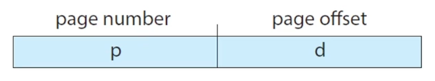

# 페이징

### 학습 키워드

- 페이징
- 단편화
- 가상 메모리
- 논리 메모리
- 물리 메모리

## 1. 핵심 개념

### 페이징이란?

물리 주소 공간을 비연속적으로 할당하여 외부 단편화를 방지하는 메모리 관리 기법

**기본 용어**

- `Page`: 논리 메모리를 고정 크기로 나눈 블록 (프로그램의 조각)
- `Frame`: 물리 메모리를 페이지와 같은 크기로 나눈 블록
- `Block`: 메모리와 디스크 사이에서 전송되는 단위
- `Page Size`: 하드웨어에 의해 정의 (4KB ~ 1GB, 2의 배수)

Intel Mac: 4KB
Apple Silicon: 16KB

### 페이징 vs 세그멘테이션

- 페이징: 모든 조각이 같은 크기 → Page
- 세그멘테이션: 조각 크기가 다름 → Segment

### 페이징의 필요성

**전통적 메모리 관리의 문제점**

새로운 25MB 프로세스를 로드하려면?  
→ 총 30MB 공간이 있지만 연속되지 않아 할당 불가  
→ 외부 단편화 발생

반대로 공간이 남으면 내부 단편화 발생

- 프로그램 전체가 연속적인 메모리에 적재되어야 함
- 다중 프로그래밍에 비효율적

### 페이지 주소

어떤 CPU가 어떤 주소를 만들었을 때 `0xFFFF` 라고 표현할 필요 없이 간단하게 표현 가능

p: 2, d: 34라고 할 때 페이지 테이블에 가면 실제 물리 주소인 f를 얻을 수 있음

### 페이지 사이즈는 어떻게 정할까?

- 하드웨어에 의해 정의됨
- 2의 배수여야 함 4KB ~ 1GB 사이

> 페이지 사이즈가 2^n이고, 논리적 주소 크기가 2^m이면 `page number는 m-n`, `page offset 은 n`만큼의 크기여야 함  
> 페이지 사이즈가 n이니까 offset도 2^n만큼을 나타낼 수 있어야 하기 때문

### 페이지 테이블 역할

- 각 프로세스마다 하나의 페이지 테이블 존재
- Logical Address → Physical Address 매핑 정보 저장
- 테이블 크기는 프로세스의 페이지 개수에 비례

**Context Switch 시(프로세스 전환 시) 문제점**

1. 새로운 프로세스 실행
2. 페이지 테이블도 다시 로드 필요
3. 페이지 테이블이 매우 크면 직접 관리 어려움

### PTBR(Page-Table-Base-Register)

페이지 테이블의 시작점을 알려주는 레지스터

- Context Switch 시 PTBR만 수정하면 되기 때문에 상대적으로 빠름
- 만약 PTBR이 `0xFF`면, `0xFF`부터 페이지 테이블 용도로 사용하겠다는 의미

### 페이지 테이블의 문제점과 TLB

메모리 접근이 2배로 증가한다.

1. 실제 물리 주소를 찾기 위해 페이지 테이블에 접근 (Frame 번호 찾기)
2. 실제 Frame 접근 (데이터 읽기)

**TLB(Translation Look-aside Buffer)**
캐시 메모리의 일종으로 메모리 접근 시간을 단축

