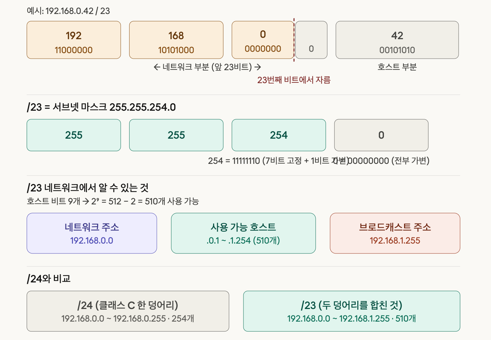
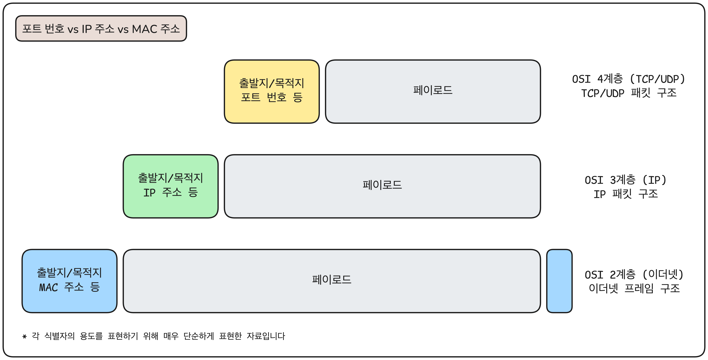
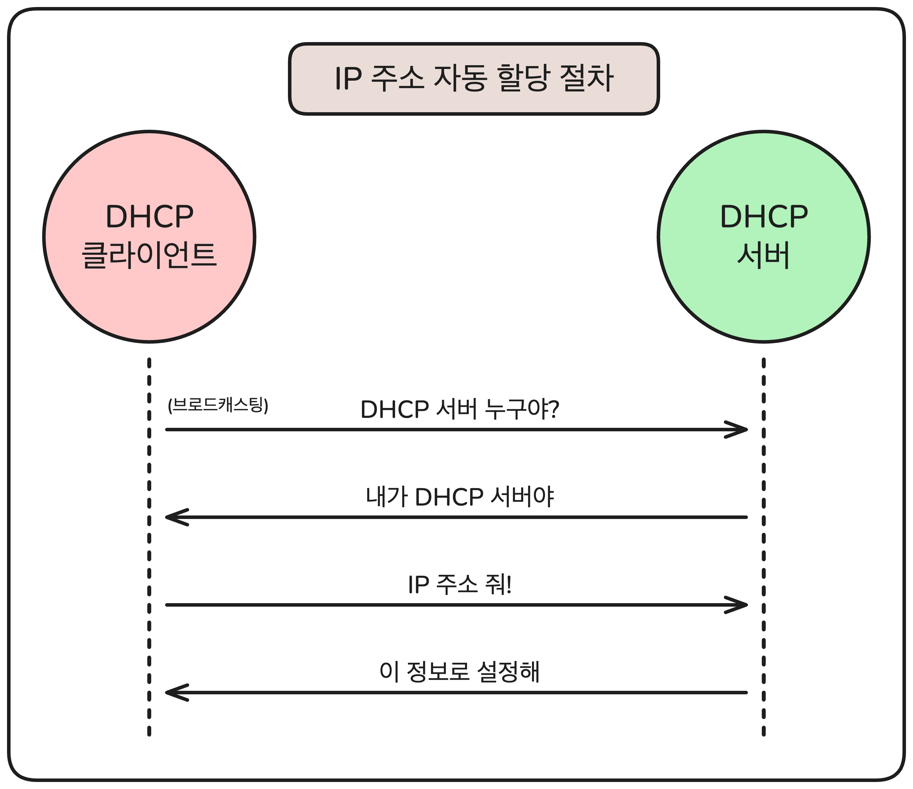
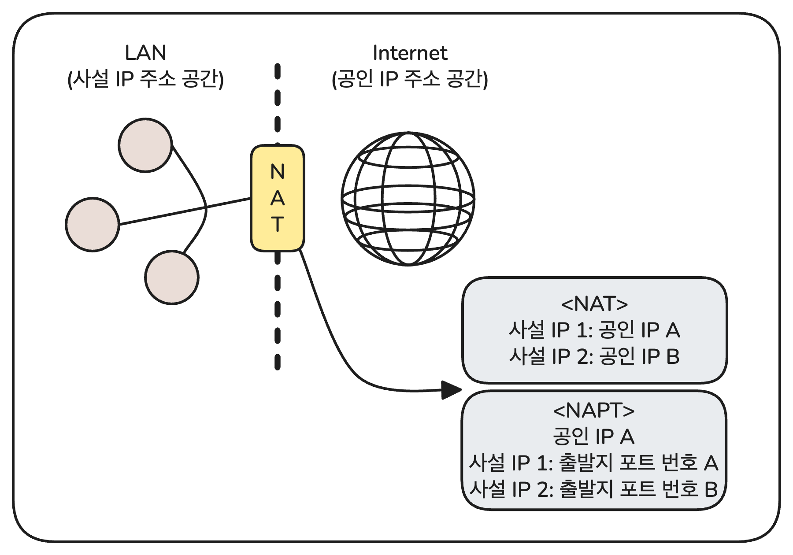
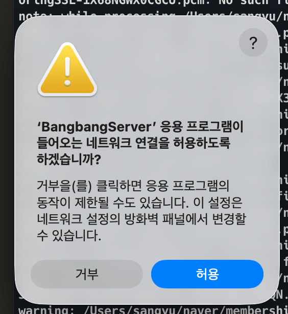
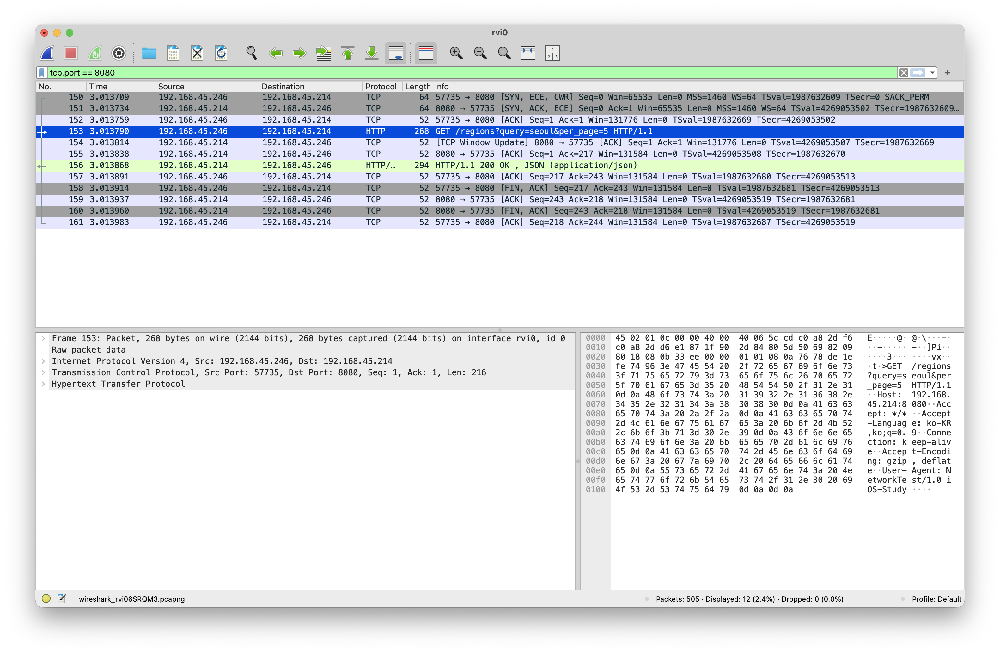
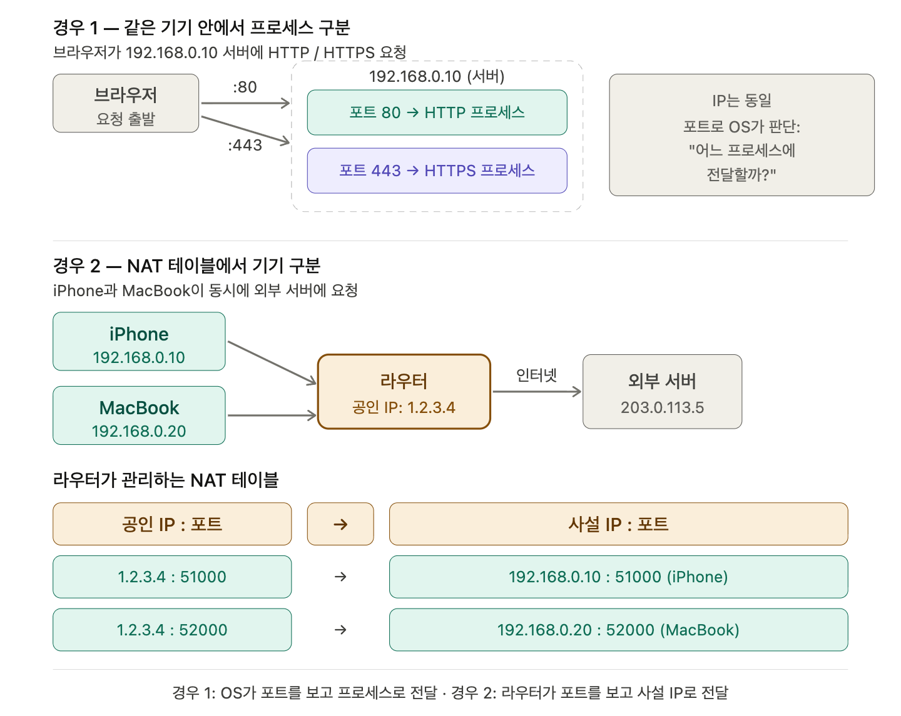

# IP

### 학습 키워드

`# IP` `# MAC 주소` `# 포트 번호`

## 1. 핵심 개념

### IP (Internet Protocl)

인터넷이 통하는 네트워크에서 어떤 정보를 수신하고 송신하는 통신에 대한 규약을 의미한다. - [IP-WIKI](https://namu.wiki/w/IP)  
OSI 참조 모델에서는 3계층 (네트워크 계층), TCP/IP 모델에서는 2계층 (인터넷 계층)에 속한다.

#### IPv4와 IPv6

v4와 v6은 IP의 버전을 나타내며 두 버전 사이에 호환성은 없다.  
IPv4는 4옥텟, IPv6는 16옥텟으로 IP 주소를 나타낸다. (1 옥텟 = 8비트)  
주소 체계의 차이로 IPv4는 주소 고갈의 문제가 존재하는데, IPv6은 방대한 주소 공간을 가지고 있어 주소가 고갈될 염려가 거의 없다.  
더해서 IPv6은 프로토콜 수준에서 암호화 통신이 규정되어 있으며 IPv4에 비교적으로 헤더가 단순하다는 특장이 있다.  
IPv6 헤더가 IPv4보다 단순하다는 점은 라우터의 처리 속도를 높이는 핵심 요인이다.

### IP 주소

TCP/IP 프로토콜에서 출발지나 목적지를 식별하는 식별자로 사용되는 데이터다.  
인터넷에서 사용할 수 있는 **공인 IP 주소**와 인터넷에서 사용할 수 없으며 LAN 내부 등의 주소 공간에서 사용하는 **사설 IP 주소**로 구분된다.  
공인과 사설은 이용 범위에 차이가 있어 다음과 같은 특징이 있다.

- 공인 IP 주소는 전세계에서 고유해야 한다.
- 사설 IP 주소는 다른 주소 공간에서 사용된다면 같은 주소를 사용할 수 있다.

### IP 네트워크에서의 서브네팅

> 참고 자료: [\[네트워크 IP\] IP 주소 체계\(클래스 기반 할당 방식, 서브넷 마스크\)](https://dyl1229.tistory.com/49)

#### 초기의 클래스 기반 할당 방식

IP 주소의 32비트 중 상위 몇 비트를 네트워크를 표현하도록 하고, 나머지를 호스트를 위해 사용할지 클래스에 따라 정해둔 방식이다.  
예를 들어 클래스 A는 상위 8비트, 클래스 B는 상위 16비트, 클래스 C는 상위 24비트로 네트워크를 표현한다.  
각 클래스 별 나눠줄 수 있는 호스트 수가 극명하게 차이나는 방식이다. (A는 16000만개, B는 65534개, C는 254개)  
300개의 주소만만 원하는 회사도 클래스 B를 할당받아 65234개의 주소를 낭비하는 문제점이 생긴 방식이었다.

#### CIDR (Classes Inter-Domain Routing)

클래스 기반 할당 방식의 문제점을 해결한 방식이다.  
앞선 방식은 무조건 8비트/16비트/24비트로 끊어야 했다면, CIDR은 자르는 위치를 좀 더 자유롭게 할 수 있는 방식이다.  
`/숫자`의 형태로 얻을 네트워크 크기를 효율적으로 가져갈 수 있는 방식이다. e.g. `/23` -> 사용 가능한 호스트 수 510개

> 네트워크 주소: 서브넷 자체를 식별하는 주소. 실제 할당 불가능  
> 브로드캐스트 수조: 서브넷 안의 모든 기기에 동시에 메시지를 보낼 때 사용.



_위 이미지는 Claude가 생성했습니다._  
_겹친 텍스트: “254 = 11111110(7비트 고정 + 1비트 가변) 00000000 (전부 가변)”_

---

### IP 주소 vs MAC 주소 vs 포트 번호



#### MAC 주소

네트워크에 연결되는 기기나 단말기가 고유하게 가지는 식별자다.  
LAN 내 장치 통신 (이더넷)에 사용된다.  
MAC 주소의 식별 대상은 단말기, IP 주소의 식별 대상은 네트워크 호스트다.

48비트 길이로 상위 24 비트는 벤더 코드(장비 제조사), 하위 24 비트는 각 제조사의 책임 하에 제품에 할당된다.  
e.g. `01-AB-47-59-2F-C0`

> MAC 주소 — 하드웨어에 고정된 식별자, 제조사가 부여하며 전 세계에서 고유  
> IP 주소 — 네트워크에서 위치를 나타내는 식별자, 네트워크 환경에 따라 바뀔 수 있음

#### 포트 번호

IP 주소만으로는 특정할 수 없는 LAN 내 장치나 단말기, 상위 프로토콜이 이용하는 애플리케이션 종류나 애플리케이션의 클라이언트 등을 포트 번호가 지정한다.  
_e.g. IP 주소는 지정할 수 없는 목적지 서버의 특정 앱의 사용을 지정하기 위해 사용된다._

16비트로 0-65535의 번호를 나타낼 수 있다.  
원칙적으로는 송수신 양쪽의 합의 하에 범위 내 어떤 번호를 사용해도 문제는 없다.  
그러나 인터넷에서는 주요 애플리케이션의 포트 번호는 0-1023을 할당하는 것이 관례다.

- 0-1023: 잘 알려진 포트, 이메일/HTTP/DNS 등 인터넷의 핵심 서비스에 할당된 특정 포트 번호
- 1024-49151: 등록된 포트 번호, 잘 알려진 포트 이외의 주요 공급 업체 제품 및 앱에 할당된 포트 번호
- 49152-65535: 다이내믹/프라이빗 포트 번호, 개인이나 기업이 자유롭게 사용할 수 있는 포트 번호
  | 포트 번호 | 프로토콜 및 서비스 | 설명 |
  |---------|--------------|--------------------------------------|
  | UDP/53 | DNS | DNS 서버에 IP 주소 문의 |
  | UDP/67 | DHCP (서버) | IP 주소 자동 할당을 관리하는 서버 |
  | UDP/68 | DHCP (클라이언트) | DHCP가 자동으로 IP 주소를 할당하는 기기 (네트워크 호스트) |
  | TCP/80 | HTTP | 웹 브라우저와 웹 서버 사이 통신 |
  | TCP/443 | HTTPS | 암호화 통신으로 세션이 보호된 HTTP 통신 |

---

### DHCP (Dynamic Host Configuration Protocol)

LAN 내 장치에 IP 주소를 자동으로 할당하는 클라이언트 서버형 프로토콜이다.

> 클라이언트 서버형: 특정 처리를 전문으로 하는 컴퓨터를 서버, 서버에 접근해 서비스를 이용하는 컴퓨터를 클라이언트라고 하는 컴퓨터 사용 형태 중 하나.

DHCP 서버는 클라이언트의 요청에 따라 관리하는 IP 주소 중 적절한 것을 할당한다.  


---

### NAT과 NAPT

> NAT = Network Address Translation  
> NAPT = Network Address Port Translation

사설 IP 주소만 할당된 장치가 인터넷에 접속할 수 없는 문제를 해결하는 방법이다.  


#### NAT

기업 등에 할당된 공인 IP 주소와 각 장치에 설정된 사설 IP 주소의 일대일 대응 변환표를 사용해 통신한다.  
사용할 수 있는 공인 IP 주소가 적으면 여러 장치가 액세스하기 어려운 문제가 있다.

#### NAPT

TCP/UDP의 출발지 포트 번호도 함께 사용해 동일한 공인 IP 주소라도 사설 IP 주소마다 다른 포트 번호를 할당해 NAT의 문제를 해결한다.  
PAT(Port Address Translation)라고 하기도 한다.

---

### ARP (Address Resolution Protocol)

IP 주소에서 해당 장비의 MAC 주소를 확인하는 프로토콜이다.

#### 필요성

LAN 내에서 각 장치 연결은 이더넷을 사용하고, 연결된 장치에서 실행되는 애플리케이션은 주로 TCP/IP 프로토콜을 사용한다.  
따라서 내부 장치 간 통신은 MAC 주소를 필요로 하는데, 애플리케이션은 IP 주소를 알아도 MAC 주소를 모른다.  
목적지 IP 주소가 LAN 내 어느 MAC 주소를 가진 장치의 것인지 확인하기 위해 사용한다.

#### 기본 동작

LAN 내 브로드캐스팅으로 MAC 주소를 알고자 하는 IP 주소를 보내면, 해당 장치가 자신의 MAC 주소를 회신한다.

#### 라우터 활용 동작

통신할 때마다 위의 기본 동작을 수행하면 매번 조회하면서 효율적이지 않을 수 있다.  
때문에 라우터에 LAN 내 모든 기기의 IP 주소/MAC 주소 대응 테이블을 만들어두는 경우가 많다.  
라우터에 문의하는 방식을 통해 MAC 주소를 확인할 수 있다.

> 라우터의 MAC 주소는 각 장치가 기본 게이트웨이로 설정해두기 때문에 찾을 필요가 없다.

---

## 2. 탐구 내용 (실무 / iOS 연결)

### 실기기 vs 시뮬레이터 — 테스트 환경에서의 주의사항

> 테스트 코드는 Claude를 통해 만들었으며, `/references/test/ip-port` 의 파일에 있다.

시뮬레이터와 실기기에서 네트워크 요청 시 IP & Port 관련 동작이 어떻게 다른지 Wireshark와 RVI로 관찰했다.

|     **대상**     |            **URL**            |           **목적**           |
| :--------------: | :---------------------------: | :--------------------------: |
| 로컬 서버 (HTTP) | http://127.0.0.1:8080/regions | 루프백 / LAN 접근 차이 관찰  |
|    외부 HTTP     |    http://httpbin.org/get     |      ATS 차단 동작 관찰      |
|    외부 HTTPS    |    https://httpbin.org/get    | ATS 차단 없는 외부 서버 관찰 |

---

#### 1️⃣ 시뮬레이터 관찰

**(1) Wireshark 설정**  
| **테스트 대상** | **인터페이스** | **필터** |
|:----------:|:---------:|:----------------------:|
| 로컬 서버 | lo0 | tcp.port == 8080 |
| 외부 HTTP | en0 | tcp.port == 80 |
| 외부 HTTPS | en0 | ip.addr == (목적지 공인 IP) |

> 시뮬레이터는 Mac의 프로세스로 동작하기 때문에 Mac의 네트워크 인터페이스를 공유한다.  
> 로컬 서버(127.0.0.1)는 루프백 트래픽이라 `en0`이 아닌 `lo0`에서 잡힌다.
>
> `en0`: 이더넷/Wi-Fi 인터페이스  
> `lo0`: 루프백 인터페이스 (실제 하드웨어가 없는 가상 인터페이스, 내부 동작)

**(2) ATS (App Transport Security) 관찰**

> 참고 자료: [Preventing Insecure Network Connections | Apple Developer Documentation](https://developer.apple.com/documentation/security/preventing-insecure-network-connections)

외부 HTTP 요청 시 `NSAppTransportSecurity` 설정 없이 요청하면 **Wireshark에 tcp.port == 80 패킷이 아예 관찰되지 않는다.**  
요청이 서버에 도달하기도 전에 OS 레벨에서 차단하기 때문이다.  
Info.plist에 아래 설정 추가 후 재요청하면 연결된다.

```xml
<key>NSAppTransportSecurity</key>
<dict>
    <key>NSAllowsArbitraryLoads</key>
    <true/>
</dict>
```

---

#### 2️⃣ 실기기 관찰

**(1) RVI(Remote Virtual Interface) 설정**

> 참고 자료: [Recording a Packet Trace | Apple Developer Documentation](https://developer.apple.com/documentation/network/recording-a-packet-trace#Set-Up-iOS-Packet-Tracing)  
> RVI는 iOS 디바이스의 네트워크 트래픽을 Mac에서 캡처할 수 있게 해주는 가상 네트워크 인터페이스다.

```bash
# 0. 실기기와 Mac 케이블로 연결

# 1. 실기기 UDID 확인
xcrun xctrace list devices

# 2. RVI 인터페이스 생성
rvictl -s [UDID]
# 성공 시: Starting device [UDID] [SUCCEEDED] with interface rvi0

# 3. Wireshark에서 rvi0 인터페이스 선택

# 4. 종료
rvictl -x [UDID]
```

> Wireshark에서는 어떤 테스트 대상이든 rvi0을 유지했고, 필터는 시뮬레이터 때와 동일하게 적용해 관찰했다.

**(2) 로컬 서버 접근 관찰 - 삽질…**  
**1단계: URL을 Mac의 LAN IP로 수정**  
시뮬레이터에서 쓰던 127.0.0.1은 iPhone 자신의 루프백을 가리키기 때문에 Mac의 LAN IP로 변경이 필요하다.

```bash
ifconfig en0 | grep "inet "   # Mac LAN IP 확인
```

```swift
// 변경 전
URL(string: "http://127.0.0.1:8080/regions")

// 변경 후
URL(string: "http://192.168.x.x:8080/regions")
```

변경 후 요청하니 실기기에 **로컬 네트워크 허용 권한 팝업**이 나타났다. 그러나 여전히 연결 거부…

**2단계: 서버 바인딩 주소 문제**

> Vapor 서버는 기본적으로 127.0.0.1:8080에 바인딩된다.  
> 127.0.0.1은 **루프백 주소**로, 네트워크 인터페이스로 나가지 않고 OS 내부에서만 처리된다.  
> Mac 안에서 Mac으로 가는 요청만 받을 수 있다.  
> iPhone은 같은 LAN 안에 있어도 **다른 기기**이기 때문에 Mac의 네트워크 인터페이스(en0, 192.168.x.x)를 통해 들어온다.  
> 서버가 그 인터페이스를 듣고 있지 않으니 연결이 거부된 것이다.

서버의 `configure.swift`에 아래 코드를 추가해 모든 인터페이스에서 수신하도록 변경했다.

```swift
public func configure(_ app: Application) async throws {
	app.http.server.configuration.hostname = "0.0.0.0" // 추가
	// ...
}
```

0.0.0.0은 **모든 네트워크 인터페이스**를 듣겠다는 의미로, 루프백(127.0.0.1)도 LAN 인터페이스(192.168.x.x)도 전부 수신한다.  
설정 변경 후 Mac에 아래와 같은 팝업이 나왔고, 허용한 뒤 정상 연결되었다!



아래에서 볼 수 있듯이 목적지 IP가 내 Mac의 LAN IP인 것을 확인했다.  
요청이 **en0**을 통해 들어온 것으로, iPhone → (Wi-Fi) → Mac en0 → 서버 프로세스 순으로 전달된 흐름이다.


---

#### 3️⃣ 결론

|       **항목**       |                   **시뮬레이터**                    |              **실기기**               |
| :------------------: | :-------------------------------------------------: | :-----------------------------------: |
|    로컬 서버 주소    |                 127.0.0.1 사용 가능                 |           Mac의 LAN IP 필요           |
|   로컬 서버 바인딩   |          127.0.0.1 바인딩으로도 접근 가능           | 서버가 0.0.0.0 바인딩이어야 접근 가능 |
|       **ATS**        |                   동일하게 적용됨                   |            동일하게 적용됨            |
|    ATS HTTP 차단     | 패킷 자체가 나가지 않음 <br>(Wireshark에 흔적 없음) |                 동일                  |
| Wireshark 인터페이스 |               en0 (외부) / lo0 (로컬)               |                 rvi0                  |
|  로컬 네트워크 권한  |                      팝업 없음                      |           권한 팝업 나타남            |

1. **로컬 서버는 항상 0.0.0.0으로 띄우자** 배포할 때는 로컬 서버가 아니겠지만, 로컬 서버와 함께 테스트하는 상황에 유의하면 좋을 듯 하다. 처음부터 0.0.0.0 바인딩을 해둬서 삽질하지 않기.
2. **ATS 설정에 유의하자** 실무에서 HTTP 통신이 필요하다면 서버에 SSL 인증서를 붙여 HTTPS로 변경하는 것이 원칙적으로 옳다. 어쩔 수 없다면 `NSAllowsArbitraryLoads` 대신 특정 도메인만 예외 처리하는 방식을 쓰자.

---

## 3. 의문 / 논점

### [1] TCP/IP 프로토콜이 뭐지? 다른 계층의 프로토콜을 왜 합쳐서 명했을까?

<details>
<summary><strong>정리 내용</strong></summary>
TCP와 IP를 사용하는 상태를 의미하는 것이 아니라, 인터넷이 동작하는 방식을 정의한 프로토콜 묶음의 이름이다.<br/ >
TCP/IP를 IP 기반 인터넷 스택 전체를 의미한다고 이해했다.<br/ >
따라서 TCP를 안 쓰고 UDP를 쓸 수도 있으며 더 상위 계층의 HTTP, TLS, DNS까지 다 포함한 개념이다.<br/ >
<strong>결론: IP 기반으로 동작하며, OSI 모델 기준 3-7계층의 스택 전체를 떠올리면 된다.</strong>
</details>

### [2] 공인 IP 주소가 없는 곳을 찾아갈 때 사설 IP 주소를 찾을까 포트 번호를 찾을까?

<details>
<summary><strong>정리 내용</strong></summary>

포트 번호가 LAN 내 장치나 단말기를 지정하기도 한다길래 궁금했다.  
포트 번호를 통해 패킷을 최종적으로 어디에 전달할지 찾는다는 점은 동일하지만, 그 과정이 다른 경우가 있다.

1. 같은 기기 안에서 프로세스 구분: OS가 포트 번호 해석
2. NAT 테이블에서 기기 구분: 라우터가 포트 번호 해석



_위 이미지는 Claude가 생성한 이미지입니다._

**결론: 내부 장치를 포트 번호로 찾는지, 사설 IP 주소로 찾는지 구분해서 질문해 헷갈렸던 것이다. 실제로는 `포트 번호 ->NAT 테이블 조회 -> 사설 IP 획득 -> 내부 장치 도달`의 과정으로 이해하면 될 듯 하다.**

</details>

### [3] NAT의 일대일 변환표는 각 장치에 공인 IP 주소를 할당한 것과 차이가 뭘까?

<details>
<summary><strong>정리 내용</strong></summary>

> 참고 자료: [\[네트워크\] NAT\(Network Address Translation\)](https://autumn-code.tistory.com/entry/%EB%84%A4%ED%8A%B8%EC%9B%8C%ED%81%AC-NATNetwork-Address-Translation)

일대일 대응이면 그 장치만을 위해 존재하는 것으로 보여 궁금했다.  
NAT 기능 사용과 고유 공인 IP 주소 직접 할당의 차이는 장치가 라우터 뒤에 숨는지 아닌지다.  
공인 IP를 직접 할당하면 기기가 인터넷에 직접 노출되어 외부 공격에 취약하다.  
이렇게 학습했던 방식은 정적 NAT인데, 동적 NAT이라는 것도 존재한다.  
실제로는 동적 NAT을 잘 쓰지 않고 PAT(NAPT)를 사용한다고 한다.
| - | **Static NAT** | **동적 NAT** | **PAT** |
|:----------:|:--------------:|:------------:|:------------:|
| 매핑 | 1:1 고정 | 1:1 그때그때 | 다:1 포트로 구분 |
| 공인 IP 필요량 | 기기 수만큼 | 동시 접속 수만큼 | 1개로 전체 커버 |
| 외부에서 먼저 접근 | 가능 | 불가 (매핑이 유동적) | 불가 |
| 주로 쓰이는 곳 | 고정 서버 | 레거시 환경 | 가정, 회사 거의 전부 |

</details>

### [4] IPv6의 서브넷팅

<details>
<summary><strong>정리 내용</strong></summary>

> 참고 자료  
> [한국인터넷정보센터\(KRNIC\)](https://xn--3e0bx5euxnjje69i70af08bea817g.xn--3e0b707e/jsp/resources/vsix/addressSystem.jsp)  
> [포스트 한개로 한방에 정리! IPv6](https://m.blog.naver.com/luexr/222055230220)

서브넷팅의 목적이 '부족한 IP의 효율적 분배'보다는 '네트워크 관리의 효율성'과 '라우팅 최적화'에 집중되어 있다.

```
|--- 48비트 ---|--- 16비트 ---|--- 64비트 ---|
  글로벌 주소       서브넷          기기 번호
 (ISP가 할당)    (내가 자름)     (기기 자동생성)
```

IPv6에선 **16비트 구역 안에서만** 서브넷팅을 한다.

1. `/48`: 16비트의 서브넷 공간을 활용
2. `/56`: 8비트의 서브넷 공간을 활용,
3. `/64`: 더 이상 서브넷팅을 하지 않는 단일 네트워크 세그먼트

하위 64비트가 고정인 이유는 기기 번호 때문이다.  
IPv6 기기는 뒤 64비트를 스스로 생성한다. 이게 동작하려면 뒤 64비트가 기기가 자유롭게 쓸 수 있도록 비워져 있어야 하니까, 서브넷은 반드시 /64에서 끝나야 한다.  
본인의 MAC 주소를 활용(EUI-64)하기도 하고 랜덤으로 생성하기도 한다. iOS를 포함한 현대 OS는 보안상의 이유로 랜덤 생성 방식을 사용한다.

</details>

---

## 4. 참고 자료

[\[\[epub3.0\] 그림으로 이해하는 네트워크 구조와 기술\]](https://ebook-product.kyobobook.co.kr/dig/epd/ebook/E000005332098)
