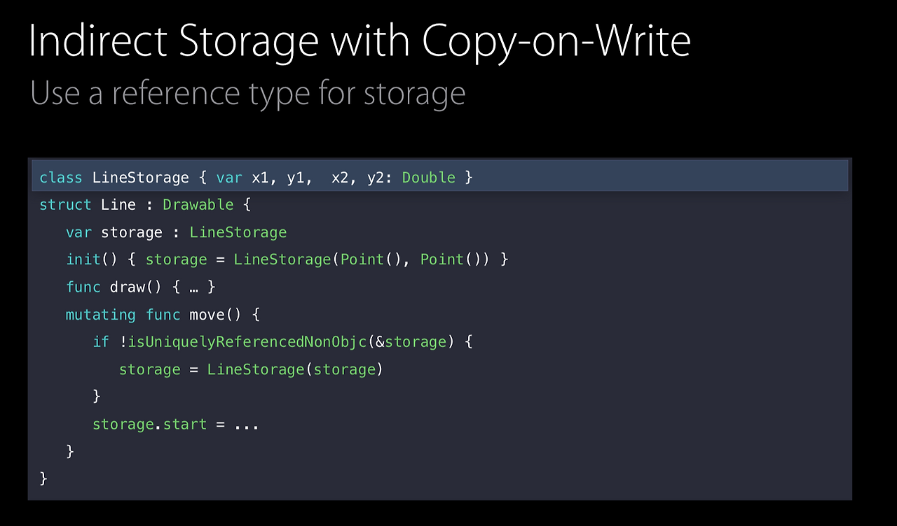

## 1. 시청한 WWDC 영상
- **세션 제목**: Understanding Swift Performance (WWDC16)
- **링크**: [Apple Developer Video: Understanding Swift Performance](https://developer.apple.com/videos/play/wwdc2016/416/)

## 2. 내용 요약
- **세션 핵심 주제**

  Swift의 Struct, Class, Protocol, Generic이 내부적으로 어떻게 동작하는지 메모리와 최적화 관점에서 아주 딥하게 까보는 세션이었습니다. 우리가 아무 생각 없이 쓰는 타입들이 성능에 어떤 영향을 미치는지 3가지 기준(Allocation, Reference Counting, Method Dispatch)으로 정리해보겠습니다.

- **주요 개념 / 기술 정리**
  1. **할당 (Allocation)**: 
     - **Stack**: 포인터만 줄이고 늘리면 돼서 거의 O(1) 수준으로 빠름.
     - **Heap**: 빈 공간 찾고, 해제할 때 다시 껴넣고, 특히 **멀티스레드 환경에서 안전하게 처리하려고 Locking 같은 동기화 작업**이 들어가서 꽤 무거움. Class는 Heap에 2 words를 기본으로 할당받음(헤더).
  2. **참조 카운팅 (Reference Counting)**:   
     - 힙에 언제 메모리를 내릴지 결정하려고 레퍼런스 카운트를 셈. 이것도 단순히 숫자를 세는 게 아니라 Thread safety를 위해 원자적(atomic)으로 연산되어야 해서 비용이 쌓임.
     - **추가 포인트**: `Label`이라는 Struct 안에 `String`(Heap 저장)과 `UIFont`(Class) 프로퍼티가 있으면 어떻게 될까? 
     
        **값을 복사할 때마다 안에 있는 힙 프로퍼티 2개를 각각 retain/release 해줘야 함!** 즉, 구조체 안에 참조 타입이 2개 이상 있으면 Class 하나 쓰는 것보다 레퍼런스 카운팅 오버헤드가 더 커짐.
  3. **메서드 디스패치 (Method Dispatch)**:
     - **Static Dispatch**: 컴파일러가 어떤 코드를 부를지 미리 알아서, 함수 내용을 아예 복붙해버리는(Inlining) 적극적인 최적화가 가능.
     - **Dynamic Dispatch**: 다형성 때문에 런타임에 vtable(가상 메서드 테이블)을 뒤져서 찾아가느라 오버헤드가 생김.
  4. **Protocol & Existential Container**:
     - Protocol 타입을 쓰면 **Existential Container**라는 특수한 저장 공간이 스택에 만들어짐.
     - 앞쪽 3 word는 `valueBuffer`라서 작은 구조체는 스택에 쏙 들어가지만, 이거보다 큰 구조체(예: 프로퍼티가 4개인 Line)는 결국 Heap에 할당됨.
     - 이 차이를 런타임에 커버하기 위해 VWT(Value Witness Table)와 PWT(Protocol Witness Table)를 거쳐서 동적 디스패치를 함.
  5. **Generics & Specialization (특수화)**:
     - 제네릭은 '정적인 다형성'을 지원함. 컴파일러가 타입 추론을 통해 해당 타입 전용 함수를 새로 찍어냄(Specialization).
     - 덕분에 Existential Container 없이 Stack에 바로 올릴 수 있고 정적 디스패치가 가능해져서 성능이 엄청 빨라짐!

- **인상적이었던 포인트**
  - "Struct는 값 타입이니까 무조건 스택!"이라고 맹신하면 안 됨. Struct 안에 Heap을 쓰는 요소(String 등)가 여러 개면 배보다 배꼽(레퍼런스 카운팅 오버헤드)이 더 커질 수 있다.

  

  - 큰 크기의 구조체가 Protocol 타입에 담길 때 일어나는 힙 할당(2번 씩 일어나는 참사)을 막기 위해, 내부 데이터를 클래스(`LineStorage`)로 빼고 `isKnownUniquelyReferenced`를 써서 **Copy-On-Write(COW)**를 직접 구현하는 기법을 사용할 수 있음.
  - 제네릭에서 `Pair<Line, Line>`을 쓰면, 특수화 덕분에 Existential Container 없이 구조체 인라인에 프로퍼티를 욱여넣어서 힙 할당을 없엘 수 있다.

- **실무 연결 연결 지점**
  - 앱에서 캐시 딕셔너리 Key로 `String`을 흔하게 쓰는데, **String은 내용물을 Heap에 저장하기 때문에 캐시에 히트해도 계속 힙 할당 오버헤드가 발생함**. 이를 고정 크기의 `UUID` 구조체나 `Enum`으로 대체하면 힙 할당도 싹 없애고 타입 안정성도 극대화할 수 있음.

## 3. 준비한 질문

## 4. 토론 / 공유 내용 정리

## 5. 의문 / 추가 탐구 포인트
