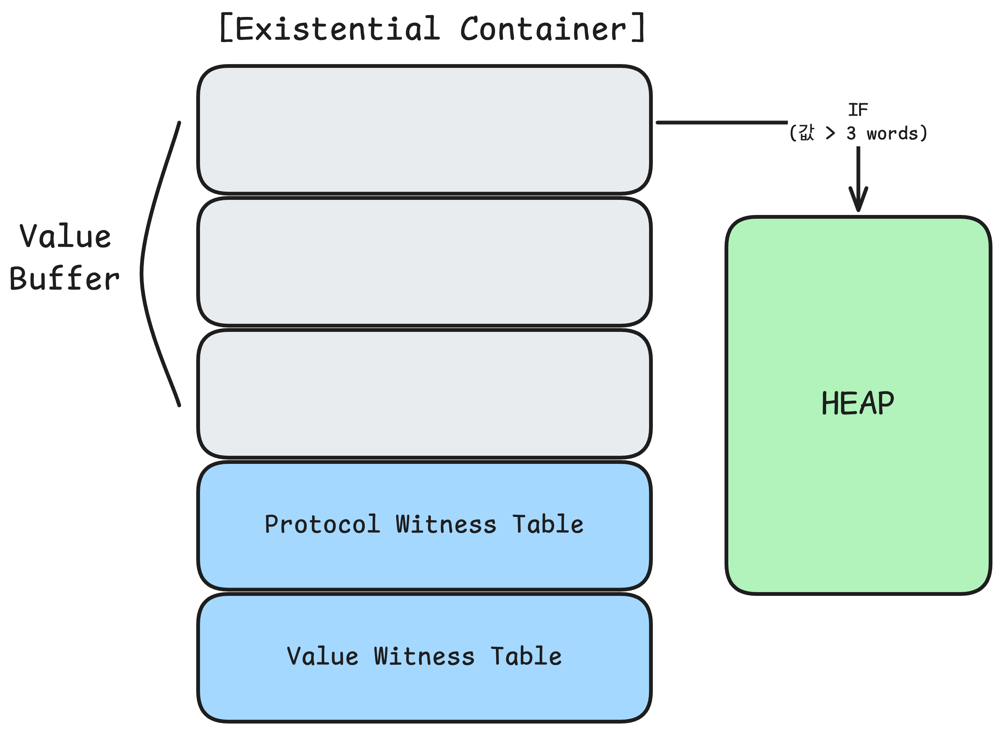

## 1. 시청한 WWDC 영상

- 세션 제목: Understanding Swift Performance
- 링크: [Understanding Swift Performance - WWDC16 - Videos - Apple Developer](https://developer.apple.com/videos/play/wwdc2016/416/)

## 2. 내용 요약

> **Swift 성능 최적화 — 메모리·디스패치·제네릭**  
> Swift에서 성능을 결정하는 세 가지 핵심 축은 **메모리 할당 방식**, **참조 횟수(Reference Count) 계산 비용**, **메소드 디스패치(Method Dispatch) 방식**임. 타입과 추상화 메커니즘을 목적에 맞게 선택함으로써 불필요한 힙 할당과 런타임 오버헤드를 줄일 수 있음.

### 인상적인 내용 및 생각 정리

- **정적 메소드 디스패치로 인한 최적화가 존재한다는 사실을 처음 알았다.**
  - 단순히 기능(메소드)만 모아둔 유틸리티 성격의 타입을 만들 때는 `class`보다 `struct`/`enum`을 선택해야겠다고 생각했다.
- **프로토콜과 제네릭을 사용했을 때의 내부 동작을 처음 알았다.**
  - 구조체 + 프로토콜이더라도, 내부 값이 크다면 힙 할당이 발생
  - 복사될 때마다 큰 내부 값을 위한 힙 할당이 발생하게 하는 것보다, 그 내부 값을 참조 타입으로 변경해 성능을 개선할 수 있음 (힙 할당 비용 감소, 참조 횟수 계산 비용 증가)
  - 제네릭을 사용하면 하나의 타입이 바인딩되어서 정적인 다형성을 적용할 수 있음
  - 정적인 다형성의 장점은 중복 코드를 줄이는 다형성의 장점을 가져가면서, 정적 디스패치로 인한 최적화 또한 챙길 수 있다는 것
- **항상 클래스를 상태 공유가 필요하기 때문에 사용했어서 COW 전략을 생각하지 못했었다.**
  - 상태 공유를 방지하고 싶으나 클래스를 써야할 때 해당 전략을 적용해봐야겠다.
  - 지금 생각나는 건 이 영상에서 확인한 프로토콜 내부 값이 큰 상황?

### 전체 내용 정리

#### [1] 메모리 할당 (Memory Allocation)<!-- {"fold":true} -->

**스택 (Stack)**

- 스택 포인터를 조절하는 것으로 할당·해제가 이루어짐
- 할당 시에는 포인터가 할당량만큼 이동하고, 해제 시에는 이전 주소로 복귀함
- 복사 시 값이 복사되어 인스턴스 간 상태 공유가 없음
- 예: `Struct`, `Enum`

**힙 (Heap)**

- 할당 -> 적절한 크기의 빈 메모리 블럭을 탐색해야 하고
- 해제 -> 메모리 블럭을 반환한 뒤 이를 가리키던 스택도 비워야 함
- 스택과 달리 실제 값을 저장할 공간과 그를 가리키는 포인터 공간(word 크기)이 모두 필요함
- 복사 시 참조가 복사되어 인스턴스들이 동일한 힙 공간을 가리키며, 변수 간 상태 공유가 발생함
- 예: `Class`, `String`
  ⠀

#### [2] 참조 횟수 계산 (Reference Counting)<!-- {"fold":true} -->

Swift는 힙 인스턴스에 대한 참조 횟수를 추적하여 0이 되면 해제함.

- 횟수를 계산할 때 정수를 더하고 빼는 과정에서 몇 가지 간접적인 처리가 필요함
- 여러 스레드에서 동시에 참조할 가능성이 있어 원자적(Atomic)으로 처리되어야 하며, 이 비용들은 누적되면 커질 수 있음
- 구조체는 기본적으로 힙 할당이 없어 참조 횟수 계산이 불필요함
- 단, 구조체의 속성이 문자열이나 클래스처럼 힙 할당이 필요한 타입이라면 각 속성마다 참조 횟수 계산이 별도로 이루어짐
- 따라서 참조 타입 속성이 둘 이상인 구조체는 오히려 클래스보다 많은 참조 횟수 계산 오버헤드가 발생함

**오버헤드를 줄이는 방법**

1. `String` 대신 `UUID` 타입 사용 → 128비트를 구조체에 직접 저장하며 힙 할당 없이 참조 횟수 계산 오버헤드도 없음
2. `String` 대신 `enum` 활용 → 타입 안전성이 높아지고, 힙에 간접 저장할 필요가 없어 성능 향상. 힙 할당이 없으므로 참조 횟수 계산 오버헤드가 훨씬 적음
   ⠀

#### [3] 메소드 디스패치 (Method Dispatch)<!-- {"fold":true} -->

**정적 디스패치 (Static Dispatch)**

- 컴파일 타임에 구현체를 확인하고 최적화를 적용할 수 있음
- 인라이닝(Inlining) 등의 최적화가 가능함
- 연결된 여러 정적 디스패치 체인은 컴파일러가 전체를 파악해 하나의 구현체로 통합(인라이닝)할 수 있어, 여러 콜 스택을 쌓는 오버헤드가 없어짐

**동적 디스패치 (Dynamic Dispatch)**

- 런타임에 구현체를 확인함
- 단일 호출 기준으로는 정적 디스패치와 비용 차이가 크지 않음
- 컴파일러가 미리 구현부를 확인할 수 없어 인라이닝 등의 최적화를 적용할 수 없음
- 다형성(Polymorphism) 지원을 위해 클래스 타입 정보 포인터와 가상 메소드 테이블(V-Table, Virtual Method Table)을 사용함
- 클래스에 `final`을 붙여 서브클래스가 없음을 명시하면 정적 디스패치를 유도할 수 있음

**Inlining (인라이닝)**

```swift
func a() {
	print("HI")
}

func b() {
	a()
}

// BEFORE
b()

// AFTER
print("HI")

```

⠀

#### [4] 프로토콜 타입의 내부 구조<!-- {"fold":true} -->


**프로토콜 증인 테이블 (PWT, Protocol Witness Table)**

- 클래스 상속 구조를 프로토콜 + 구조체 구조로 대체하면 메소드 디스패치 방식이 V-Table에서 PWT로 바뀜
- PWT는 프로토콜을 구현한 타입마다 하나씩 생성되며, 테이블의 각 엔트리는 해당 타입의 구현부로 연결됨

**실존 컨테이너 (Existential Container)**

- 같은 프로토콜을 채택하더라도 구현 내용에 따라 필요한 스택 공간의 크기가 다름
- 배열은 요소들이 동일한 오프셋을 가지길 원하는데, 프로토콜 타입을 요소 타입으로 갖는 배열에서 이를 보장하기 위해 실존 컨테이너가 사용됨
- 실존 컨테이너의 앞 3 words는 값 버퍼(Value Buffer)로 사용됨
  - 저장되는 값이 3 words 이하: 값 버퍼에 직접 저장 (힙 할당 없음)
  - 저장되는 값이 3 words 초과: 힙에 할당 후 포인터를 버퍼에 저장
- 실존 컨테이너는 PWT와 값 증인 테이블(VWT)에 대한 참조를 포함함

**값 증인 테이블 (VWT, Value Witness Table)**

- 프로토콜 값의 생명주기를 관리하는 테이블로, 프로토콜을 구현한 타입마다 하나씩 생성됨
- 변수 수명 주기에 따라 이 테이블의 함수들을 통해 힙 할당, 복사, 참조 횟수 감소, 힙 해제를 수행함

#### [5] 간접 저장과 쓰기 시 복사 (Copy on Write, CoW)<!-- {"fold":true} -->

- 프로토콜에 3 words보다 큰 구조체가 들어가면, 구현체가 복사될 때마다 새로운 힙 할당이 발생함
- 이 비용을 피하기 위해, 프로토콜이 가진 큰 값을 **구조체 대신 클래스로 감싸면 여러 구현체가 같은 힙 인스턴스를 가리키는 참조를 값 버퍼에 저장**함 → 힙 할당 오버헤드를 줄이는 대신 참조 횟수 계산 오버헤드가 생김
- 이때 의도하지 않은 상태 공유를 막기 위해 **CoW**를 적용함
  - **값 수정 직전에, 해당 힙 인스턴스의 참조 횟수가 1보다 크면 복사본을 만들어 상태를 분리**함
  - 프로토콜을 채택한 구조체 내부에서 구현하는 것이 효과적임
    ⠀

#### [6] 프로토콜 타입: 작은 값 vs 큰 값 비교<!-- {"fold":true} -->

|      **구분**      |        **작은 값 (≤ 3 words)**         |                                                                       **큰 값 (> 3 words)**                                                                        |
| :----------------: | :------------------------------------: | :----------------------------------------------------------------------------------------------------------------------------------------------------------------: |
|    **값 버퍼**     |   값 버퍼에 직접 저장 (힙 할당 없음)   |                                                               힙에 할당 후 참조 저장 (힙 할당 있음)                                                                |
| **참조 횟수 계산** |                  없음                  |                                                                    값이 참조를 포함할 경우 있음                                                                    |
|      **기타**      | PWT를 통한 동적 디스패치로 다형성 지원 | 복사 시마다 힙 할당 발생. 값을 클래스로 감싸 같은 힙 인스턴스를 가리키도록 구현 가능 — 참조 횟수 계산 오버헤드는 늘지만 힙 할당 오버헤드를 줄여 균형을 맞추는 전략 |

#### [7] 제네릭 (Generic)<!-- {"fold":true} -->

프로토콜 타입을 매개변수로 받는 함수를 제네릭으로 변경하면 동작 방식이 달라짐.

- 제네릭은 매개변수 다형성(Parametric Polymorphism)을 제공하는 더 정적인 형태임
- **호출 컨텍스트마다 하나의 타입이 바인딩**됨
- 따라서 다음과 같은 차이 발생
  - 프로토콜 타입 사용 -> 실존 컨테이너가 전달되지만
  - 제네릭 사용 -> 실존 컨테이너 대신 `값`과 함께 해당 타입의 `VWT`와 `PWT`가 추가 인자로 전달됨

**전문화 (Specialization)**

- 제네릭의 가장 큰 이점으로, 컴파일러가 특정 타입으로 호출되는 제네릭 함수의 전용 버전을 별도 생성함
- 타입 정보가 명확해지므로 **정적 디스패치와 인라이닝이 가능해져 성능이 크게 향상**됨
- 전문화는 컴파일러가 타입 정의와 함수 구현을 모두 볼 수 있을 때 발생하며, 전체 모듈 최적화(WMO, Whole Module Optimization)가 중요함. Xcode 8부터 기본으로 활성화되었음

**저장소 구조 최적화**

- 프로토콜 타입을 속성으로 가지는 구조체를 제네릭 형태로 변경한 상황을 가정

* 제네릭 타입의 속성은 감싸는 타입 내부에 인라인으로 할당되어 불필요한 힙 할당을 방지함
* 단, 한 번 선언한 인스턴스에 동일한 프로토콜 타입이지만 다른 구체 타입을 재할당하는 것은 불가능함 (동적으로 타입을 바꾸어야 한다면 프로토콜 타입을 선택해야 함)
  ⠀
  **제네릭 성능 비교**

|      **구분**       | **전문화된 제네릭 + 구조체** | **전문화된 제네릭 + 클래스** | **전문화되지 않은 제네릭 + 작은 값** | **전문화되지 않은 제네릭 + 큰 값** |
| :-----------------: | :--------------------------: | :--------------------------: | :----------------------------------: | :--------------------------------: |
|     **힙 할당**     |         복사 시 없음         |    인스턴스 생성 시 있음     |        없음 (값 버퍼에 저장)         |                있음                |
| **참조 횟수 계산**  |             없음             |             있음             |                 없음                 |    값이 참조를 포함할 경우 있음    |
| **메소드 디스패치** |        정적 디스패치         | V-Table을 통한 동적 디스패치 |       PWT를 통한 동적 디스패치       |      PWT를 통한 동적 디스패치      |

#### [8] 결론: 요구사항에 맞는 최소 역동성의 추상화를 선택하자

- **구조체 (Struct)**: 값 타입 — 컴파일 타임 검사/최적화 가능
- **클래스 (Class)**: 객체 지향 방식이 필요할 때 사용
- **제네릭**: 정적 다형성이 필요할 때 사용
- **프로토콜 타입**: 동적 다형성이 필요할 때 사용
  - 프로토콜 내부에 큰 값이 존재해 복사 시마다 힙 할당이 발생하는 경우 → 간접 저장과 CoW로 해결

## 3. 준비한 질문

-

## 4. 토론 / 공유 내용 정리

-

## 5. 의문 / 추가 탐구 포인트

### 문자열이 아닌 enum 사용이 왜 타입 안전성을 높이지?

### enum의 케이스에 원시 문자열을 뒷받침 해두는 코드는 힙 할당을 필요로 하지 않는 건가? (e.g. case red = “Red Color”)
